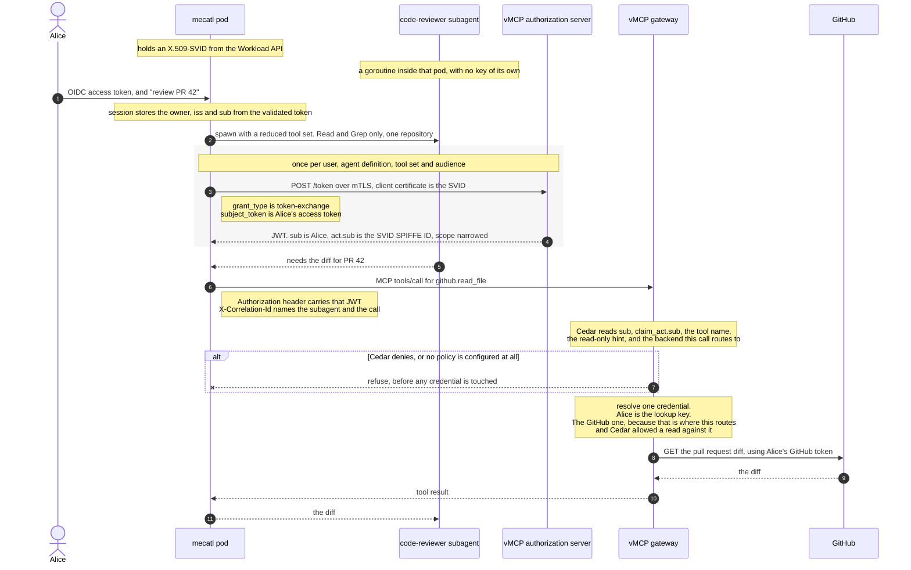

# Agent identity, part 2: the outbound hop

*Status: strawman / working draft. Speculative scoping, not a design record under
[ADR 0002](adr/0002-documentation-lifecycle.md). Companion to
[`docs/agent-identity-model.md`](agent-identity-model.md), which this takes as its
premise and does not restate. Same tier as
[`docs/scoped-resource-grants.md`](scoped-resource-grants.md).*

## The flow at a glance



**The whole design is one idea: the decision and the credential fetch must see the same
target, resolved once.**

Today neither sees it. Cedar is never told which backend the call routes to, even though
the tool object carries that identifier. And credentials are loaded in HTTP authentication
middleware, before the JSON-RPC body is parsed — so at that moment there is no tool name,
no arguments and no backend, and the code loads every credential Alice has and lets a later
step index into the map by a name from static config.

Fix both and everything else follows. Cedar's allow then means "this actor may call this
tool at this backend", which is exactly what justifies reaching for that backend's
credential — so no second decision is needed at the fetch.

| Hop | What changes |
|---|---|
| 1 · authenticate | The session stores who owns it. A scheduled run has no inbound request to read a user from, so it captures offline access at creation and still runs as that user. |
| 2 · spawn | Which tools the child may call has to be known outside mecatl. How many turns it may take does not, and should not leave. |
| 3 · get credential | One JWT, reused across sibling subagents, obtained by exchanging Alice's token. The pod authenticates with its SVID rather than a secret. |
| 4 · call | Already correct: the JWT decides everything, and the correlation header is only ever logged. |
| 5 · gate | Give Cedar the backend identifier. **This is the substantive piece** — it is what makes an allow strong enough to justify a credential. Configuring a policy at all is a deployment requirement, not a code change. |
| 6 · fetch | Key on Alice rather than a login session, and move the fetch to the far side of routing so it uses the backend the gate saw. Plumbing, once hop 5 is right. |
| 7 · backend | No change. GitHub sees an ordinary GitHub token and learns nothing about agents. |
| 8 · park/resume | On resume, mint from whoever is asking now rather than from a stored row. |

---

## What this decides

[`agent-identity-model.md`](agent-identity-model.md) models identity from the user down
to the subagent and stops at the boundary. This doc covers what happens at that boundary
and beyond it: how the harness reaches a tool, what a gateway decides, and how a user's
stored third-party credential gets used without handing the agent more than it was
given.

It also lists what has to change, in which repository, in what order. A design that says
what should happen without saying what to build is not actionable.

**What it takes as given.** The three-tier model, subagents not being network entities,
mecatl as its own issuer, and the parkable-credential lifecycle. Those are settled in the
companion doc.

**How to read the annotations.** Each step says what should happen and why. A quoted
block then says what happens today and what the difference costs. Those blocks are a cost
signal, never a constraint: mecatl, vMCP and ToolHive are built by the same team, and two
branches already exist because someone decided a change was needed. A missing interface
is a thing to build.

---

## Vocabulary

Several words in this area cover more than one thing, and the ambiguity does real damage —
"binding" alone covers four distinct mechanisms with opposite properties. Definitions used
consistently below.

**Binding** — four things share this word.
*Holder binding*: only whoever holds this key may use this credential.
*Context binding*: this credential can read what is filed under some session.
*Authority binding*: this credential may perform these operations.
*Principal binding*: this is Alice's authority, exercised by some agent.
The test that separates them: does the claim let the holder reach past the authority the
credential already states? A session pointer does — the credential may say "read one
repository" and the pointer still resolves to everything the user owns. A holder key does
not; it narrows who may use the credential and adds nothing. **A binding should constrain,
never grant.**

**Principal** — the party whose authority is being exercised. Either a user or a client,
never both, and code that consumes one has to handle each.

**Actor** — the party exercising it. In a delegated credential these are different, which
is what distinguishes delegation from impersonation.

**Owner** — who is recorded as responsible for a session or a schedule. Usually the
principal, but not always: a scheduled run is owned by whoever created it and acts as
itself.

**Authority** — what a credential permits: which tools, which operations, which resources.
Distinct from **limits**, which bound what a run costs — turns, tool calls, timeouts.
Authority may need to travel outside the process; limits never do.

**Definition and instance** — a definition is a kind of agent, named in configuration and
stable enough for a policy to reference. An instance is one running occurrence, ephemeral
and unnamed in advance. Policy keys on definitions. Audit records instances.

**Workload** — in the WIMSE sense, something independently addressable and executable. A
mecatl pod is one. A subagent is not, which is the reason it has an identity but no key.

**Attenuation** — issuing a credential strictly weaker than the one it derives from. Not
the same as *revocation*, which withdraws one already issued.

**Credential and capability** — a credential states what its holder may do. A capability
*is* the permission: holding it is sufficient. A pointer into a credential store is a
capability wearing a credential's clothes, which is why one inside a delegated credential
defeats the delegation.

---

## The properties this is built on

One test, then what it rules out. The hops argue each of these where it applies; this is
the list to check a change against.

**A binding should constrain, never grant.** Does the claim let the holder reach past the
authority the credential already states? A session pointer does. A holder key does the
opposite.

- **Safe in hostile hands.** The holder is driven by a language model reading untrusted
  input. Everything the credential can cause must already be permitted.
- **A pointer must not widen.** A reference is fine when following it is limited by what the
  credential says, and unsafe when the read ignores it.
- **The limits must be visible where the credential is used**, or every narrowing stops at
  the harness boundary.
- **A subagent gets an identity, not a key.** mecatl issues it and it is real inside
  mecatl's trust domain. Nothing below the pod can hold a key privately, so nothing outside
  should be asked to attest one.
- **It survives rehydration.** Sessions park for hours and resume elsewhere.
- **It works with no user present**, because a scheduled run has none — though it still
  runs *as* a user.
- **When an input to a decision is absent, refuse.** Least access, not most.
- **One credential says who you are, a different one says what you may do.** Who-you-are is
  long-lived and widely presented; what-you-may-do changes per call. Folding the second into
  the first means reissuing on every permission change and showing every recipient a list
  most have no business seeing.
- **Sharing a credential and attributing an action do not conflict.** One credential reused
  across siblings, with a logged correlation value naming which one acted.

## A worked example

Alice asks her agent to review an open pull request. The agent spawns a code-reviewer
subagent, which needs the diff from GitHub. GitHub is reached through vMCP, and vMCP
holds Alice's GitHub credential.

One path, eight steps. Where it genuinely forks, the fork is marked. Two parallel
narratives are how a prerequisite gets stated in one and silently assumed in the other.

---

### Hop 1 — Alice authenticates and the session records who owns it

**What should happen.** Alice authenticates once, and the session stores who owns it. The
owner is a property of the session, not of the request that created it.

That distinction matters because some work has no request behind it. A scheduled run
starts itself, from a timer inside the process, so there is no inbound HTTP request whose
token could be read. If reading an inbound token is the only way an owner ever gets set,
scheduled work has no owner at all, and no amount of key or issuer machinery fixes that,
because the work never passes the place where identity is attached.

**A scheduled run acts as the user, not as itself.** Alice said "check CI at 3am and fix
what is broken." That work is hers: her intent, her repositories, her authority. A run that
authenticates as itself loses her entirely, which is one of the two bad options epic
[#5194](https://github.com/stacklok/toolhive/issues/5194) opens with. So the credential
carries Alice as principal and the agent as actor, exactly as it does when she is present.

**Which requires capturing offline access when the schedule is created.** There is no way
to mint a credential naming Alice out of nothing at 3am, and no specification offers one.
Every shipped system does one of two things: replay something captured at consent time, or
give up and use a service identity. So the schedule stores a refresh token, obtained with
Alice's consent at creation, and the fire exchanges it for a short-lived credential.

That is not the stored-credential problem this design removes. **The agent still never
holds anything of Alice's** — the refresh token lives in the gateway's vault, scoped to one
user and one provider, and is revocable. AWS AgentCore and Auth0 both ship exactly this,
binding stored tokens to an agent identity and a user id and refreshing automatically. It
is `offline_access`, not a novel mechanism.

**And it is safer than the alternative that avoids storage.** Google's domain-wide
delegation mints a user-principal token from nothing, with no stored token at all — and is
documented as a critical privilege-escalation risk, because the grant is domain-wide and
cannot be scoped to one user. A revocable per-user refresh token is the *less* dangerous
of the two. What makes something dangerous here is the ability to mint Alice's credential
at will, not the existence of a token that can be taken away.

**When the credential is gone, fail and say how to fix it.** Refresh tokens expire, and a
provider can revoke one without telling us. The run then fails — it does not fall back to a
service identity, because that silently converts Alice's job into somebody else's. AgentCore's
pattern is worth copying: emit an authorization URL so Alice can re-consent, delivered by
whatever channel the deployment has. A job that stops and explains itself beats one that
keeps running as the wrong principal.

> **The obvious counter-example, and why not.** GitHub Actions goes the other way: a
> scheduled workflow gets an app installation token, which is a service identity, and its
> record of who caused the run resolves to whoever last edited the cron expression. So it
> splits attribution from authority. Microsoft Graph recommends the same shape, calling
> delegated access interactive by design. Both are defensible for CI. Neither fits here,
> because last-cron-editor is a poor proxy for whose authority is being spent, and this
> design's whole purpose is to keep that answer accurate.

> **Today.** Session creation has no owner field, on either the session or the team
> request. `makeFireFunc` calls `CreateSessionWithProfile` in-process from a
> leader-elected goroutine, so a scheduled fire never reaches the interceptor that would
> assign one.
>
> **Change.** An owner on session creation; an owner on the schedule; the fire path reads
> it. New, small, mecatl-side. Everything downstream needs it.

**What an attacker gets.** If whatever validates the inbound token records the wrong user,
every credential minted under that session is minted for the wrong person, and nothing
downstream can tell.

The obvious defence does not work. If that component signs its binding and the store
records it and audit compares the two, a compromised component holds the signing key and
writes the same wrong answer in both places, so the comparison agrees with itself. What
works is anchoring to something it cannot forge: keep the issuer and identifier of the
original assertion from the identity provider, so an auditor re-checks against the
provider rather than against the component under suspicion.

---

### Hop 2 — the parent spawns a subagent and narrows what it may do

**What should happen.** The child gets a strict subset of the parent's authority, chosen
at spawn, and cannot widen it. It holds no key. Its identity is a claim the parent caused
to be minted.

**Only some of the narrowing needs to leave the harness.** Which tools the child may call,
and whether it may write, determine what it can reach outside the process — so a gateway
deciding whether to use Alice's GitHub token needs to know them. How many turns it may
take, how many tool calls, how long before it times out: those bound what it costs and
have no bearing on any decision made elsewhere. They stay inside.

Keeping them apart matters in both directions. A limit that should have travelled and
didn't means the gateway allows something the parent forbade. A limit that travels
needlessly ends up as a claim in a credential, where it is one more thing to version and
one more thing a policy might accidentally depend on.

**Narrowing that nobody outside can check is a convention.** mecatl's containment is real
and tested — the composed catalog, the deny-dominant evaluator pinned to an audience —
but it runs entirely inside the process. That stops the harness doing the wrong thing by
accident. It does not let anyone else confirm it didn't.

> **Today.** The narrowing works, in-process. Nothing carries the reach-changing part
> outward.
>
> **Change.** That part has to reach whatever decides at hops 5 and 6. How much travels
> in a credential and how much a policy already knows is open — see the end.

**What an attacker gets.** Prompt injection at the *parent* is worse than at a child,
because the parent picks the child's tools, mode and prompt. Identity cannot prevent
that; the attacker is driving the harness's own reasoning from inside the pod.

It does bound it. A ceiling carried in the credential limits what a compromised parent
can hand out, which is the difference between a bad turn and an unbounded one. Cutting
the other way, the harness defences this leans on are posture-conditional — guardrails
drop to advisory at the top of the posture ladder — so containment is weakest where the
model is trusted most.

---

### Hop 3 — the harness gets a credential

**What should happen.** One credential per user, agent definition, scope and audience,
reused across every sibling subagent, obtained by exchanging the user's token. The pod
authenticates with its SVID rather than a secret.

```http
POST /token HTTP/1.1
Host: vmcp.example.com
Content-Type: application/x-www-form-urlencoded
                         # mTLS: client cert is the pod's X.509-SVID,
                         # spiffe://mecatl.example.com/pod/mecatl-7f4c

grant_type=urn:ietf:params:oauth:grant-type:token-exchange
&subject_token=<Alice's access token>
&subject_token_type=urn:ietf:params:oauth:token-type:access_token
&scope=repo:read
&audience=https://vmcp.example.com
```

```jsonc
// the credential that comes back, decoded
{
  "iss": "https://vmcp.example.com",
  "sub": "alice@example.com",                       // whose authority
  "act": { "sub": "spiffe://mecatl.example.com/agent/code-reviewer" },
  "scope": "repo:read",                             // narrowed at the mint
  "aud": "https://vmcp.example.com",
  "exp": 1785312000
}
```

Three things to notice. **`sub` is Alice**, because this is an ordinary access token and
not an SVID — the JWT-SVID rule that forces `sub` to be the holder applies to credentials
mecatl issues, not to this one. **`act.sub` is the agent definition**, not the individual
subagent, which is what lets eight siblings share this. And **`scope` carries the
narrowing**, so nothing else has to travel.

Each call then adds a correlation value that is logged and never authorized on:

```
X-Correlation-Id: sess-9a3f/subagent-call_01H8/2
```

**Why no second credential for the individual.** A subagent never holds one. The pod holds
the credential and calls on its children's behalf, so there is no per-subagent token to
steal, replay or revoke — containing a misbehaving subagent means cancelling a goroutine
the parent already owns. Signing the correlation value would only matter if the gateway
authorized on the individual instance, and it cannot usefully: instances are ephemeral and
unnamed in advance, so no policy could reference one.

**And a subagent is not a workload,** which is the underlying reason. A workload is
independently addressable and executable; a goroutine shares an address, a process and a
memory space with its siblings. No attestor can attest it, so a per-subagent credential
would ask an external authorization server to accept an assertion in place of an
attestation. mecatl issues the subagent an identity — real inside its own trust domain —
but no key exists below the pod, because nothing down there could hold one privately.

**Why the SVID rather than a secret.** Three things at once, and they are not separable:
no secret in an environment the model can read, per-pod attestation instead of
"whoever holds the secret", and `client_id` becoming a SPIFFE URI, which is what puts a
namespaced identifier in `act.sub` for policy to name. Using a registered mechanism rather
than an invented one means it works against any authorization server that implements it.

> **Today, and what changes.** No client that may use this grant can be provisioned at
> all: registration hardcodes clients public, permits only `authorization_code` and
> `refresh_token`, and there is no static-client config, so the path is reachable only
> through a test seam. **This blocks everything downstream.**
>
> The fix is the `spiffe-authserver` branch, which auto-registers a confidential client
> with both required grant types and authenticates it with the SVID. A static client with
> a shared secret would also work and is rejected: it ships the credential-in-the-
> environment problem this design removes, and gets thrown away when the SVID path lands.
>
> Deployment prerequisites: TLS terminates at the authorization server or the ingress
> forwards the client certificate, and the authorization server holds mecatl's trust
> bundle. The workload API is now on the credential path, so a pod that cannot reach it at
> startup obtains no credential for any session.

**What an attacker gets.** Whoever holds this credential can act as that agent definition,
for that user, within that scope, until it expires — which is the argument for it naming
little and expiring fast. An attacker inside the process gets what the model gets, which
is the argument against a static secret. An attacker who can make the harness request a
credential naming a user it is not acting for defeats everything downstream, which is what
the consent check on the subject token exists to stop.

### Hop 4 — the harness calls a tool

**What should happen.** The call carries the credential and the correlation value, and
nothing else that matters. No header the gateway reads for identity. Everything *decided
on* travels in the credential, because anything else cannot be verified at the far end;
the correlation value is logged, never authorized on, which is why it does not need to
be.

This is what makes the subagent tier safe. A subagent cannot talk its way into a stronger
identity by manipulating a header, because there is no header to manipulate. Its identity
was fixed when the harness minted the credential, before it ran.

> **Today.** The inbound path reads only `MCP-Protocol-Version` and `Accept`, and the
> identity struct has no header-populated field, so this already holds. Worth keeping
> when the outbound path stops baking a static header map into a client at dial time.

**What an attacker gets.** An attacker who controls the subagent's reasoning — the
expected case — gets to choose the tool name and the arguments on this call, and nothing
else. They cannot change whose authority is presented, which agent definition is named, or
what that definition may do, because all three were fixed when the pod obtained the
credential, before the subagent ran and outside its reach.

So the capability gained is exactly "issue any call the credential already permits." That
is a real capability and the reason hop 5 has to be able to distinguish among those calls.
What it is not is escalation: no sequence of tool calls widens the credential.

---

### Hop 5 — the gateway decides

**What should happen.** One gate, always in the path, that sees the whole question: who is
acting, for whom, on what, at which backend. It decides before any credential is touched,
and refusing stops the call.

This is what the rule looks like once the gate has the backend:

```cedar
// A code-reviewer subagent may read from GitHub, on behalf of any user,
// but only tools the backend has declared read-only.
permit (
    principal,
    action == Action::"call_tool",
    resource in MCP::"github"
)
when {
    context.claim_act.sub == "spiffe://mecatl.example.com/agent/code-reviewer" &&
    resource.readOnlyHint == true
};
```

Two of those four conditions are unavailable today. `resource in MCP::"github"` needs the
backend identifier, which exists on the tool object and is never passed. And
`resource.readOnlyHint` is absent unless the backend declared it, with no classifier to
fall back on — so a rule that omits the `== true` check silently permits unannotated
tools.

**Why one gate rather than several.** A check that lives in each outbound path can be left
out of one of them, and the omission is invisible until someone finds it. A single gate can
be wrong; it cannot be absent.

**A policy is a deployment requirement, not something the product should enforce.** With
no `authz` block configured the admission check returns allow unconditionally — which is a
reasonable default for a gateway with nothing to hand out, and the wrong posture once
credential injection is on. Those two configuration decisions are independent and nothing
links them.

That is ours to get right when we deploy, not a default to argue about upstream: other
deployments legitimately want allow-all for development or single-user use. So it belongs
in the deployment requirements below rather than in the change list.

Worth being honest that a runbook item is weaker than a product guarantee. Nothing stops
someone standing up a gateway with credentials and no policy; the invariant holds because
we hold it.

> **Today, and what changes.** Admission is already the single gate and already always in
> the path, which is the part that is right. It receives the acting agent as a nested claim
> and a read/write hint from the backend's tool annotation.
>
> Four changes, all fixes to an existing gate rather than new components. **Pass the
> backend identifier** — it exists on the tool and is dropped. **Refuse when credentials
> are configured and no policy is** — today the authz factory returns nil, which becomes an
> allow-all admission whose check returns true unconditionally, so a fresh deployment
> serves any advertised tool to any authenticated caller. **Stop discarding the issued
> token's claims** when a primary upstream provider is pinned, or `claim_act` vanishes and
> a rule written about it stops matching rather than failing. **Choose the unannotated
> default** — treat an absent hint as mutating, so the rule above refuses rather than
> permits.

**What an attacker gets.** This is where a confused deputy is caught or not. The agent
cannot read Alice's credentials, but it can ask the gateway to use them, and the gate is
the only thing between the request and that use. A gate that cannot see the backend can be
talked into using the wrong credential for a call it was willing to allow. A gate that is
absent can be talked into anything.

One rule worth taking verbatim from the credential-broker draft: *"The PDP MUST NOT
evaluate justification text for approval decisions."* Agent-authored prose must never
influence the decision. In an agent deployment that is the entire injection surface.

### Hop 6 — the gateway uses one of Alice's credentials

**What should happen.** One operation, after the gate allowed the call, keyed on the
backend the gate saw:

```go
cred, err := vault.Fetch(ctx, "alice@example.com", BackendID("github"))

switch {
case errors.Is(err, ErrNoCredential):
    // Alice has never connected GitHub. A missing integration,
    // surfaced to her as "connect GitHub to use this".
case errors.Is(err, ErrUnknownBackend):
    // routing produced a backend the vault has never heard of.
    // A configuration bug, not a user-facing one. Distinct on purpose:
    // collapsing the two makes a routing fault look like a missing account.
}
```

**No decision parameter, and that is the point.** Cedar was asked whether this actor may
call `github.read_file` at the GitHub backend, and said yes. The call only reaches here
because it said yes. So the authorization for using Alice's GitHub credential already
happened — it is what the allow meant. There is no second predicate.

That holds only if the gate saw the backend. If it did not, its allow means "this actor may
read something", which justifies reaching for nothing in particular. **So hop 5 carries the
weight and this hop is plumbing** — get the fetch past routing and key it on the same
backend the gate was given. Decide and fetch resolve the target once, together.

**Why the key is the user, and why the current key cannot work at all.** The credential is
Alice's, so the lookup keys on Alice.

Today it keys on `tsid`, a token-session identifier. That is not a small difference of
opinion about naming — **an agent can never have one**, for two independent reasons.

It is generated as `rand.Text()` at the start of an authorization-code flow
(`pkg/authserver/server/handlers/authorize.go:93`) and picked up on the callback
(`handlers/callback.go:108`) to key the stored upstream credentials. So it is minted when
a human begins a browser login. An agent never traverses that flow, so nothing mints one
for it.

And where the user's own token *does* carry one, the exchange drops it: the delegation
handler passes an empty session link, commented "No IDP session link for delegated
tokens" (`server/tokenexchange/handler.go:142-144`).

That produces a dichotomy the epic does not name:

| | `tsid` | actor | credential lookup |
|---|---|---|---|
| Forward the user's token verbatim | present | **lost** | works |
| Exchange it for a delegated token | **dropped** | present | **dead** |

You can have the actor or the credential lookup, not both.
[#5194](https://github.com/stacklok/toolhive/issues/5194) exists to get the actor, so it
kills `tsid`-keyed credential injection for agents as a side effect.

A pointer minted at browser login describes an episode; the question here is whose
credential this is, which is an entitlement. Keying on the user is not a workaround for
the agent case — it is the correct key, and the agent case is what makes that obvious.

> **Today, and what changes.** The request arrives, authentication middleware validates the
> token, takes the login-session pointer out of it, and loads **every** credential stored
> under that pointer — GitHub, Slack, AWS, everything Alice has connected — into a map.
> This happens before the JSON-RPC body is parsed, so nothing there knows the call is
> `github.read_file` or where it routes. The code says so: a per-backend check would need
> routing context this layer does not have. Afterwards the outbound strategy indexes that
> map by a provider name from static configuration.
>
> So a subagent narrowed to read-only on one repository can trigger `slack.post_message`
> and nothing in the credential path objects, because by then the Slack token is already
> loaded and the only question left is which key to read.
>
> **Change.** Move the fetch to where the backend is known. The user-keyed half already
> exists as an enterprise decorator and is a port. The interface it replaces sits in
> authentication middleware, which is the right place for authentication and the wrong one
> for this.

**We are the outlier, which is the useful thing to know.** Every comparable system fetches
against a target it already knows. RFC 8693 settles it in its request grammar — an exchange
carries `resource` and `audience`, so it cannot precede knowing them. Vault has no map to
index; its policy check and its credential production are one operation on one path. AWS's
agent gateway fetches one credential per invocation against a named target. Envoy runs
external authorization after route matching for exactly this reason, and documents a later
filter clearing the route cache as a privilege-escalation vector, because the decision was
then made about a different target than the one served. Same failure, named as a security
bug by someone else.

Preloading and indexing has a classical name: ambient authority, failing as a confused
deputy, because the later stage never had to prove entitlement to what it reaches.

**One assumption.** A user has at most one credential per backend — structural in the
current model, where two accounts are two backends. If that ever changes, Cedar's allow
stops identifying a credential and does so quietly, since it would still return allow.

**Something hangs off the login session that moving the key does not move.** The stored
credential has a refresh lifecycle. Bound it to the schedule rather than the token: a
schedule has an expiry Alice set, its grant is refreshed only while the schedule is live,
and when it lapses the next run surfaces a re-authorization prompt. Unsupervised extension
is then limited by something she chose and can see.

**What an attacker gets.** Today, anyone who can reach one allowed tool call reaches every
credential Alice owns, because they are all in memory and the remaining step is a map
lookup. After the change, they reach the one credential for the one backend the gate
approved. The blast radius goes from her whole connected-account set to a single provider.

### Hop 7 — the backend serves the call

**What should happen.** The backend gets a credential it already understands, for a call
already authorized, and verifies what it always verifies. It learns nothing about agents
or delegation.

That is a goal, not a shortfall. A backend has no policy about mecatl's subagents it
could apply, and making it understand our vocabulary would turn every integration into a
negotiation.

**The chain does not reach here.** Whatever the gateway minted or injected is what the
backend sees. RFC 8693 §2.1 is explicit that an exchange *"is a one-time event and does
not create a tight linkage between the input and output tokens"*, so a backend cannot
walk it back. Any claim that a third party can verify the chain has to be scoped to **the
gateway**, not the resource server.

That is the right place — the gateway is where the claimed authority and the credential
about to be used are both visible, and the only hop where refusing prevents anything. But
the boundary should be stated rather than implied to extend further.

> **Today.** This already holds. The outbound strategies derive a credential from stored
> tokens or an exchange, and none read the inbound claims. No change; the deliverable is
> accuracy.

**What an attacker gets.** Someone who compromises the gateway can make a backend call
that is indistinguishable, at the backend, from one Alice made herself — the backend sees
an ordinary GitHub token and has no way to learn an agent was involved. The gateway's audit
record is the only place that distinction exists, so the same attacker can also remove the
evidence.

That is the honest cost of stopping the chain at the gateway, and it is worth stating
because "verifiable by anyone holding the bundle" implies otherwise. The mitigation is not
at this hop: it is that the gateway's audit and mecatl's own log are separate records that
can be reconciled, so an attacker needs both.

---

### Hop 8 — the session parks, then resumes somewhere else

**What should happen.** The credential expires. The authority does not. On resume the
credential is re-derived, never wider than before.

**Where there is a live caller, derive from that caller.** Someone who just authenticated
is a stronger statement than a row saying they once did. This covers more cases than it
seems: approve-after-restart comes from an inbound request, so a human clicking approve
is authenticated; a resumed subagent runs under a live parent turn; a background child is
run-scoped with a live parent. The only case with nobody present is the scheduled run
from hop 1 — which already has its own stored owner and its own no-user credential.

**Authority must not be read out of a row that anything can write.** If the stored record
is the authority, whatever can write the store can grant authority, and the identity
layer is decoration on a database.

> **Today.** Sessions park and resume on other pods, and the persisted labels have no
> integrity protection — rehydration trusts them verbatim, including the permission
> posture. So monotonic attenuation across resume is one write away from false, and the
> store is currently unauthenticated.
>
> **Change.** Derive from the live caller where there is one, which covers nearly every
> path and costs almost nothing. Sign the chain at mint and verify before re-minting for
> the one path where nobody is present. Much smaller than signing for all of them.

**What an attacker gets.** Someone who can write the store but cannot sign is a distinct
and likelier adversary than one who has compromised a pod — a leaked database credential
rather than code execution. That adversary is precisely who chain integrity defeats, and
folding the two together into "the pod that can sign can impersonate anything" makes the
mitigation look less valuable than it is.

---

## The steps as interfaces

Signatures rather than prose, because prose let several things stay vague that a type does
not. Shapes, not literal Go, and they span two codebases. Each step's output has to be the
next step's input; where it is not, that is a finding.

```
Hop 1   BindPrincipal(inbound Request)            -> (Principal, error)
        OwnerOf(spec ScheduleSpec)                -> (Principal, error)
        RootAuthority(p Principal)                -> (Authority, error)

Hop 2   Narrow(parent Authority, spec SpawnSpec)  -> (Authority, Limits, error)

Hop 3   DelegatedCredential(
            subject UserToken, def DefinitionID,
            a Authority, aud Audience)            -> (Credential, error)
        // unattended: same output, different input
        DelegatedFromStored(
            u UserID, def DefinitionID,
            a Authority, aud Audience)            -> (Credential, error)

Hop 4   Call(c Credential, corr Correlation,
             tool ToolName, args Args)            -> (Result, error)

Hop 4/5 Verify(c Credential)                      -> (Claims, error)
Hop 5   Decide(claims Claims, tool ToolName,
               backend BackendID, op Operation)   -> (Decision, error)

Hop 6   Fetch(u UserID, backend BackendID)        -> (StoredCredential, error)

Hop 8   Rederive(s Session, prior Authority,
                 caller *Principal)                -> (Credential, error)
```

Six things the signatures caught that the prose had hidden.

**`Principal` is a sum type that mostly should not be.** Every path here carries a user,
including the unattended one. The client branch is what a run *degrades* to when a stored
grant is gone, and the answer there is to fail. It exists to be rejected, not handled
evenhandedly.

**`Narrow` returns two values and only one travels.** Authority crosses the boundary;
limits never leave. Separating them in the type is what stops turn counts becoming claims.

**Two constructors, both producing a credential that names the user.** They differ only in
where the subject comes from — a presented token, or a grant stored when a schedule was
created. Neither names the harness.

**`DelegatedCredential`'s parameters are exactly the cache key,** which fell out rather
than being designed. Adding a parameter later silently fragments the cache.

**`Fetch` takes no decision.** An earlier version split this in two and passed the gate's
verdict into the second half. The candidate list was the preload this design removes,
written back in as a step; and the verdict is unnecessary, because the call only arrives if
the gate allowed it and the gate saw the backend. Two seams in the current code produced a
two-stage signature the properties never asked for.

**Four missing arrows,** found by checking outputs against inputs. Nothing produced
`Claims`, so `Verify` is now explicit — which surfaces that the gateway needs the trust
bundle too, the same requirement as the authorization server. Nothing produced the root
`Authority` that `Narrow` reduces. `Rederive` promised a credential never wider than before
while taking nothing describing before. And `Correlation` appears in no later signature,
which is correct rather than missing: it is logged, never read by a decision.

## The work, as an index

Detail is in the hop each row names. This view exists for planning across two repositories,
not for reading the design.

**Blocking — nothing runs until these do**

| # | What | Where | Hop |
|---|---|---|---|
| 1 | A confidential client that may use the exchange grant, authenticated by SVID | vMCP — port `spiffe-authserver` | 3 |
| 2 | Accept subject tokens from an external issuer | vMCP — validator exists unwired, [#5989](https://github.com/stacklok/toolhive/issues/5989) gates it on a consent model | 3 |
| 3 | Publish the trust bundle to the authorization server and the gateway | vMCP + mecatl — two consumers, one artifact | 3, 5 |
| 4 | An owner on session creation, and on schedules with offline access captured | mecatl — new | 1 |

**The design itself**

| # | What | Where | Hop |
|---|---|---|---|
| 5 | Pass the backend identifier to the gate | vMCP — exists on the tool, dropped | 5 |
| 6 | Stop discarding the issued token's claims when a primary upstream provider is pinned | vMCP — fix | 5 |
| 7 | Treat an unannotated tool as mutating | vMCP — policy default | 5 |
| 8 | Move the credential fetch past routing, keyed on the backend | vMCP — new | 6 |
| 8a | Key the credential read on the user rather than `tsid` | vMCP — the enterprise user-keyed decorator does this; a port, not new work | 6 |
| 8b | Decide what happens to the `tsid`-keyed path | vMCP — see below | 6 |
| 9 | Split authority from limits so only the first can travel | mecatl — new | 2 |
| 10 | Mint in composition, never behind a port the loop calls | mecatl — `TeamMemberEngineFactory` is the existing shape | 3 |
| 11 | A per-call correlation value | mecatl — the MCP adapter bakes static headers at dial | 4 |

**Correctness and hygiene, not blocking**

| # | What | Where | Hop |
|---|---|---|---|
| 12 | Check a stored credential against the identity that stored it | vMCP — the error is declared and never returned | 6 |
| 13 | Owner-scoped session listing | mecatl — the owner field makes filtering possible, nothing applies it | 1 |
| 14 | Derive from the live caller on resume | mecatl — persisted labels are trusted verbatim today | 8 |
| 15 | Wire the token cache | vMCP — declared in `pkg/vmcp/cache`, referenced nowhere | 3 |
| 16 | Advertise the grant, and a client-auth method, in discovery | vMCP — fix | 3 |

### Order

Rows 1 to 4 gate everything. Row 4 is mecatl-side and independent, so it runs in parallel.

Then rows 5 to 7, which make the gate correct before anything depends on it — row 5 in
particular, since it is what makes an allow mean enough to justify a credential.

Then rows 8, 8a and 8b, which follow from row 5 and are mostly plumbing once it lands.

Row 8b needs a decision before anyone writes code, and it is not ours alone. The enterprise
user-keyed decorator does not sit alongside the `tsid`-keyed read — it substitutes a
composite of gateway and user into the slot the existing code calls a session id, and
ignores the session id it is passed. So it replaces rather than coexists.

That is fine for the agent path, which has no `tsid` to offer. It is a change in behaviour
for the browser path, which does: a stolen token for one login session currently reaches
only that session's credentials, and after the change reaches everything that user has
connected. The enterprise design accepts that trade deliberately, on the grounds that
upstream tokens are a per-user resource and per-session scoping would force re-consent on
every new session, with revocation as the remedy.

Worth confirming that reasoning holds for our deployments rather than inheriting it,
because it widens a blast radius on a path that is not the one we are trying to fix.

Caching matters before fan-out is usable but not before it is correct.

## Deployment requirements

Things this design needs from how vMCP is configured and run, rather than from code. They
are listed separately because a runbook item is weaker than a product guarantee, and it is
worth being honest about which of these is which.

**An authorization policy must be configured wherever credential providers are.** With no
`authz` block the admission check returns allow unconditionally, and the same path then
injects a caller's stored credentials. Allow-all is a legitimate default for a gateway with
nothing to hand out, and other deployments want it for development and single-user use, so
this is not a default to change upstream. It is ours to get right. Nothing enforces it: the
invariant holds because we hold it.

**TLS terminates at the authorization server, or the ingress forwards the client
certificate.** An mTLS client certificate that a proxy terminates and drops is the failure
that reads as configuration and is really topology.

**Both the authorization server and the gateway hold mecatl's trust bundle** — the first to
validate the SVID used as client authentication, the second to verify the minted credential
before any claim reaches policy. Missing either fails loudly, but at different hops and
with different errors, so they will be diagnosed as unrelated.

**The workload API is reachable at pod startup.** It is now on the credential path, so a
pod that cannot reach it obtains no credential for any session. There is no degradation
story for this yet, and deciding one beats discovering it.

**One credential per backend per user.** Structural in the current model, since two accounts
are two backends. If a deployment ever configures otherwise, credential selection stops
being able to choose and does so silently, because the policy engine still returns allow.

## Decisions

Questions this doc previously left open, and where each is argued.

**The user goes in `sub`.** The companion doc inverts this because JWT-SVID requires `sub`
to be the credential holder — but that constrains credentials *mecatl issues as SVIDs*, and
the outbound credential is an ordinary access token minted by the gateway. So the standard
RFC 8693 shape applies, and nothing has to traverse a chain to find the user. Two
credentials, two conventions, each correct in its own domain. Hop 3.

**The credential's scope carries the narrowing; policy names the definition.** A child's
tool set follows from its definition, which policy reads from `act.sub`. What varies beyond
that is scope, already a standard claim. No structured authority vocabulary, no
subset-checking, no new claim. Hops 3 and 5.

**An unannotated tool is treated as mutating**, so it is refused to a read-only agent. That
follows from refusing when a decision input is missing, and puts the cost of annotating on
the backend that wants the looser treatment. Hop 5.

**Refresh is bounded by the schedule, not the token.** Refresh-on-use lets an unsupervised
agent extend a credential forever; refresh-on-login stops a working schedule for reasons
its owner never sees. Bounding the schedule makes the limit something she set. Hop 6.

**One credential per backend per user is structural,** not incidental — two accounts are two
backends. It is what lets an allow *identify* a credential rather than permit a class of
them. Recorded because it fails quietly if it ever stops holding: the policy engine would
still return allow, and the fetch would simply have no way to choose. Hop 6.

**Owner-scoped reads are required** and are a listing change rather than an identity one.
Row 13.

## References

### Relied on, and checked against the current text

Each of these supports a specific claim above. Section numbers were verified by reading
the document, not from memory — an earlier draft of this work carried three that did not
resolve.

- **RFC 8693** (token exchange) — §1.1 delegation versus impersonation; §2.1 *"the
  exchange is a one-time event and does not create a tight linkage between the input and
  output tokens"*, which is why the chain stops at the gateway; §4.1 the closed set of
  top-level claims plus the current actor, and the restriction of `act` contents to
  identity.
- **RFC 9396** (`authorization_details`) — §2.2 the common data fields, and that fields
  within one object combine as a product; §6.1 *"there is no standardized mechanism to
  compare two arbitrary authorization detail requests"*.
- **`draft-ietf-wimse-arch`** — §2 a workload is "an independently addressable and
  executable software entity", which is why a goroutine is not one; §4.3 workload identity
  incorporated into a token to *constrain* its use; §4.5 *"avoid treating successful
  authentication as implicit authorization"*.
- **`draft-ietf-wimse-workload-creds`** — §5.1 the identity claim set (`iss`, `sub`, `exp`,
  `jti`, `cnf`, and nothing about authority); §5.3 authority carried separately in a
  context token.
- **`draft-hartman-credential-broker-4-agents`** — §4.2 *"The PDP MUST NOT evaluate
  justification text for approval decisions"*, adopted verbatim; and the absence of any
  mechanism for choosing among several credentials for one user and service.
- **RFC 8705** (mTLS client authentication) and **`draft-ietf-oauth-spiffe-client-auth`**
  for the client-authentication shape at hop 3.

### Read, and not relied on

Consulted while working this out, and cited by name rather than by section because nothing
above depends on them. Recorded so the ground covered is visible and nobody re-treads it.

- **`draft-ietf-oauth-transaction-tokens`** — per-call context inside a trust domain. Would
  be the mechanism if a second per-call credential were ever wanted; the design uses an
  unsigned correlation value instead.
- **`draft-mcguinness-oauth-ai-agent-instance`** — per-instance identity and revocation.
  Written for agents as independent processes holding their own credentials, which is not
  this architecture.
- **`draft-mcguinness-oauth-actor-profile`** — actor semantics, and the useful detail that
  it operates at the representation layer rather than the policy layer.
- **`draft-liu-oauth-chain-delegation`** and
  **`draft-niyikiza-oauth-attenuating-agent-tokens`** — in-token narrowing with a
  containment algorithm. Relevant only if authority ever travels in the credential, which
  this design decided against.
- **`draft-ietf-oauth-identity-chaining`**, **ID-JAG**, **RFC 9068**, **RFC 7523** — read
  during earlier rounds; the claims that depended on them did not survive revision.
