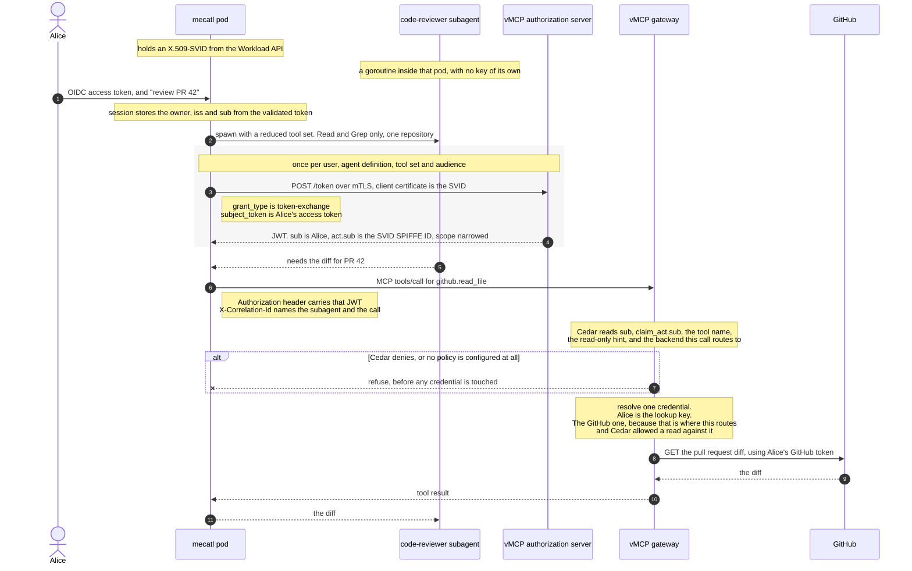

# Agent identity, part 2: the outbound hop

*Status: strawman / working draft. Speculative scoping, not a design record under
[ADR 0002](adr/0002-documentation-lifecycle.md). Companion to
[`docs/agent-identity-model.md`](agent-identity-model.md), which this takes as its
premise and does not restate. Same tier as
[`docs/scoped-resource-grants.md`](scoped-resource-grants.md).*

## The flow at a glance



**The whole design is one idea: the decision and the credential fetch must see the same
target, resolved once.**

Today neither sees it. Cedar is never told which backend the call routes to, even though
the tool object carries that identifier. And credentials are loaded in HTTP authentication
middleware, before the JSON-RPC body is parsed — so at that moment there is no tool name,
no arguments and no backend, and the code loads every credential Alice has and lets a later
step index into the map by a name from static config.

Fix both and everything else follows. Cedar's allow then means "this actor may call this
tool at this backend", which is exactly what justifies reaching for that backend's
credential — so no second decision is needed at the fetch.

| Hop | What changes |
|---|---|
| 1 · authenticate | The session stores who owns it. A scheduled run has no inbound request to read a user from, so it captures offline access at creation and still runs as that user. |
| 2 · spawn | Which tools the child may call has to be known outside mecatl. How many turns it may take does not, and should not leave. |
| 3 · get credential | One JWT, reused across sibling subagents, obtained by exchanging Alice's token. The pod authenticates with its SVID rather than a secret. |
| 4 · call | Already correct: the JWT decides everything, and the correlation header is only ever logged. |
| 5 · gate | Give Cedar the backend identifier. Refuse when credentials are configured but no policy is. **This is the substantive piece** — it is what makes the allow strong enough to justify a credential. |
| 6 · fetch | Key on Alice rather than a login session, and move the fetch to the far side of routing so it uses the backend the gate saw. Plumbing, once hop 5 is right. |
| 7 · backend | No change. GitHub sees an ordinary GitHub token and learns nothing about agents. |
| 8 · park/resume | On resume, mint from whoever is asking now rather than from a stored row. |

---

## What this decides

[`agent-identity-model.md`](agent-identity-model.md) models identity from the user down
to the subagent and stops at the boundary. This doc covers what happens at that boundary
and beyond it: how the harness reaches a tool, what a gateway decides, and how a user's
stored third-party credential gets used without handing the agent more than it was
given.

It also lists what has to change, in which repository, in what order. A design that says
what should happen without saying what to build is not actionable.

**What it takes as given.** The three-tier model, subagents not being network entities,
mecatl as its own issuer, and the parkable-credential lifecycle. Those are settled in the
companion doc.

**How to read the annotations.** Each step says what should happen and why. A quoted
block then says what happens today and what the difference costs. Those blocks are a cost
signal, never a constraint: mecatl, vMCP and ToolHive are built by the same team, and two
branches already exist because someone decided a change was needed. A missing interface
is a thing to build.

---

## Vocabulary

Several words in this area cover more than one thing, and the ambiguity does real damage —
"binding" alone covers four distinct mechanisms with opposite properties. Definitions used
consistently below.

**Binding** — four things share this word.
*Holder binding*: only whoever holds this key may use this credential.
*Context binding*: this credential can read what is filed under some session.
*Authority binding*: this credential may perform these operations.
*Principal binding*: this is Alice's authority, exercised by some agent.
The test that separates them: does the claim let the holder reach past the authority the
credential already states? A session pointer does — the credential may say "read one
repository" and the pointer still resolves to everything the user owns. A holder key does
not; it narrows who may use the credential and adds nothing. **A binding should constrain,
never grant.**

**Principal** — the party whose authority is being exercised. Either a user or a client,
never both, and code that consumes one has to handle each.

**Actor** — the party exercising it. In a delegated credential these are different, which
is what distinguishes delegation from impersonation.

**Owner** — who is recorded as responsible for a session or a schedule. Usually the
principal, but not always: a scheduled run is owned by whoever created it and acts as
itself.

**Authority** — what a credential permits: which tools, which operations, which resources.
Distinct from **limits**, which bound what a run costs — turns, tool calls, timeouts.
Authority may need to travel outside the process; limits never do.

**Definition and instance** — a definition is a kind of agent, named in configuration and
stable enough for a policy to reference. An instance is one running occurrence, ephemeral
and unnamed in advance. Policy keys on definitions. Audit records instances.

**Workload** — in the WIMSE sense, something independently addressable and executable. A
mecatl pod is one. A subagent is not, which is the reason it has an identity but no key.

**Attenuation** — issuing a credential strictly weaker than the one it derives from. Not
the same as *revocation*, which withdraws one already issued.

**Credential and capability** — a credential states what its holder may do. A capability
*is* the permission: holding it is sufficient. A pointer into a credential store is a
capability wearing a credential's clothes, which is why one inside a delegated credential
defeats the delegation.

---

## The properties this is built on

One test, then what it rules out.

**A binding should constrain, never grant.** The test: does this claim let the holder
reach anything the credential's own stated authority does not already cover?

A session pointer does. The credential might say "read one repository", and the pointer
still resolves to every credential the user owns, because the store never consults the
scope. A holder key does the opposite — it narrows who may use the credential and adds
nothing to what the credential permits.

Stated more carefully than "removing it reduces reach", because that test is too blunt: it
also condemns the user identifier a credential lookup legitimately needs. Removing that
would reduce reach too, but it grants nothing beyond the authority already written in the
credential — it identifies whose authority is being exercised. The distinction is between
a claim that *carries* authority and one that *names the subject of* authority already
stated.

From that, and from what mecatl is:

- **The credential must be safe in hostile hands.** The thing holding it is driven by a
  language model reading untrusted input. Everything it can cause must already be
  permitted.
- **A pointer must not widen.** A reference is fine if following it is limited by what
  the token says. It is unsafe when the read ignores the token's own limits.
- **The limits must be visible where the credential is used.** Otherwise every narrowing
  the harness performs stops at its own edge.
- **A subagent gets an identity but not a key.** mecatl is its own trust domain and can
  issue a subagent an identity; what it cannot do is give it a key, because subagents are
  goroutines sharing one process and cannot hold anything separately from each other. So
  a subagent identity is real inside mecatl's domain and unattestable outside it. Nothing
  external should be asked to verify it, and the pod is where proof of possession lives.
- **It survives rehydration.** Sessions park for hours and resume elsewhere.
- **It works with no user.** A scheduled run has none.
- **When something needed for a decision is absent, refuse.** A credential arriving with
  no limits attached, or a gateway with credentials configured and no policy written, gets
  the least access rather than the most.

Two more that came out of the standards rather than from mecatl:

- **One credential says who you are; a different one says what you may do.** Don't fold
  the second into the first. Who-you-are is long-lived and presented to everything;
  what-you-may-do changes per call and per resource, so putting it in the identity
  credential means reissuing that credential every time permissions change, and handing
  every recipient a list of permissions most of them have no business seeing. WIMSE keeps
  them apart for this reason — its identity token carries issuer, subject, expiry and a
  key binding, and nothing about authorization.
- **Sharing a credential and attributing an action are both required, and they do not
  conflict.** One credential can be reused across concurrent siblings while a logged
  correlation value still says which one acted. See hop 3.

---

## A worked example

Alice asks her agent to review an open pull request. The agent spawns a code-reviewer
subagent, which needs the diff from GitHub. GitHub is reached through vMCP, and vMCP
holds Alice's GitHub credential.

One path, eight steps. Where it genuinely forks, the fork is marked. Two parallel
narratives are how a prerequisite gets stated in one and silently assumed in the other.

---

### Hop 1 — Alice authenticates and the session records who owns it

**What should happen.** Alice authenticates once, and the session stores who owns it. The
owner is a property of the session, not of the request that created it.

That distinction matters because some work has no request behind it. A scheduled run
starts itself, from a timer inside the process, so there is no inbound HTTP request whose
token could be read. If reading an inbound token is the only way an owner ever gets set,
scheduled work has no owner at all, and no amount of key or issuer machinery fixes that,
because the work never passes the place where identity is attached.

**A scheduled run acts as the user, not as itself.** Alice said "check CI at 3am and fix
what is broken." That work is hers: her intent, her repositories, her authority. A run that
authenticates as itself loses her entirely, which is one of the two bad options epic
[#5194](https://github.com/stacklok/toolhive/issues/5194) opens with. So the credential
carries Alice as principal and the agent as actor, exactly as it does when she is present.

**Which requires capturing offline access when the schedule is created.** There is no way
to mint a credential naming Alice out of nothing at 3am, and no specification offers one.
Every shipped system does one of two things: replay something captured at consent time, or
give up and use a service identity. So the schedule stores a refresh token, obtained with
Alice's consent at creation, and the fire exchanges it for a short-lived credential.

That is not the stored-credential problem this design removes. **The agent still never
holds anything of Alice's** — the refresh token lives in the gateway's vault, scoped to one
user and one provider, and is revocable. AWS AgentCore and Auth0 both ship exactly this,
binding stored tokens to an agent identity and a user id and refreshing automatically. It
is `offline_access`, not a novel mechanism.

**And it is safer than the alternative that avoids storage.** Google's domain-wide
delegation mints a user-principal token from nothing, with no stored token at all — and is
documented as a critical privilege-escalation risk, because the grant is domain-wide and
cannot be scoped to one user. A revocable per-user refresh token is the *less* dangerous
of the two. What makes something dangerous here is the ability to mint Alice's credential
at will, not the existence of a token that can be taken away.

**When the credential is gone, fail and say how to fix it.** Refresh tokens expire, and a
provider can revoke one without telling us. The run then fails — it does not fall back to a
service identity, because that silently converts Alice's job into somebody else's. AgentCore's
pattern is worth copying: emit an authorization URL so Alice can re-consent, delivered by
whatever channel the deployment has. A job that stops and explains itself beats one that
keeps running as the wrong principal.

> **The obvious counter-example, and why not.** GitHub Actions goes the other way: a
> scheduled workflow gets an app installation token, which is a service identity, and its
> record of who caused the run resolves to whoever last edited the cron expression. So it
> splits attribution from authority. Microsoft Graph recommends the same shape, calling
> delegated access interactive by design. Both are defensible for CI. Neither fits here,
> because last-cron-editor is a poor proxy for whose authority is being spent, and this
> design's whole purpose is to keep that answer accurate.

> **Today.** Session creation has no owner field, on either the session or the team
> request. `makeFireFunc` calls `CreateSessionWithProfile` in-process from a
> leader-elected goroutine, so a scheduled fire never reaches the interceptor that would
> assign one.
>
> **Change.** An owner on session creation; an owner on the schedule; the fire path reads
> it. New, small, mecatl-side. Everything downstream needs it.

**What an attacker gets.** If whatever validates the inbound token records the wrong user,
every credential minted under that session is minted for the wrong person, and nothing
downstream can tell.

The obvious defence does not work. If that component signs its binding and the store
records it and audit compares the two, a compromised component holds the signing key and
writes the same wrong answer in both places, so the comparison agrees with itself. What
works is anchoring to something it cannot forge: keep the issuer and identifier of the
original assertion from the identity provider, so an auditor re-checks against the
provider rather than against the component under suspicion.

---

### Hop 2 — the parent spawns a subagent and narrows what it may do

**What should happen.** The child gets a strict subset of the parent's authority, chosen
at spawn, and cannot widen it. It holds no key. Its identity is a claim the parent caused
to be minted.

**Only some of the narrowing needs to leave the harness.** Which tools the child may call,
and whether it may write, determine what it can reach outside the process — so a gateway
deciding whether to use Alice's GitHub token needs to know them. How many turns it may
take, how many tool calls, how long before it times out: those bound what it costs and
have no bearing on any decision made elsewhere. They stay inside.

Keeping them apart matters in both directions. A limit that should have travelled and
didn't means the gateway allows something the parent forbade. A limit that travels
needlessly ends up as a claim in a credential, where it is one more thing to version and
one more thing a policy might accidentally depend on.

**Narrowing that nobody outside can check is a convention.** mecatl's containment is real
and tested — the composed catalog, the deny-dominant evaluator pinned to an audience —
but it runs entirely inside the process. That stops the harness doing the wrong thing by
accident. It does not let anyone else confirm it didn't.

> **Today.** The narrowing works, in-process. Nothing carries the reach-changing part
> outward.
>
> **Change.** That part has to reach whatever decides at hops 5 and 6. How much travels
> in a credential and how much a policy already knows is open — see the end.

**What an attacker gets.** Prompt injection at the *parent* is worse than at a child,
because the parent picks the child's tools, mode and prompt. Identity cannot prevent
that; the attacker is driving the harness's own reasoning from inside the pod.

It does bound it. A ceiling carried in the credential limits what a compromised parent
can hand out, which is the difference between a bad turn and an unbounded one. Cutting
the other way, the harness defences this leans on are posture-conditional — guardrails
drop to advisory at the top of the posture ladder — so containment is weakest where the
model is trusted most.

---

### Hop 3 — the harness gets credentials to call the gateway

**What should happen.** One credential, shared, plus a correlation value on each call.

**The credential** says whose authority is being used, which kind of agent is using it,
and what that kind may do. It is obtained once per distinct combination of those and
reused. Eight concurrent code-reviewer subagents working for Alice share one, because
minting per call puts a network round trip in front of every tool use and there is no
token cache in the gateway's proxy path today.

**The correlation value** names the individual subagent and the specific call. It is not
a credential and is not signed. Both sides log it, and joining the two logs answers
"which subagent did this".

**Why not a second credential for the individual.** A subagent never holds one. The pod
holds the credential and makes calls on its children's behalf, so there is no per-subagent
token to steal, replay or revoke, and containing a misbehaving subagent means cancelling a
goroutine the parent already owns. Signing the correlation value would only matter if the
gateway needed to *authorize* on the individual instance, and it cannot usefully: instances
are ephemeral and unnamed in advance, so no policy could reference one.

> An earlier version of this analysis proposed two credentials, on the strength of a draft
> requiring per-instance revocation. That draft assumes agents are independent processes
> holding their own credentials, which is not this architecture.

**The subagent is not a party to this exchange, because a subagent is not a workload.** A
workload, in the WIMSE sense, is independently addressable and executable. A goroutine is
neither — it shares an address, a process and a memory space with its siblings, and nothing
outside can tell them apart. No attestor can attest it, so asking an external authorization
server to accept a per-subagent credential would mean asking it to accept an assertion in
place of an attestation.

So the pod obtains the credential and the subagent's identity travels as a claim inside it.
mecatl issues that identity, and it is a real identity in mecatl's own trust domain. What
does not exist below the pod is a *key*, because there is nothing down there that could
hold one privately.

Worth knowing the standards are moving away from this shape rather than toward it: the
newest agent-specific drafts assume every agent generates its own keypair, or define an
agent as a workload outright. The sub-workload tier is ours permanently.

**Nothing here may be a pointer.** A claim that dereferences to a credential set is a key
by the test above. These credentials state their authority rather than referring to
authority held elsewhere.

**Where SPIFFE fits.** The harness must authenticate as a registered client to get the
shared credential. An X.509-SVID over mutual TLS does that with no static secret in the
process environment, which matters concretely — `envscrub` exists because under posture
`auto` or `yolo` the model can read its own environment. Per-pod attestation comes with
it.

**Client authentication and the policy subject are one decision, not two.** The identity
that lands in the credential is the client identity, so authenticating with an SVID makes
`client_id` a SPIFFE URI, which flows into the actor claim, which is what policy reads.
Choosing the authentication method chooses the policy subject.

That is a reason to prefer it rather than a cost. A definition name is a local string that
means whatever the config says; a SPIFFE ID is namespaced and structured. In a
single-tenant deployment the difference is cosmetic. In the multi-tenant one this design
targets, it is not.

The objection to a SPIFFE-shaped policy subject is that an SVID path encodes the
deployment, so a trust-domain rename rewrites every rule. That is largely avoidable, and
avoiding it is a path-design decision worth making early: **put the agent definition in
its own path segment** so a rule can match the suffix and never name the trust domain.

**Strictly, no hop below requires this** — an ordinary confidential client reaches the
same credential and the flow runs. It is on the critical path anyway, as a decision rather
than a derivation: the alternative is a shared secret sitting in an environment the
adversary in this threat model can read, and it is work that gets thrown away when the
SVID path lands later.

What SVID authentication buys is three things at once: no secret for the model to read,
per-pod attestation rather than "whoever holds the secret", and a namespaced policy
subject. It uses a registered mechanism rather than an invented one, so it works against
any authorization server implementing it.

Two prerequisites that are easy to miss, because they are not about the harness. TLS has
to terminate at the authorization server, or the ingress has to forward the client
certificate. And the authorization server is in a **different trust domain** from the pod,
so it needs mecatl's trust bundle to validate the SVID at all — which is a federation
relationship to establish, not a config flag. The companion doc is explicit that federation
is bilateral and not free; that applies here.

A third worth stating: this puts the workload API on the credential path. If it is
unavailable at startup the pod cannot authenticate and no session can obtain a credential.
That is a new dependency with no degradation story yet.

> **Today.** No client that may use the exchange grant can be provisioned at all:
> registration hardcodes clients as public, permits only `authorization_code` and
> `refresh_token`, and there is no static-client config, so the path is reachable only
> through a test seam. Client authentication is not the obstacle —
> `client_secret_basic` works with no new code. SPIFFE client auth exists on the
> `spiffe-authserver` branch and is deliberately deferred in
> [#5194](https://github.com/stacklok/toolhive/issues/5194), which extracted the
> OAuth-only path first.
>
> **Change.** Provisioning: a static confidential client, or relaxed registration. Small,
> and it blocks everything after it.

**What an attacker gets.** Whoever holds the shared credential can act as that kind of
agent for whatever it names, which is the argument for it naming little and expiring
fast. An attacker inside the process gets what the model gets, which is the argument
against a static secret. An attacker who can make the harness request a credential naming
a user it is not acting for defeats everything downstream, which is what the consent
check on the subject token is for.

---

### Hop 4 — the harness calls a tool

**What should happen.** The call carries the credential and the correlation value, and
nothing else that matters. No header the gateway reads for identity. Everything *decided
on* travels in the credential, because anything else cannot be verified at the far end;
the correlation value is logged, never authorized on, which is why it does not need to
be.

This is what makes the subagent tier safe. A subagent cannot talk its way into a stronger
identity by manipulating a header, because there is no header to manipulate. Its identity
was fixed when the harness minted the credential, before it ran.

> **Today.** The inbound path reads only `MCP-Protocol-Version` and `Accept`, and the
> identity struct has no header-populated field, so this already holds. Worth keeping
> when the outbound path stops baking a static header map into a client at dial time.

**What an attacker gets.** An attacker who controls the subagent's reasoning — the
expected case — gets to choose the tool name and the arguments on this call, and nothing
else. They cannot change whose authority is presented, which agent definition is named, or
what that definition may do, because all three were fixed when the pod obtained the
credential, before the subagent ran and outside its reach.

So the capability gained is exactly "issue any call the credential already permits." That
is a real capability and the reason hop 5 has to be able to distinguish among those calls.
What it is not is escalation: no sequence of tool calls widens the credential.

---

### Hop 5 — the gateway decides

**What should happen.** One gate, always in the path, that sees the whole question: who
is acting, for whom, on what, at which backend. It decides before any credential is
selected, and refusing stops the call.

**One gate rather than several.** A check that lives in each outbound path can be left
out of one of them, and the omission is invisible until someone finds it. A single gate
can be wrong, but it cannot be absent.

**What the decision needs to see.** The acting agent, so policy can be written about
agents and not only users. The operation, so reading and writing differ. And the backend,
because "may this agent read" and "may this agent read GitHub" are different questions,
and only the second is useful when one gateway fronts several backends holding different
credentials.

**Missing must mean refusal.** A gateway with credentials attached and no policy written
should serve nothing. Allow-all is a reasonable default for a proxy with nothing to hand
out, and the wrong one the moment there is something.

> **Today.** Admission is already the single gate and already always in the path. It
> receives the acting agent as a nested claim and a read/write hint from the backend's
> own tool annotation. It does not receive the backend — that identifier exists on the
> tool and is not passed. With no policy configured the gate is allow-all, so a
> deployment with credentials wired and no policy serves any advertised tool to any
> authenticated caller.
>
> Two sharper edges. The read/write hint is whatever the backend declared, absent by
> default, with no fallback, so a policy has to decide what an unannotated tool means.
> And pinning a primary upstream provider causes the issued token's claims to be
> discarded, so the acting agent disappears and a policy written about it stops matching
> rather than starting to fail.
>
> **Change.** Pass the backend identifier. Make absence refuse when a credential store is
> attached. Stop discarding the issued token's claims. Choose the unannotated default.
> All fixes to an existing gate; no new component.

**What an attacker gets.** This is where a confused deputy is caught or not. The agent
cannot read Alice's credentials, but it can ask the gateway to use them, and the gate is
the only thing between the request and that use. A gate that cannot see the backend can
be talked into using the wrong credential for a call it was willing to allow. A gate that
is absent can be talked into anything.

One rule worth taking verbatim from `draft-hartman-credential-broker-4-agents-00`: *"The
PDP MUST NOT evaluate justification text for approval decisions."* Agent-authored prose
must never influence the decision. In an agent deployment that is the entire
prompt-injection surface, not a refinement.

---

### Hop 6 — the gateway uses one of Alice's credentials

**What should happen.** One operation, after the gate has allowed the call, keyed on the
backend the gate saw: `Fetch(user, backend) -> credential`.

**Why the key is the user.** The credential belongs to Alice, so the lookup keys on Alice.
Not on a login session — a pointer minted when a human logged in through a browser
describes an episode, not an entitlement. An agent has no such episode: nothing mints one
for it, and where a user's token carried one, exchanging it for a delegated credential
drops it. A design that looks up credentials by login session cannot serve an agent at all.

**Why no second decision.** Cedar was asked whether this actor may call `github.read_file`
at the GitHub backend, and said yes. The call only reaches this point because it said yes.
So the authorization for using Alice's GitHub credential already happened — it is what the
allow meant. There is no further predicate to evaluate here, and nothing for the narrowing
to be re-checked against, because the gate is where it was checked.

That only holds if the gate saw the backend. If it did not, its allow means "this actor may
read something", which does not justify reaching for any particular credential. **So hop 5
carries the weight, and this hop is plumbing** — get the fetch to the far side of routing
and key it on the same backend the gate was given. Decide and fetch resolve the target
once, together.

**One assumption this depends on:** a given user has at most one credential per backend.
That holds in the current model, where a backend is a configured MCP server and its
credential is configured per user per backend — two accounts would be two backends. If that
ever stops being true, Cedar's allow no longer identifies which credential, and something
more is needed.

**Something does hang off the login session, and moving the key does not move it.** The
stored GitHub credential has a refresh lifecycle, currently tied to the session that
obtained it and renewed by the login path. Key the lookup on the user and the question
becomes: who refreshes Alice's token when she has not logged in for a week and only her
scheduled agent is using it? Refreshing on use lets unsupervised agent activity extend a
credential indefinitely. Not refreshing means agent access expires on the provider's
schedule. This is a consequence of the change and the design should pick one.

> **Today.** The request arrives, authentication middleware validates the token, takes the
> login-session pointer out of it, and loads **every** credential stored under that pointer
> — Alice's GitHub token, her Slack token, her AWS credentials — into a map. This happens
> before the JSON-RPC body is parsed, so nothing there knows the call is `github.read_file`
> or where it routes. The code says so: a per-backend check would need routing context this
> layer does not have. Afterwards the outbound strategy indexes that map by a provider name
> from static configuration.
>
> So the credential is chosen by config written before the request existed. A subagent
> narrowed to read-only on one repository can trigger `slack.post_message` and nothing in
> the credential path objects, because by then the Slack token is already loaded and the
> only question left is which key to read.
>
> **Change.** Move the fetch to where the backend is known, and key it there. The interface
> that exists today sits in authentication middleware, which is the right place for
> authentication and the wrong one for this.

**We are the outlier here, which is the useful thing to know.** Every comparable system
already fetches against a target it knows. RFC 8693 settles it in its request grammar: an
exchange carries `resource` and `audience`, so it cannot precede knowing them. Vault has no
map to index — its policy check and its credential production are one operation on one
path. AWS's agent gateway fetches one credential per invocation against a named target.
Envoy runs external authorization after route matching for exactly this reason, and
documents a later filter clearing the route cache as a privilege-escalation vector, because
the decision was then made about a different target than the one served. Same failure,
named as a security bug by someone else.

Preloading and indexing has a classical name too: ambient authority, and the failure is a
confused deputy, because the later stage never had to prove entitlement to what it reaches.

**What an attacker gets.** Today, an attacker who can reach any allowed tool call reaches
every credential Alice owns, because they are all already in memory and the only remaining
step is a map lookup. After the change, they reach the one credential for the one backend
the gate approved. The blast radius goes from Alice's whole connected-account set to a
single provider.


### Hop 7 — the backend serves the call

**What should happen.** The backend gets a credential it already understands, for a call
already authorized, and verifies what it always verifies. It learns nothing about agents
or delegation.

That is a goal, not a shortfall. A backend has no policy about mecatl's subagents it
could apply, and making it understand our vocabulary would turn every integration into a
negotiation.

**The chain does not reach here.** Whatever the gateway minted or injected is what the
backend sees. RFC 8693 §2.1 is explicit that an exchange *"is a one-time event and does
not create a tight linkage between the input and output tokens"*, so a backend cannot
walk it back. Any claim that a third party can verify the chain has to be scoped to **the
gateway**, not the resource server.

That is the right place — the gateway is where the claimed authority and the credential
about to be used are both visible, and the only hop where refusing prevents anything. But
the boundary should be stated rather than implied to extend further.

> **Today.** This already holds. The outbound strategies derive a credential from stored
> tokens or an exchange, and none read the inbound claims. No change; the deliverable is
> accuracy.

**What an attacker gets.** Someone who compromises the gateway can make a backend call
that is indistinguishable, at the backend, from one Alice made herself — the backend sees
an ordinary GitHub token and has no way to learn an agent was involved. The gateway's audit
record is the only place that distinction exists, so the same attacker can also remove the
evidence.

That is the honest cost of stopping the chain at the gateway, and it is worth stating
because "verifiable by anyone holding the bundle" implies otherwise. The mitigation is not
at this hop: it is that the gateway's audit and mecatl's own log are separate records that
can be reconciled, so an attacker needs both.

---

### Hop 8 — the session parks, then resumes somewhere else

**What should happen.** The credential expires. The authority does not. On resume the
credential is re-derived, never wider than before.

**Where there is a live caller, derive from that caller.** Someone who just authenticated
is a stronger statement than a row saying they once did. This covers more cases than it
seems: approve-after-restart comes from an inbound request, so a human clicking approve
is authenticated; a resumed subagent runs under a live parent turn; a background child is
run-scoped with a live parent. The only case with nobody present is the scheduled run
from hop 1 — which already has its own stored owner and its own no-user credential.

**Authority must not be read out of a row that anything can write.** If the stored record
is the authority, whatever can write the store can grant authority, and the identity
layer is decoration on a database.

> **Today.** Sessions park and resume on other pods, and the persisted labels have no
> integrity protection — rehydration trusts them verbatim, including the permission
> posture. So monotonic attenuation across resume is one write away from false, and the
> store is currently unauthenticated.
>
> **Change.** Derive from the live caller where there is one, which covers nearly every
> path and costs almost nothing. Sign the chain at mint and verify before re-minting for
> the one path where nobody is present. Much smaller than signing for all of them.

**What an attacker gets.** Someone who can write the store but cannot sign is a distinct
and likelier adversary than one who has compromised a pod — a leaked database credential
rather than code execution. That adversary is precisely who chain integrity defeats, and
folding the two together into "the pod that can sign can impersonate anything" makes the
mitigation look less valuable than it is.

---

## The steps as interfaces

Written as signatures rather than prose, because prose let several things stay vague that
a type does not. These are shapes, not literal Go, and they span two codebases.

Each step's output has to be the next step's input. Where it is not, that is a finding.

```
Hop 1   BindPrincipal(inbound Request)            -> (Principal, error)
        OwnerOf(spec ScheduleSpec)                -> (Principal, error)
        RootAuthority(p Principal)                -> (Authority, error)

Hop 2   Narrow(parent Authority, spec SpawnSpec)  -> (Authority, Limits, error)

Hop 3   DelegatedCredential(
            subject UserToken, def DefinitionID,
            a Authority, aud Audience)            -> (Credential, error)
        // unattended: same output, different input
        DelegatedFromStored(
            u UserID, def DefinitionID,
            a Authority, aud Audience)            -> (Credential, error)

Hop 4   Call(c Credential, corr Correlation,
             tool ToolName, args Args)            -> (Result, error)

Hop 4/5 Verify(c Credential)                      -> (Claims, error)
Hop 5   Decide(claims Claims, tool ToolName,
               backend BackendID, op Operation)   -> (Decision, error)

Hop 6   Fetch(u UserID, backend BackendID)        -> (StoredCredential, error)

Hop 8   Rederive(s Session, prior Authority,
                 caller *Principal)                -> (Credential, error)
```

Six things the signatures expose that the prose hid.

**`Principal` is a sum type, and mostly should not be.** Hop 1 can produce a user or a
client, but every path this design cares about carries a user — including the unattended
one. A client principal is what a run degrades to when the user's stored grant is gone,
and the design's answer there is to fail rather than degrade. So the sum type exists to be
rejected in one branch, not to be handled evenhandedly in both.

**`Narrow` returns two values, and only one of them travels.** `Authority` is the
reach-changing part — tools, mutation, resources — and crosses the boundary. `Limits` is
turns, tool calls and timeouts, and never leaves the process. Separating them in the type
is what stops the second kind accidentally becoming a claim.

**Two constructors, and both produce a credential naming the user.** They differ only in
where the subject comes from — a token the caller presented, or a stored grant captured
when a schedule was created. Neither produces a credential naming the harness. An earlier
version had the unattended path authenticate as the harness itself, which loses the user
and is the failure mode this whole design exists to avoid.

**`DelegatedCredential`'s parameters are exactly the cache key.** That falls out rather
than being designed, which is a good sign. It also means adding a parameter later silently
fragments the cache.

**`Operation` has three values, not two.** Read-only, mutating, and unknown — because the
hint comes from the backend's own tool annotation and is absent by default. Policy has to
handle unknown explicitly. A two-valued type here is how an unannotated tool quietly gets
treated as safe.

**`Fetch` takes no decision, and that is the point.** An earlier version split this into
"which credentials are candidates" and "which one may be used", and passed the gate's
verdict into the second. Both were wrong. The candidate list is the preload this design
removes, written back in as a design step; and the verdict is not needed, because the call
only reaches here if the gate allowed it and the gate saw the backend. Two seams in the
current code produced a two-stage signature that the properties never asked for.

It still needs two distinct errors: "no credential for that backend" and "the backend is
unknown" are different conditions, and collapsing them makes a missing integration look
like a routing bug.

And one thing the signatures make obvious that was easy to miss in prose: **`Decide` takes
`backend`, and today the gate is not given one.** That single missing parameter is the
design's actual work, visible here as an input with nowhere to come from.

Four more gaps, found by checking each output against the next input rather than by
reading the prose:

**Nothing produced `Claims`.** A credential arrives at hop 4 and a decision needs claims at
hop 5, with no step in between. `Verify` is where signature checking, expiry and audience
validation live, and leaving it implicit hid the fact that the gateway has to hold
mecatl's trust bundle to do it — the same federation requirement hop 3 names for the
authorization server.

**Nothing produced the root `Authority`** that `Narrow` reduces. Hop 1 yields a principal;
the first narrowing needs something to narrow *from*. `RootAuthority` is where a user's
entitlements enter, and its absence made the top of the chain look like it came from
nowhere.

**`Rederive` could not enforce its own rule.** It promised a credential "never wider than
before" while taking nothing describing what came before. It now takes the prior authority
to bound against.

**`Correlation` still appears in no signature after `Call`,** and that is correct rather
than a gap: it is logged at both ends and never read by a decision. Worth stating, because
a value that enters and never returns usually means something is missing.

`Rederive`'s caller is a pointer on purpose. Non-nil is the common path and the cheap one.
Nil is the scheduled run, and the only case that needs the signed chain.

---

## What has to change, on each side

Organised by codebase, each tied to the interface it serves. Everything here is fungible —
these are cost signals, not constraints.

### mecatl

| Interface | Change | Where |
|---|---|---|
| `BindPrincipal` | A principal field on session creation, on both the session and team requests | proto contract, `session` aggregate, server adapter |
| `OwnerOf` | An owner on `ScheduleSpec`, plus offline access captured at creation, both read by the fire path | `makeFireFunc` calls `CreateSessionWithProfile` in-process, so it never crosses the interceptor that would assign one |
| `BindPrincipal` | Labels must reach children, and empty must be rejected rather than compared | `buildChildSession`, `runBranch` and `Supervisor.sessionID` call `session.New` with no labels; the only writer lives in the server adapter, off every child-spawn path |
| `Narrow` | Split the returned authority from the limits, so only the reach-changing part can travel | today both are internal — catalog composition plus the audience-pinned evaluator |
| `DelegatedCredential`, `DelegatedFromStored` | Mint in composition, never behind a port the loop calls | the loop must stay identity-agnostic. `TeamMemberEngineFactory` and `WithSubagentEngineFactory` are the existing shape: composition-supplied closures, with `engine/agent` carrying only an opaque string on `parentCaps`, following the `forkHistory` precedent |
| `Call` | A per-call correlation value | the MCP adapter bakes a static header map into a client at dial time; nothing is per-call today |
| — | Owner-scoped session listing. The owner field makes filtering possible; something has to apply it, or the field is decoration and the enumeration leak the companion doc records stays open |
| `Rederive` | Derive from the live caller where there is one | the rehydration seam exists; it currently trusts persisted labels verbatim, including the permission posture |

### vMCP and ToolHive — fixes on `main`

| Interface | Change | Where |
|---|---|---|
| `DelegatedCredential` | **Make a confidential client provisionable, and do it with SVID client authentication rather than a secret.** Registration currently hardcodes clients public, rejects any auth method but `none`, and permits only `authorization_code` and `refresh_token`; there is no static-client config. **This blocks everything else.** The `spiffe-authserver` branch already auto-registers a confidential client with both required grant types, so the port answers this and the secret question together — see the branch table below. A static client with a shared secret is explicitly not the interim: it would ship the credential-in-the-environment problem the design exists to remove, and then be thrown away. |
| `Decide` | Pass the backend identifier to the gate | it exists on the tool type; admission passes only the name |
| `Decide` | Refuse when a credential store is attached and no policy is configured | the authz factory returns nil, which becomes an allow-all admission whose check returns true unconditionally |
| `Decide` | Stop discarding the issued token's claims when a primary upstream provider is pinned | claim resolution swaps to that provider's token, so the acting agent disappears and policy stops matching rather than failing |
| `Select` | Check the stored credential against the identity that stored it | the error for this is declared and never returned on that path |
| — | Advertise the grant, and a client-auth method, in discovery | discovery lists only `authorization_code` and `refresh_token`, and only `none` |

### vMCP and ToolHive — exists but unwired

| Interface | Change | Where |
|---|---|---|
| `DelegatedCredential` | Wire the multi-issuer subject-token validator | it exists with tests and has no non-test callers; the factory wires the self-issued one only. [#5989](https://github.com/stacklok/toolhive/issues/5989) gates it on a consent model, because external tokens often carry no `client_id` and fail the consent check closed |
| — | Wire the token cache | `pkg/vmcp/cache` declares the cache and is referenced nowhere outside its own package; two strategies keep private per-config caches instead |

### vMCP and ToolHive — ports from branches

| Branch | What to take | Note |
|---|---|---|
| `token-delegation` | The `oidc-trust` upstream type and its config surface — this is what lets hop 3 accept a subject token from the corporate IdP | **Port the config surface onto main's handler, not the branch's.** The branch handler predates main's hardening and lacks the consent check, `act` nesting and audience narrowing. |
| `spiffe-authserver` | The client-auth strategy, its middleware, and one wiring line | **On the critical path, and the answer to the provisioning blocker.** Auto-registers a confidential client with both required grant types, and authenticates it with the pod's SVID rather than a secret. Deferred in [#5194](https://github.com/stacklok/toolhive/issues/5194) as a sequencing decision, which this design reverses on the grounds that the alternative ships a secret the model can read. One deployment prerequisite to confirm: TLS has to terminate at the authorization server, or the ingress has to forward the client certificate. |

### Doesn't exist anywhere

| Interface | Change |
|---|---|
| `Fetch` | Key the credential read on the user rather than a login session, and move it to the far side of routing so it can use the backend the gate saw. The enterprise user-keyed decorator does the first half already and is a port. The second half is the new work, and it is smaller than it looks: no new predicate, no subset-checking, no authority vocabulary — the gate's allow is the authorization, so the fetch only has to happen somewhere that knows the backend. Note this is a fix rather than an invention: every comparable system already fetches against a known target, and Envoy treats decide-and-fetch disagreeing about the target as a privilege-escalation class |

One design analogue worth reading before building this, with a caveat. The `nono` agent
sandbox uses a credential-injection proxy that routes by service prefix and then resolves
the credential for that service — target-keyed, which is the right shape — but it loads
credentials from the keystore eagerly at startup, which is the shape we are moving away
from. It gets away with that because it is single-user and local: one principal, keys on
the same machine, no cross-user blast radius. A multi-user gateway has no equivalent
excuse. Worth studying for the injection mechanics, not as validation of preloading. It
also uses "phantom token" for its swap-the-credential-at-the-proxy pattern, which collides
with Curity's established use of the term for something else; avoid the phrase.

### Order

Provisioning and the external-issuer path gate everything — without them there is no
credential to reason about. Session and schedule ownership gates the mecatl side
independently, so it can proceed in parallel.

Then the gate's two missing inputs and its fail-closed default, since those are small and
make the gate correct before anything depends on it.

Then giving the gate the backend it is missing, which is the design's real work — not
because it is much code, but because it is what makes an allow mean enough to justify a
credential. Moving the fetch to the far side of routing follows from it and is plumbing.

Caching matters before fan-out is usable, but not before it is correct.

The SPIFFE port is on the critical path, because it is how the first item gets done. The
alternative — a static confidential client with a shared secret — would work and is
rejected deliberately: it puts a credential in an environment the adversary in this threat
model can read, and it is throwaway work, since the SVID path has to happen eventually
anyway.

---

## Decisions, and what is still open

Five questions this doc previously left open now have answers. Two do not.

### The user goes in `sub`, and the collision does not apply here

The companion doc inverts the usual shape — its `sub` is the acting instance, because
JWT-SVID requires `sub` to be the credential holder, and the user therefore lives in the
chain. That is a real constraint on credentials **mecatl issues as SVIDs**.

The outbound credential is not one. It is an ordinary OAuth access token minted by the
gateway's authorization server; the SVID only authenticates the request that obtains it.
So the JWT-SVID rule does not reach it, and it can use the standard RFC 8693 shape:
`sub` is Alice, `act.sub` is the agent.

That dissolves the problem rather than solving it. The user sits where every reader looks
first, so nothing has to traverse a chain, and the friction with actor-profile — whose
default for a resource server is the outermost actor — disappears. Two credentials with
two conventions, each correct in its own domain.

### The credential's scope carries the narrowing; policy names the definition

Almost nothing needs to travel. A child's tool set follows from its definition, and policy
can name the definition directly from `act.sub`. What varies per spawn beyond that is the
scope, and scope is already part of what the credential is keyed on, so it travels for
free in a standard claim.

No structured authority vocabulary, no subset-checking at the gateway, no new claim. The
`authorization_details` machinery stays unused unless something later needs to express
authority that is neither definition-shaped nor scope-shaped, and nothing does yet.

### An unannotated tool is treated as mutating

The read-only hint comes from the backend's own tool annotation and is absent by default,
with no classifier to fall back on. Absent means mutating, so an unannotated tool is
refused to a read-only agent. That follows from refusing when an input to a decision is
missing, and it puts the cost of annotating on the backend that benefits from the looser
treatment.

### Refresh is bounded by the schedule, not by the token

Refresh-on-use lets an unsupervised agent extend a credential forever. Refresh-only-on-login
means a working schedule stops for reasons Alice never sees. Neither is good, and the
choice is a false one: bound the **schedule**.

A schedule has an expiry — set by Alice or defaulted — and its stored grant is refreshed
only while the schedule is live and unexpired. Unsupervised extension is then bounded by
something Alice chose and can see, rather than by a token lifetime she never set. When the
schedule lapses, the grant stops being refreshed and the next run surfaces a
re-authorization prompt.

### Owner-scoped reads are required, and are a separate change

This was listed as an open question and is not one. An owner field makes filtering
possible; it does not filter. Session listing has to become owner-scoped or the field is
decoration. That belongs in the change list rather than here — it is a change to the
listing surface, not to identity, and it does not block anything in this design.

---

### Still open

**Whether the trust-domain federation for SVID authentication is cheap in practice.** The
port is settled and on the critical path. The deployment side is not: the authorization
server needs mecatl's trust bundle, and TLS has to terminate there or the ingress has to
forward the client certificate. In some clusters that is configuration and in others it is
a project. It determines schedule, not design.

**What happens the first time a backend needs two credentials for one user.** The design
assumes one credential per backend per user, which holds today because a second account
would be a second backend. It is worth knowing in advance whether that is a property of
the model or an accident of current deployments, because Cedar's allow stops identifying a
credential the moment it breaks.

## References

- RFC 8693 (token exchange: §1.1 delegation versus impersonation, §2.1 no linkage between
  input and output tokens, §4.1 the current actor and identity-only `act` contents),
  RFC 9396 (`authorization_details`; §2.2 the field model, §6.1 no standardized
  comparison), RFC 8705 (mTLS client authentication), RFC 9068 §2.2 (`client_id` in
  conformant JWT access tokens), RFC 7523 (JWT assertion grants)
- Adopted drafts: `draft-ietf-oauth-transaction-tokens` (per-call context inside a trust
  domain), `draft-ietf-oauth-identity-chaining` (§2.5 no higher privilege than the subject
  token), `draft-ietf-oauth-identity-assertion-authz-grant` (ID-JAG),
  `draft-ietf-oauth-spiffe-client-auth`
- Individual drafts: `draft-mcguinness-oauth-ai-agent-instance` (per-instance identity and
  revocation), `draft-mcguinness-oauth-actor-profile` (actor semantics, layer scope),
  `draft-liu-oauth-chain-delegation` (in-token subset), 
  `draft-niyikiza-oauth-attenuating-agent-tokens` (§4.5, §7 containment algorithm),
  `draft-hartman-credential-broker-4-agents` (broker model; the justification-text rule)
- WIMSE: `draft-ietf-wimse-arch` (§2 the workload floor, §4.3 constrain, §4.5 authentication
  is not authorization), `draft-ietf-wimse-workload-creds` (§5.1, §7 identity and authority
  are separate)
