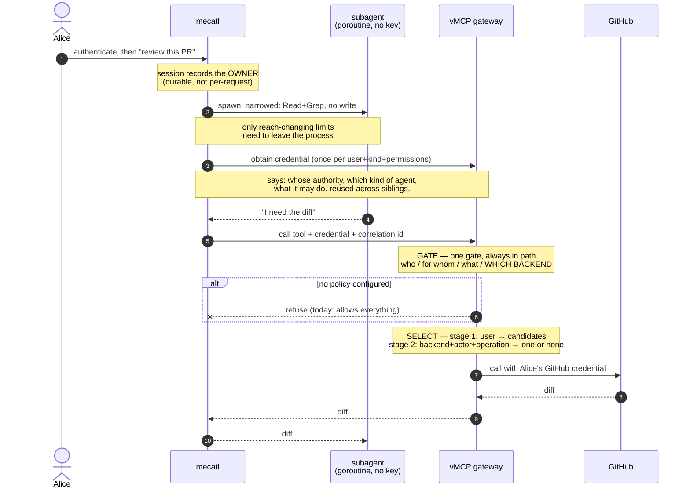

# Agent identity, part 2: the outbound hop

*Status: strawman / working draft. Speculative scoping, not a design record under
[ADR 0002](adr/0002-documentation-lifecycle.md). Companion to
[`docs/agent-identity-model.md`](agent-identity-model.md), which this takes as its
premise and does not restate. Same tier as
[`docs/scoped-resource-grants.md`](scoped-resource-grants.md).*

## The flow at a glance



The two places the design does real work are the gate and the select, and they are
different questions. The gate asks whether this call is allowed. The select asks which of
Alice's credentials, if any, this particular call justifies using. Today the gate cannot
see the backend, and the select happens before the gateway knows what is being called.

| Hop | What changes |
|---|---|
| 1 · authenticate | Session gains an owner. Scheduled runs get one too, since they never cross an edge. |
| 2 · spawn | Reach-changing limits must survive outside the process; cost limits need not. |
| 3 · get credential | One shared credential plus a correlation id. Needs a provisionable confidential client. |
| 4 · call | Already correct — nothing but the credential decides anything. |
| 5 · gate | Pass the backend. Refuse when no policy and credentials are attached. |
| 6 · select | Key on the user, then narrow by backend and operation. **The substantive piece.** |
| 7 · backend | No change. The chain stops at the gateway; say so. |
| 8 · park/resume | Derive from the live caller where there is one. |

---

## What this decides

[`agent-identity-model.md`](agent-identity-model.md) models identity from the user down
to the subagent and stops at the boundary. This doc covers what happens at that boundary
and beyond it: how the harness reaches a tool, what a gateway decides, and how a user's
stored third-party credential gets used without handing the agent more than it was
given.

It also lists what has to change, in which repository, in what order. A design that says
what should happen without saying what to build is not actionable.

**What it takes as given.** The three-tier model, subagents not being network entities,
mecatl as its own issuer, and the parkable-credential lifecycle. Those are settled in the
companion doc.

**How to read the annotations.** Each step says what should happen and why. A quoted
block then says what happens today and what the difference costs. Those blocks are a cost
signal, never a constraint: mecatl, vMCP and ToolHive are built by the same team, and two
branches already exist because someone decided a change was needed. A missing interface
is a thing to build.

---

## The properties this is built on

One test, then what it rules out.

**A binding should constrain, never grant.** The test is whether removing it increases
what the holder can reach. Take away a session pointer and the holder reaches less, so
the pointer grants. Take away a holder key and a stolen copy becomes usable, so the key
constrains. Anything that increases reach is a key with the word "binding" on it.

From that, and from what mecatl is:

- **The credential must be safe in hostile hands.** The thing holding it is driven by a
  language model reading untrusted input. Everything it can cause must already be
  permitted.
- **A pointer must not widen.** A reference is fine if following it is limited by what
  the token says. It is unsafe when the read ignores the token's own limits.
- **The limits must be visible where the credential is used.** Otherwise every narrowing
  the harness performs stops at its own edge.
- **No keys below the pod.** Subagents are goroutines, so identity below that is a claim,
  not a credential.
- **It survives rehydration.** Sessions park for hours and resume elsewhere.
- **It works with no user.** A scheduled run has none.
- **Missing means nothing.** A credential with no limits attached gets the least access,
  not the most.

Two more that came out of the standards rather than from mecatl:

- **Identity and authority are separate credentials.** WIMSE keeps them apart
  deliberately: a WIT carries `iss`/`sub`/`exp`/`jti`/`cnf` and no authority at all, and
  `-workload-creds` §7 says authorization happens separately at the receiver. Folding
  authority into an identity credential is a choice to argue for, not a default.
- **Sharing a credential and attributing an action are both required, and they do not
  conflict.** One credential can be reused across concurrent siblings while a logged
  correlation value still says which one acted. See hop 3.

---

## A worked example

Alice asks her agent to review an open pull request. The agent spawns a code-reviewer
subagent, which needs the diff from GitHub. GitHub is reached through vMCP, and vMCP
holds Alice's GitHub credential.

One path, eight steps. Where it genuinely forks, the fork is marked. Two parallel
narratives are how a prerequisite gets stated in one and silently assumed in the other.

---

### Hop 1 — Alice authenticates and the session records who owns it

**What should happen.** Alice authenticates once, and the session stores who owns it. The
owner is a property of the session, not of the request that created it.

That matters because work can begin without a request. A scheduled run starts itself,
in-process, and never crosses a network edge. If the edge is the only place an owner gets
assigned, that work has none — and no amount of key or issuer machinery reaches it,
because it never passes the point where identity is attached.

**When there is no human.** A scheduled run should authenticate as itself, and the audit
record should say the schedule did this. The alternative is a service account holding a
stored long-lived credential, which brings back the stored-secret problem this design
exists to remove and puts a false name in the log.

> **Today.** Session creation has no owner field, on either the session or the team
> request. `makeFireFunc` calls `CreateSessionWithProfile` in-process from a
> leader-elected goroutine, so a scheduled fire never reaches the interceptor that would
> assign one.
>
> **Change.** An owner on session creation; an owner on the schedule; the fire path reads
> it. New, small, mecatl-side. Everything downstream needs it.

**What an attacker gets.** An edge that records the wrong user poisons every credential
minted under it, and nothing downstream can tell.

The obvious defence does not work. If the edge signs the binding and the store records it
and audit compares them, a compromised edge holds the signing key and writes the same
wrong answer in both places. What works is anchoring to something the edge cannot forge:
keep the original assertion's issuer and identifier, so an auditor can re-check against
the identity provider rather than against the component under suspicion.

---

### Hop 2 — the parent spawns a subagent and narrows what it may do

**What should happen.** The child gets a strict subset of the parent's authority, chosen
at spawn, and cannot widen it. It holds no key. Its identity is a claim the parent caused
to be minted.

**Only some of the narrowing needs to leave the harness.** Which tools the child has, and
whether it may write, change what it can reach. Turn limits, tool-call ceilings and
timeouts change what it costs. The first kind has to survive to the point where a
credential is used. The second never leaves.

**Narrowing that nobody outside can check is a convention.** mecatl's containment is real
and tested — the composed catalog, the deny-dominant evaluator pinned to an audience —
but it runs entirely inside the process. That stops the harness doing the wrong thing by
accident. It does not let anyone else confirm it didn't.

> **Today.** The narrowing works, in-process. Nothing carries the reach-changing part
> outward.
>
> **Change.** That part has to reach whatever decides at hops 5 and 6. How much travels
> in a credential and how much a policy already knows is open — see the end.

**What an attacker gets.** Prompt injection at the *parent* is worse than at a child,
because the parent picks the child's tools, mode and prompt. Identity cannot prevent
that; the attacker is driving the harness's own reasoning from inside the pod.

It does bound it. A ceiling carried in the credential limits what a compromised parent
can hand out, which is the difference between a bad turn and an unbounded one. Cutting
the other way, the harness defences this leans on are posture-conditional — guardrails
drop to advisory at the top of the posture ladder — so containment is weakest where the
model is trusted most.

---

### Hop 3 — the harness gets credentials to call the gateway

**What should happen.** One credential, shared, plus a correlation value on each call.

**The credential** says whose authority is being used, which kind of agent is using it,
and what that kind may do. It is obtained once per distinct combination of those and
reused. Eight concurrent code-reviewer subagents working for Alice share one, because
minting per call puts a network round trip in front of every tool use and there is no
token cache in the gateway's proxy path today.

**The correlation value** names the individual subagent and the specific call. It is not
a credential and is not signed. Both sides log it, and joining the two logs answers
"which subagent did this".

**Why not a second credential for the individual.** Because a subagent never holds one.
The harness holds the credential and makes calls on behalf of its children, so there is
no per-subagent token that could be stolen, replayed, or revoked. Containing a misbehaving
subagent is cancelling a goroutine the parent already owns, not revoking a token.

A signed second credential would only be worth it if the gateway needed to *authorize* on
the individual instance, and it cannot usefully: instances are ephemeral and unnamed in
advance, so no policy could reference one. The harness is also the only thing that could
forge the value, and it is already trusted to name the actor in the shared credential —
so signing it adds nothing.

> Recorded because this went back and forth. An earlier version of this analysis proposed
> two credentials, on the strength of `draft-mcguinness-oauth-ai-agent-instance` requiring
> per-instance revocation. That draft is written for agents as independent processes
> holding their own credentials. Our subagents hold nothing, so the requirement does not
> transfer. If the gateway ever needs to attribute without reading our logs, the
> second-credential shape is available and `draft-ietf-oauth-transaction-tokens` is the
> mechanism — but that is a credential on every call to save a log join.

**The subagent is not a party to any of this.** It is a goroutine with no key, so the
harness obtains credentials on its behalf. That is not a compromise. There is nothing
below the pod any attestor can reach, so a per-subagent credential would be an assertion
dressed as an attestation.

Worth knowing that the standards are moving away from us here rather than toward us.
WIMSE defines a workload as independently addressable and executable, so a goroutine has
no slot in that vocabulary — and the newest agent-specific drafts raise that floor rather
than lowering it. `draft-sweeney-wimse-credential-delegation` requires every agent to
generate its own keypair at instantiation, with no provision for agents that lack private
keys. `draft-reece-wimse-cross-org-delegation` defines an agent as a workload in the
WIMSE sense. So the sub-workload tier is ours to handle and will stay that way; we should
not plan on a standard growing into this shape.

**Nothing here may be a pointer.** A claim that dereferences to a credential set is a key
by the test above. These credentials state their authority rather than referring to
authority held elsewhere.

**Where SPIFFE fits.** The harness must authenticate as a registered client to get the
shared credential. An X.509-SVID over mutual TLS does that with no static secret in the
process environment, which matters concretely — `envscrub` exists because under posture
`auto` or `yolo` the model can read its own environment. Per-pod attestation comes with
it.

**Client authentication and the policy subject are one decision, not two.** The identity
that lands in the credential is the client identity, so authenticating with an SVID makes
`client_id` a SPIFFE URI, which flows into the actor claim, which is what policy reads.
Choosing the authentication method chooses the policy subject.

That is a reason to prefer it rather than a cost. A definition name is a local string that
means whatever the config says; a SPIFFE ID is namespaced and structured. In a
single-tenant deployment the difference is cosmetic. In the multi-tenant one this design
targets, it is not.

The objection to a SPIFFE-shaped policy subject is that an SVID path encodes the
deployment, so a trust-domain rename rewrites every rule. That is largely avoidable, and
avoiding it is a path-design decision worth making early: **put the agent definition in
its own path segment** so a rule can match the suffix and never name the trust domain.

**None of this is required.** An ordinary confidential client reaches the same credential
and the design runs. What SVID authentication buys is three things at once — no secret for
the model to read, per-pod attestation instead of "whoever holds the secret", and a
namespaced policy subject for free — using a registered mechanism rather than an invented
one, so it works against any authorization server that implements it.

> **Today.** No client that may use the exchange grant can be provisioned at all:
> registration hardcodes clients as public, permits only `authorization_code` and
> `refresh_token`, and there is no static-client config, so the path is reachable only
> through a test seam. Client authentication is not the obstacle —
> `client_secret_basic` works with no new code. SPIFFE client auth exists on the
> `spiffe-authserver` branch and is deliberately deferred in
> [#5194](https://github.com/stacklok/toolhive/issues/5194), which extracted the
> OAuth-only path first.
>
> **Change.** Provisioning: a static confidential client, or relaxed registration. Small,
> and it blocks everything after it.

**What an attacker gets.** Whoever holds the shared credential can act as that kind of
agent for whatever it names, which is the argument for it naming little and expiring
fast. An attacker inside the process gets what the model gets, which is the argument
against a static secret. An attacker who can make the harness request a credential naming
a user it is not acting for defeats everything downstream, which is what the consent
check on the subject token is for.

---

### Hop 4 — the harness calls a tool

**What should happen.** The call carries the credential and the correlation value, and
nothing else that matters. No header the gateway reads for identity. Everything *decided
on* travels in the credential, because anything else cannot be verified at the far end;
the correlation value is logged, never authorized on, which is why it does not need to
be.

This is what makes the subagent tier safe. A subagent cannot talk its way into a stronger
identity by manipulating a header, because there is no header to manipulate. Its identity
was fixed when the harness minted the credential, before it ran.

> **Today.** The inbound path reads only `MCP-Protocol-Version` and `Accept`, and the
> identity struct has no header-populated field, so this already holds. Worth keeping
> when the outbound path stops baking a static header map into a client at dial time.

**What an attacker gets.** Prompt injection reaching the subagent is expected, not
exceptional. What it buys is bounded by what the credentials permit, which is why hop 3's
narrowing carries the weight.

---

### Hop 5 — the gateway decides

**What should happen.** One gate, always in the path, that sees the whole question: who
is acting, for whom, on what, at which backend. It decides before any credential is
selected, and refusing stops the call.

**One gate rather than several.** A check that lives in each outbound path can be left
out of one of them, and the omission is invisible until someone finds it. A single gate
can be wrong, but it cannot be absent.

**What the decision needs to see.** The acting agent, so policy can be written about
agents and not only users. The operation, so reading and writing differ. And the backend,
because "may this agent read" and "may this agent read GitHub" are different questions,
and only the second is useful when one gateway fronts several backends holding different
credentials.

**Missing must mean refusal.** A gateway with credentials attached and no policy written
should serve nothing. Allow-all is a reasonable default for a proxy with nothing to hand
out, and the wrong one the moment there is something.

> **Today.** Admission is already the single gate and already always in the path. It
> receives the acting agent as a nested claim and a read/write hint from the backend's
> own tool annotation. It does not receive the backend — that identifier exists on the
> tool and is not passed. With no policy configured the gate is allow-all, so a
> deployment with credentials wired and no policy serves any advertised tool to any
> authenticated caller.
>
> Two sharper edges. The read/write hint is whatever the backend declared, absent by
> default, with no fallback, so a policy has to decide what an unannotated tool means.
> And pinning a primary upstream provider causes the issued token's claims to be
> discarded, so the acting agent disappears and a policy written about it stops matching
> rather than starting to fail.
>
> **Change.** Pass the backend identifier. Make absence refuse when a credential store is
> attached. Stop discarding the issued token's claims. Choose the unannotated default.
> All fixes to an existing gate; no new component.

**What an attacker gets.** This is where a confused deputy is caught or not. The agent
cannot read Alice's credentials, but it can ask the gateway to use them, and the gate is
the only thing between the request and that use. A gate that cannot see the backend can
be talked into using the wrong credential for a call it was willing to allow. A gate that
is absent can be talked into anything.

One rule worth taking verbatim from `draft-hartman-credential-broker-4-agents-00`: *"The
PDP MUST NOT evaluate justification text for approval decisions."* Agent-authored prose
must never influence the decision. In an agent deployment that is the entire
prompt-injection surface, not a refinement.

---

### Hop 6 — the gateway picks a credential and uses it

**What should happen.** Two stages, in order.

**First, which credentials are candidates.** The credential belongs to the user, so this
keys on the user. Not on a session, not on a login — those describe a browser visit, and
the question here is whose credential this is.

**Second, which one may be used for this call.** That takes the backend being routed to
and the decision from hop 5. The result is one credential or none.

**Why the first stage cannot key on a login session.** A pointer minted when a human
logged in through a browser describes an episode, not an entitlement. An agent has no
such episode: nothing mints one for it, and where a user's token carried one, exchanging
it for a delegated credential drops it. So a design that looks up credentials by login
session cannot serve an agent. There is nothing to manage here, nothing to keep fresh.

**And the user has to be somewhere the lookup can read.** If the credential names the
acting agent as its subject, the user sits one level in. Whatever holds it has to be
legible at this hop. A design that puts the user only in a structure declared unreadable
has made the lookup impossible.

**Why the second stage cannot be skipped.** Keying on the user alone returns everything
the user has. The first stage narrows to a person; the second narrows to a purpose.
Without it, every delegated credential reaches every credential its user owns, and the
narrowing from hop 2 stops at the gateway's front door.

**Missing anything means nothing is used.** No decision, no backend, no user — no
credential.

> **Today.** The read keys on the login-session pointer and returns every credential
> filed under it. There is a real interface behind it that a filtering implementation
> could replace, but it runs in HTTP middleware before routing, so at that point there is
> no tool, no backend and no arguments — the code says so itself. Selection happens
> afterwards in the outbound strategies, by a provider name fixed in static config rather
> than derived from the call.
>
> The enterprise user-keyed decorator already replaces the login-session key with a user
> key, which is the first stage. It sits below the same interface, so it sees no more of
> the call than the layer above.
>
> **Change.** Stage one is largely a port of work that exists. Stage two needs hop 5's
> decision to reach the point of selection, which currently runs before the gateway knows
> what is being called. That is the substantive piece of this design.

**Nobody has specified stage two, so we are building it.** RFC 9396 says there is no
standardized way to compare two authorization detail requests and puts comparison out of
scope. Several drafts get close to this problem — a credential-exchange draft declines it
explicitly as unfittable to one protocol, a delegation draft routes through an opaque
handle and leaves the vault's organisation undefined, a broker draft defines no way to
choose among several credentials for the same user and service. All of them hand the
remainder to an unspecified policy point.

That is worth knowing for one reason only: nobody is about to hand us an answer, so this
is ours to build and we should build the simplest thing that satisfies the properties.

Two things worth borrowing rather than reinventing, if and when they fit. A recent WIMSE
delegation draft independently arrives at the same two-stage split — authorization
depending on the agent's conveyed authority and the principal's entitlements as separate
inputs — which is mild evidence the shape is right rather than a reason to adopt anything.
And if we end up carrying authority in the credential, one draft has a worked containment
algorithm (tool-set subset plus per-constraint subsumption) that beats inventing one.

**One friction worth naming.** The actor-profile draft permits reading an inner chain
entry as an authorization input, but a resource server's default is the outermost actor.
Our authorization-relevant identity is the user, which sits inner. So traversal is
allowed and is not what a conformant reader does first — an argument for carrying the
user where the reader already looks, rather than relying on it walking the chain.

**What an attacker gets.** Reaching stage one as the wrong user gets that user's whole
credential set, which is why the key has to be an entitlement rather than an episode.
Reaching stage two unchecked gets the right user's whole set, which is the confused
deputy one layer lower. And a stored credential never checked against the identity that
stored it lets a chain rooted at one user reach another's — worth naming because that
check is declared in the code and never performed.

---

### Hop 7 — the backend serves the call

**What should happen.** The backend gets a credential it already understands, for a call
already authorized, and verifies what it always verifies. It learns nothing about agents
or delegation.

That is a goal, not a shortfall. A backend has no policy about mecatl's subagents it
could apply, and making it understand our vocabulary would turn every integration into a
negotiation.

**The chain does not reach here.** Whatever the gateway minted or injected is what the
backend sees. RFC 8693 §2.1 is explicit that an exchange *"is a one-time event and does
not create a tight linkage between the input and output tokens"*, so a backend cannot
walk it back. Any claim that a third party can verify the chain has to be scoped to **the
gateway**, not the resource server.

That is the right place — the gateway is where the claimed authority and the credential
about to be used are both visible, and the only hop where refusing prevents anything. But
the boundary should be stated rather than implied to extend further.

> **Today.** This already holds. The outbound strategies derive a credential from stored
> tokens or an exchange, and none read the inbound claims. No change; the deliverable is
> accuracy.

**What an attacker gets.** The backend cannot tell the agent from the user, so attribution
there is only as good as the gateway's audit record. That puts the gateway inside the
trust boundary for attribution, which is fine and worth saying, because "verifiable by
anyone with the bundle" reads as though it were not.

---

### Hop 8 — the session parks, then resumes somewhere else

**What should happen.** The credential expires. The authority does not. On resume the
credential is re-derived, never wider than before.

**Where there is a live caller, derive from that caller.** Someone who just authenticated
is a stronger statement than a row saying they once did. This covers more cases than it
seems: approve-after-restart comes from an inbound request, so a human clicking approve
is authenticated; a resumed subagent runs under a live parent turn; a background child is
run-scoped with a live parent. The only case with nobody present is the scheduled run
from hop 1 — which already has its own stored owner and its own no-user credential.

**Authority must not be read out of a row that anything can write.** If the stored record
is the authority, whatever can write the store can grant authority, and the identity
layer is decoration on a database.

> **Today.** Sessions park and resume on other pods, and the persisted labels have no
> integrity protection — rehydration trusts them verbatim, including the permission
> posture. So monotonic attenuation across resume is one write away from false, and the
> store is currently unauthenticated.
>
> **Change.** Derive from the live caller where there is one, which covers nearly every
> path and costs almost nothing. Sign the chain at mint and verify before re-minting for
> the one path where nobody is present. Much smaller than signing for all of them.

**What an attacker gets.** Someone who can write the store but cannot sign is a distinct
and likelier adversary than one who has compromised a pod — a leaked database credential
rather than code execution. That adversary is precisely who chain integrity defeats, and
folding the two together into "the pod that can sign can impersonate anything" makes the
mitigation look less valuable than it is.

---

## The steps as interfaces

Written as signatures rather than prose, because prose let several things stay vague that
a type does not. These are shapes, not literal Go, and they span two codebases.

Each step's output has to be the next step's input. Where it is not, that is a finding.

```
Hop 1   BindPrincipal(inbound Request)            -> (Principal, error)
        OwnerOf(spec ScheduleSpec)                -> (Principal, error)

Hop 2   Narrow(parent Authority, spec SpawnSpec)  -> (Authority, Limits, error)

Hop 3   DelegatedCredential(
            subject UserToken, def DefinitionID,
            a Authority, aud Audience)            -> (Credential, error)
        ClientCredential(
            def DefinitionID,
            a Authority, aud Audience)            -> (Credential, error)

Hop 4   Call(c Credential, corr Correlation,
             tool ToolName, args Args)            -> (Result, error)

Hop 5   Decide(claims Claims, tool ToolName,
               backend BackendID, op Operation)   -> (Decision, error)

Hop 6   Candidates(u UserID)                      -> ([]StoredCredential, error)
        Select(cands []StoredCredential,
               backend BackendID, d Decision)     -> (StoredCredential, error)

Hop 8   Rederive(s Session, caller *Principal)    -> (Credential, error)
```

Six things the signatures expose that the prose hid.

**`Principal` is a sum type, not one thing.** Hop 1 produces either a user or a client,
and hop 3 has a different constructor for each. Writing "the principal" throughout let
that stay invisible. Anything consuming a `Principal` has to handle both, and the audit
record differs.

**`Narrow` returns two values, and only one of them travels.** `Authority` is the
reach-changing part — tools, mutation, resources — and crosses the boundary. `Limits` is
turns, tool calls and timeouts, and never leaves the process. Separating them in the type
is what stops the second kind accidentally becoming a claim.

**Two credential constructors, not one with a nullable subject.** They are different
grants and different trust models: one exchanges a user's token, the other authenticates
as the harness. A single function with an optional user is how the unattended path ends up
sharing validation it should not.

**`DelegatedCredential`'s parameters are exactly the cache key.** That falls out rather
than being designed, which is a good sign. It also means adding a parameter later silently
fragments the cache.

**`Operation` has three values, not two.** Read-only, mutating, and unknown — because the
hint comes from the backend's own tool annotation and is absent by default. Policy has to
handle unknown explicitly. A two-valued type here is how an unannotated tool quietly gets
treated as safe.

**`Select` needs two distinct errors.** "This user has no credential for that backend" and
"this caller may not use it" are different conditions. Collapsing them makes a permission
failure indistinguishable from a missing integration, which is both a bad diagnostic and a
small information leak.

And one thing the signatures make obvious that was easy to miss in prose: **`Decide` takes
`backend`, and `Select` takes the `Decision`.** Today the gate is not given the backend,
and selection happens before routing so it cannot receive a decision at all. The two
missing arrows are the design's actual work, and they are visible here as parameters that
have nowhere to come from.

`Rederive`'s caller is a pointer on purpose. Non-nil is the common path and the cheap one.
Nil is the scheduled run, and the only case that needs the signed chain.

---

## What has to change, on each side

Organised by codebase, each tied to the interface it serves. Everything here is fungible —
these are cost signals, not constraints.

### mecatl

| Interface | Change | Where |
|---|---|---|
| `BindPrincipal` | A principal field on session creation, on both the session and team requests | proto contract, `session` aggregate, server adapter |
| `OwnerOf` | An owner on `ScheduleSpec`, read by the fire path | `makeFireFunc` calls `CreateSessionWithProfile` in-process, so it never crosses the interceptor that would assign one |
| `BindPrincipal` | Labels must reach children, and empty must be rejected rather than compared | `buildChildSession`, `runBranch` and `Supervisor.sessionID` call `session.New` with no labels; the only writer lives in the server adapter, off every child-spawn path |
| `Narrow` | Split the returned authority from the limits, so only the reach-changing part can travel | today both are internal — catalog composition plus the audience-pinned evaluator |
| `DelegatedCredential`, `ClientCredential` | Mint in composition, never behind a port the loop calls | the loop must stay identity-agnostic. `TeamMemberEngineFactory` and `WithSubagentEngineFactory` are the existing shape: composition-supplied closures, with `engine/agent` carrying only an opaque string on `parentCaps`, following the `forkHistory` precedent |
| `Call` | A per-call correlation value | the MCP adapter bakes a static header map into a client at dial time; nothing is per-call today |
| `Rederive` | Derive from the live caller where there is one | the rehydration seam exists; it currently trusts persisted labels verbatim, including the permission posture |

### vMCP and ToolHive — fixes on `main`

| Interface | Change | Where |
|---|---|---|
| `DelegatedCredential` | Make a confidential client provisionable | registration hardcodes clients public, rejects any auth method but `none`, and permits only `authorization_code` and `refresh_token`; there is no static-client config. **This blocks everything else.** |
| `Decide` | Pass the backend identifier to the gate | it exists on the tool type; admission passes only the name |
| `Decide` | Refuse when a credential store is attached and no policy is configured | the authz factory returns nil, which becomes an allow-all admission whose check returns true unconditionally |
| `Decide` | Stop discarding the issued token's claims when a primary upstream provider is pinned | claim resolution swaps to that provider's token, so the acting agent disappears and policy stops matching rather than failing |
| `Select` | Check the stored credential against the identity that stored it | the error for this is declared and never returned on that path |
| — | Advertise the grant, and a client-auth method, in discovery | discovery lists only `authorization_code` and `refresh_token`, and only `none` |

### vMCP and ToolHive — exists but unwired

| Interface | Change | Where |
|---|---|---|
| `DelegatedCredential` | Wire the multi-issuer subject-token validator | it exists with tests and has no non-test callers; the factory wires the self-issued one only. [#5989](https://github.com/stacklok/toolhive/issues/5989) gates it on a consent model, because external tokens often carry no `client_id` and fail the consent check closed |
| — | Wire the token cache | `pkg/vmcp/cache` declares the cache and is referenced nowhere outside its own package; two strategies keep private per-config caches instead |

### vMCP and ToolHive — ports from branches

| Branch | What to take | Note |
|---|---|---|
| `token-delegation` | The `oidc-trust` upstream type and its config surface — this is what lets hop 3 accept a subject token from the corporate IdP | **Port the config surface onto main's handler, not the branch's.** The branch handler predates main's hardening and lacks the consent check, `act` nesting and audience narrowing. |
| `spiffe-authserver` | The client-auth strategy, its middleware, and one wiring line | Auto-registers a **confidential** client with both `client_credentials` and `token-exchange`, so this is also a candidate answer to the provisioning blocker above |

### Doesn't exist anywhere

| Interface | Change |
|---|---|
| `Candidates` | Key the credential read on the user rather than a login session. The enterprise user-keyed decorator already does this and is a port rather than new work |
| `Select` | **Stage two.** The decision from the gate has to reach the point of selection. The credential read has a real interface behind it, but it runs in HTTP middleware before routing, so there is no tool, no backend and no arguments at that point. Moving or splitting it is the substantive piece of this design |

### Order

Provisioning and the external-issuer path gate everything — without them there is no
credential to reason about. Session and schedule ownership gates the mecatl side
independently, so it can proceed in parallel.

Then the gate's two missing inputs and its fail-closed default, since those are small and
make the gate correct before anything depends on it.

Then stage two, which is the design's real work.

Caching matters before fan-out is usable but not before it is correct. The SPIFFE port is
not on the critical path, though it is the recommended default and may be the cheapest
route to the provisioning blocker.

---

## Deliberately open

**Where the user is carried, given the subject names the agent.** The lookup needs it
legible. Which claim holds it is a naming decision with a caching consequence, because it
becomes part of the key.

**How much narrowing travels in a credential versus living in policy.** The drafts
genuinely disagree, so this is not a settled question we are ducking.
`draft-mcguinness-oauth-actor-profile-00` says it *"operates at the representation and
propagation layer, not at the authorization policy layer"*.
`draft-liu-oauth-chain-delegation-00` puts it in the token with a MUST-subset the
resource server verifies. Since a child's tool set is largely determined by its
definition, policy can name most of it directly, and only what genuinely varies per spawn
needs to travel. Read-versus-write is the clear case; whether anything else qualifies is
worth settling before committing to a structured authority claim.

One shape constraint if we do carry it: fields inside a single `authorization_details`
object combine as a cartesian product, so this needs one object per backend-and-operation
cluster rather than one large object.

**What an unannotated tool means.** No fallback classifier exists, so this is a default
somebody chooses.

**Whether SPIFFE is on the critical path.** It is required for no hop above. It is
required for one thing: an agent identifier a policy can name as a SPIFFE ID. Whether
that is worth the port is a judgement about where policy is heading.

---

## References

- RFC 8693 (token exchange: §1.1 delegation versus impersonation, §2.1 no linkage between
  input and output tokens, §4.1 the current actor and identity-only `act` contents),
  RFC 9396 (`authorization_details`; §2.2 the field model, §6.1 no standardized
  comparison), RFC 8705 (mTLS client authentication), RFC 9068 §2.2 (`client_id` in
  conformant JWT access tokens), RFC 7523 (JWT assertion grants)
- Adopted drafts: `draft-ietf-oauth-transaction-tokens` (per-call context inside a trust
  domain), `draft-ietf-oauth-identity-chaining` (§2.5 no higher privilege than the subject
  token), `draft-ietf-oauth-identity-assertion-authz-grant` (ID-JAG),
  `draft-ietf-oauth-spiffe-client-auth`
- Individual drafts: `draft-mcguinness-oauth-ai-agent-instance` (per-instance identity and
  revocation), `draft-mcguinness-oauth-actor-profile` (actor semantics, layer scope),
  `draft-liu-oauth-chain-delegation` (in-token subset), 
  `draft-niyikiza-oauth-attenuating-agent-tokens` (§4.5, §7 containment algorithm),
  `draft-hartman-credential-broker-4-agents` (broker model; the justification-text rule)
- WIMSE: `draft-ietf-wimse-arch` (§2 the workload floor, §4.3 constrain, §4.5 authentication
  is not authorization), `draft-ietf-wimse-workload-creds` (§5.1, §7 identity and authority
  are separate)
