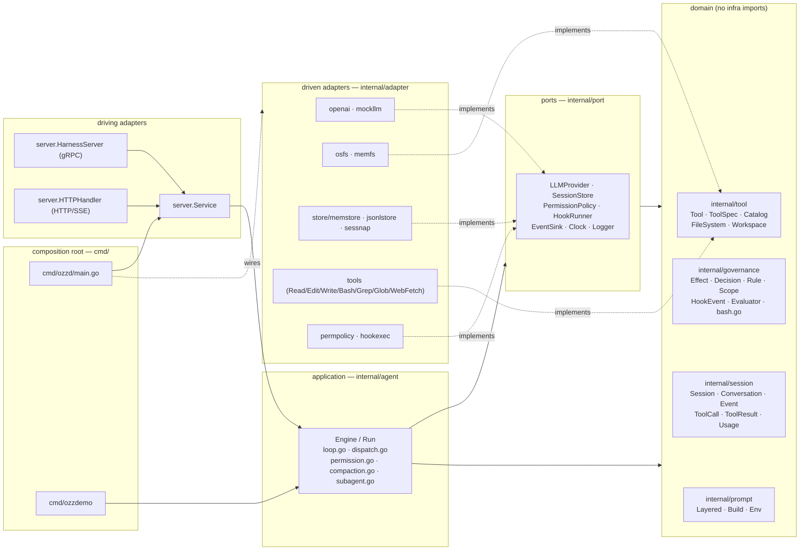
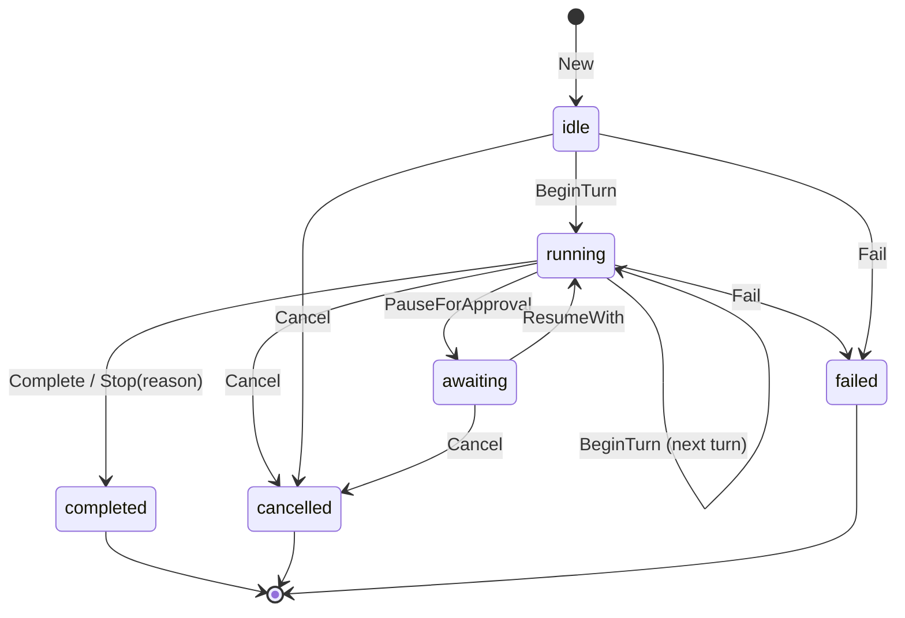
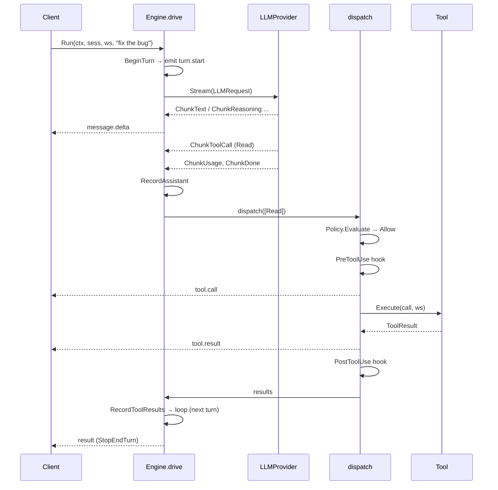
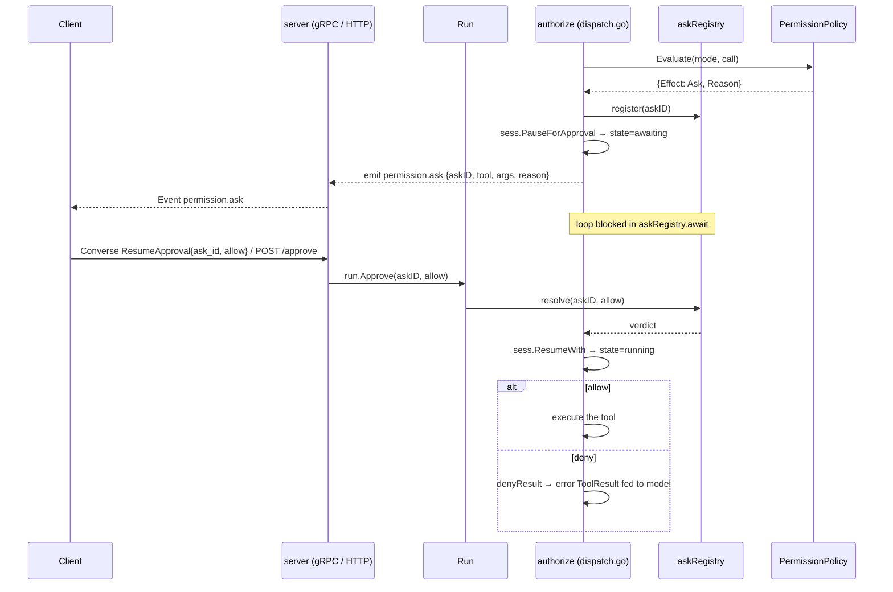

# ozzharness — Architecture

> Reader-facing architecture guide. This describes the **code as it exists** in
> `internal/`, `cmd/`, and `contracts/`. Where the design notes in
> `docs/design/` differ from the implementation, this document follows the
> implementation.

## 1. What it is

ozzharness is a **headless agentic coding harness**: a service (and library)
that runs the agent loop — call the model, stream its output, execute coding
tools, enforce permissions and hooks, and emit a single typed event stream.
There is no TUI. Clients drive it over **gRPC** (a bidirectional `Converse`
stream) or **HTTP/SSE**. Both surfaces speak one provider-neutral domain
`session.Event` and call the same application service; neither ever sees an
OpenAI type.

The system is built **hexagonally (ports & adapters) with a DDD core**.
Dependencies point inward only: a domain of pure value objects and aggregates
(`session`, `governance`, `tool`, `prompt`), a set of port interfaces the
application consumes (`port`), the application use-case layer that is the agent
loop (`agent`), and adapters that implement the ports (`adapter/*`). The LLM
provider sits behind the `port.LLMProvider` seam, with the OpenAI Responses API
isolated entirely inside `internal/adapter/openai`, so the core is
provider-agnostic and unit-testable against fakes (`mockllm`, `memfs`,
`memstore`).

## 2. The big picture



**Dependency direction is inward only.** The allowed-imports rule, stated by the
per-package `doc.go` files and honoured by the code:

| Package | May import |
|---|---|
| `session`, `governance`, `tool`, `prompt` (domain) | stdlib + other domain packages. Never `adapter`, `agent`, `contracts`, `os`, or any third-party library. |
| `port` | domain packages + stdlib (`context`, `io`, `iter`, `time`). |
| `agent` (application) | domain + `port` + stdlib only. Never an adapter or `contracts`. (Tests may import adapters.) |
| `adapter/*` | domain + `port` + the one external lib it adapts. Never `agent`. |
| `contracts/gen` | generated; protobuf + gRPC runtime. |
| `cmd/*` | everything — this is the only place concrete adapters meet ports. |

Two deliberate cycle-breaks worth noting, documented in code:
- `port` imports `tool` and `prompt` (because `LLMRequest` carries
  `[]tool.ToolSpec` and `prompt.Layered`) — see the package note at the top of
  `internal/port/llm.go`.
- `FileSystem`/`Workspace` live in `internal/tool`, **not** `internal/port`,
  because `port` already imports `tool` while `tool.Tool.Execute` takes a
  `Workspace`; defining them in `port` would form a `port↔tool` cycle. See the
  package note in `internal/tool/tool.go`.
- `governance` does **not** import `session` (so `session` can import
  `governance` without a cycle); the `Evaluator` works on primitive args, and
  the `permpolicy` adapter bridges `session` types into it.

## 3. The domain model

### Session aggregate (`internal/session/session.go`)

`Session` is the aggregate root. Outside code holds a `SessionID` and reaches
inner entities only through intention-revealing methods, so the state machine
and stop conditions always hold. There are no public setters for lifecycle
state; mutation flows through methods such as `BeginTurn`, `RecordAssistant`,
`RecordToolResults`, `RecordUserPrompt`, `ReplaceHistory`, `PauseForApproval`,
`ResumeWith`, `Complete`, `Stop`, `Cancel`, `Fail`.

States (`session.State`): `idle`, `running`, `awaiting`, `completed`, `failed`,
`cancelled`. The last three are terminal (`State.IsTerminal()`).



Notable, code-accurate details:
- `BeginTurn` is legal from `idle` **or** `running` (a follow-up model call in
  the same run) and increments `Counters.Turns`. It does **not** itself enforce
  limits; the loop consults `StopReason()` as a pre-turn guard.
- `Cancel`/`Fail`/`Stop`/`Complete` are legal from any non-terminal state and
  clear any pending ask.
- `ResumeWith()` takes **no** governance argument and returns the resolved
  `PendingAsk`. The aggregate only reconciles its own lifecycle; the loop owns
  acting on the decision. This keeps `session` a clean domain leaf with no
  `governance` dependency in its method signatures.

`Limits` (`MaxTurns`, `MaxToolCalls`, `MaxConsecutiveFailures`) and `Counters`
(`Turns`, `ToolCalls`, `ConsecutiveFailures`) drive stop conditions. A **zero
limit disables** that condition — which is why the composition root injects
non-zero defaults. Three derived predicates:
- `LimitTripped()` — pure; reports the limit-implied stop reason.
- `RecordedStopReason()` — pure; the faithful terminal reason recorded via
  `Stop/Cancel/Fail/Complete` (used by persistence; performs no derivation).
- `StopReason()` — `RecordedStopReason()` first, else `LimitTripped()`; the
  loop's pre-turn guard. Its godoc explicitly warns it conflates the two and is
  not a faithful witness — persistence must use `RecordedStopReason()`.

`PermissionMode`: `default`, `plan` (read-only toolset enforced), `acceptEdits`.

### Conversation / Message / Turn (`internal/session/conversation.go`)

`Conversation` holds the ordered, model-visible `[]Message`. `Message` is an
immutable value object built via `NewUserMessage`, `NewSystemMessage`,
`NewAssistantMessage(text, reasoning, calls)`, `NewToolMessage(result)`. Roles:
`system`, `user`, `assistant`, `tool`. `Message.Reasoning` carries the
provider's opaque reasoning item, replayed back verbatim and never interpreted.
`Turn` is a value object summarizing one model call plus its results and usage
(defined but not the primary carrier — the loop appends messages directly).

### Value objects

- `ToolCall{ID, Name, Args json.RawMessage}` (`toolcall.go`) — produced by the
  LLM, consumed by tool + governance; `NewToolCall`.
- `ToolResult{CallID, Content, IsError}` — `NewToolResult` / `NewToolError`;
  an error result is still fed back to the model so it can recover.
- `Usage{InputTokens, OutputTokens, CacheReadTokens, CacheWriteTokens}`
  (`usage.go`) with `CacheHitRate()` and an immutable `Add(other) Usage`.

### Event taxonomy (`internal/session/event.go`)

`EventType` is the single, provider-neutral taxonomy shared by the loop and the
API. The real constants:

| EventType value | Const | Emitted when |
|---|---|---|
| `session.init` | `EvSessionInit` | run starts (declared; loop emits `turn.start` first) |
| `turn.start` | `EvTurnStart` | beginning of each turn |
| `message.delta` | `EvMessageDelta` | streamed assistant text delta |
| `tool.call` | `EvToolCall` | a tool is about to run |
| `tool.result` | `EvToolResult` | a tool result (incl. denies / hook blocks) |
| `permission.ask` | `EvPermissionAsk` | loop paused for client approval |
| `hook` | `EvHook` | a hook fired (e.g. PreToolUse block) |
| `compaction` | `EvCompaction` | a compaction boundary crossed |
| `result` | `EvResult` | terminal: carries `ResultPayload{Stop, Text, Usage}` |

`Event` carries `Type, Seq, Turn, Text` plus optional pointers `ToolCall`,
`ToolResult`, `Ask *PendingAsk`, `Result *ResultPayload`, `Usage *Usage`.

## 4. The ports (`internal/port`)

Small interfaces, `context.Context` first. Each has a fake adapter so the loop
runs with no network and no disk.

| Port | Responsibility | Signature (verbatim) |
|---|---|---|
| `LLMProvider` (`llm.go`) | provider-agnostic model call; streams neutral chunks | `Stream(ctx context.Context, req LLMRequest) (iter.Seq2[Chunk, error], error)` |
| `SessionStore` (`store.go`) | persist/retrieve session state | `Save(ctx context.Context, s *session.Session) error` · `Load(ctx context.Context, id session.SessionID) (*session.Session, error)` |
| `HookRunner` (`hookrunner.go`) | run a lifecycle hook, map exit code to outcome | `Run(ctx context.Context, ev governance.HookEvent) (governance.HookOutcome, error)` |
| `PermissionPolicy` (`permission.go`) | deny→ask→allow across merged scopes | `Evaluate(ctx context.Context, mode session.PermissionMode, c session.ToolCall) governance.PermissionDecision` |
| `EventSink` (`log.go`) | relay loop events to the API stream | `Emit(ev session.Event)` |
| `Logger` (`log.go`) | structured tool-execution observability | `ToolCall(id session.SessionID, call session.ToolCall, result session.ToolResult, took time.Duration)` |
| `Clock` (`clock.go`) | abstract wall clock | `Now() time.Time` |

The model-call request and stream types (`llm.go`):

```go
type LLMRequest struct {
    System   prompt.Layered    // stable prefix + volatile suffix
    Messages []session.Message
    Tools    []tool.ToolSpec
    Model    string
}

type ChunkKind int
const (
    ChunkText ChunkKind = iota
    ChunkReasoning
    ChunkToolCall
    ChunkUsage
    ChunkDone
)

type Chunk struct {
    Kind     ChunkKind
    Text     string             // text on ChunkText, reasoning on ChunkReasoning
    ToolCall *session.ToolCall  // on ChunkToolCall
    Usage    *session.Usage     // on ChunkUsage
    Stop     session.StopReason // on ChunkDone
}
```

### The tool contract and the FS seam (`internal/tool`)

```go
type Tool interface {
    Spec() ToolSpec
    ReadOnly() bool
    Execute(ctx context.Context, in session.ToolCall, ws Workspace) (session.ToolResult, error)
}
```

`ToolSpec{Name, Description, Schema json.RawMessage}` is what the model sees;
descriptions are documentation (gauntlet #10). `Catalog` (`catalog.go`) is a
name→Tool registry with `Register`/`MustRegister`/`Lookup`/`Tools`. Its
`Specs(mode)` and `Available(mode)` apply **plan-mode filtering at the catalog
level**: in `ModePlan` only `ReadOnly()` tools are exposed, ordered by name.

`FileSystem` and `Workspace` live here (not in `port`) to break the
`port↔tool` cycle. `Workspace` is the session-scoped seam every tool executes
against: it scopes all paths to one root (rejecting `../` escapes), exposes
`Read/Write/Stat/Glob/Grep/RunCommand`, and carries the Edit **read-ledger**
via `RecordRead(path, version)` / `WasReadUnchanged(ctx, path)`. The
read-before-edit invariant is enforced inside the Edit tool against this ledger
(`internal/adapter/tools/edit.go`: invariant #1 via `WasReadUnchanged`, #2
exact match, #3 uniqueness unless `replace_all`).

## 5. The agent loop (`internal/agent`)

`Engine` is built from `Deps` (all ports + config) via `NewEngine`, which
defaults the `Compactor` to `HeuristicCompactor{}` and `CompactionRatio` to
`0.8`. `Engine.Run(ctx, sess, ws, userText)` returns a `*Run` handle
immediately and drives the loop in a background goroutine; the `Run` exposes:
- `Events() <-chan session.Event` — the primary surface, closed exactly once
  when the run terminates.
- `Approve(askID string, allow bool)` — resolves a `permission.ask`
  out-of-band.
- `Cancel()` — cancels the run's context.

`drive` (in `loop.go`) is the algorithm:

1. **Record the prompt** (`recordPrompt`): on the first turn, discover project
   instructions (`prompt.DiscoverInstructions`) and record them + the user text
   through the aggregate root.
2. **Pre-turn stop guard**: if `sess.StopReason()` trips or `ctx` is cancelled,
   terminate.
3. `BeginTurn`, emit `turn.start`.
4. **Maybe compact** (`maybeCompact`).
5. **Run the turn** (`runTurn`): build the `LLMRequest`, call `LLM.Stream`,
   consume chunks, emit `message.delta` for text, accumulate reasoning, collect
   tool calls and usage, capture the stop reason; assemble one assistant
   `Message`. `ctx` cancellation mid-stream surfaces as a cancellation.
6. `RecordAssistant`. If there are **no tool calls**, the model is done →
   complete the run.
7. **Dispatch** the tool calls, `RecordToolResults`, `save`, loop back to (2).

The loop terminates the session in exactly one of `Complete`/`Stop`/`Cancel`/
`Fail` and emits exactly one terminal `result` event carrying cumulative usage.



### Read-parallel / mutate-serial dispatch (`dispatch.go`)

Enforced in `Engine.dispatch`, keyed off `Tool.ReadOnly()`:
- Calls are processed **in original order**, batched into maximal runs of
  consecutive read-only tools.
- A read-only batch (`runReadBatch`) authorizes + runs PreToolUse hooks for
  every call first (permission **asks are sequenced one at a time**, never two
  at once), then executes the cleared calls **concurrently**, one goroutine per
  call, results merged under a mutex.
- A mutating or **unknown** tool (`runOne`) runs **alone, serially**, never
  overlapping anything.
- Results are keyed by `CallID` and re-assembled in input order.

A `cancelled` flag propagates from `dispatch` so the loop terminates as
`StopCancelled` if `ctx` was cancelled mid-await or mid-execution. A
harness-level tool error becomes an error `ToolResult` (the loop never aborts on
one tool failure); a genuinely unknown tool yields an error result too.

## 6. Permission pause / resume

When `Policy.Evaluate` returns `Ask`, `dispatch.go`'s `authorize` pauses the
loop. The handshake is brokered by `askRegistry` (`permission.go`): the loop
**registers the resolution channel before** pausing and emitting, so an
`Approve` that races in cannot be lost. `PauseForApproval` moves the session to
`awaiting`; the loop emits `permission.ask`; `askRegistry.await` blocks on the
buffered channel until `Run.Approve` resolves it or `ctx` is cancelled.



- **Allow** → the call executes normally.
- **Deny** → `denyResult` synthesizes a `permission denied: <reason>` error
  `ToolResult`, fed back so the model can adapt.
- **Cancel while awaiting** → `await` returns `ok=false`; the loop ends as
  `StopCancelled`.

This ties directly to the API: the gRPC `Converse` stream carries the verdict in
a `ResumeApproval` frame on the **same** stream emitting events (no out-of-band
correlation), and the HTTP surface uses `POST /v1/sessions/{id}/approve`. Both
land on `Run.Approve`. The `Service` keeps a registry of in-flight `*agent.Run`
keyed by session id so the verdict reaches the right run
(`server/service.go`: `LookupRun`).

## 7. Hooks

Hook lifecycle phases (`governance/hookevent.go`): `SessionStart`,
`UserPromptSubmit`, `PreToolUse`, `PostToolUse`, `Stop`, `SubagentStop`. v1 the
loop fires **PreToolUse** and **PostToolUse** (and the Task tool fires
**SubagentStop**); the rest are defined for later.

Placement in `dispatch.go`:
- **PreToolUse** (`preHook`) runs after permission clears, before execution, for
  every call (read-batch and serial). On a hook **block** it emits a `hook`
  event and substitutes an error `ToolResult` (the tool does not run). A hook
  execution error is surfaced to the model as a block annotation rather than
  aborting the run; a cancelled context is the one case that ends the run.
- **PostToolUse** (`postHook`) runs best-effort after execution; a block there
  only annotates (the tool already ran).

Exit-code semantics live in the `hookexec` adapter
(`internal/adapter/hookexec/hookexec.go`): the `HookEvent` is JSON-serialized to
the hook process's **stdin**; **exit 0 = allow**, **exit 2 = block**
(`HookOutcome.Block = true`, message from stdout/stderr). `HookOutcome.Mutated`
can replace the action's input payload.

## 8. Subagents (`internal/agent/subagent.go`)

`TaskTool` is a `tool.Tool` (catalog name `Task`) that delegates a focused
read-only investigation to a **child agent loop**. Its `Execute`:
1. Builds a **fresh** child `session.New(...)` — own conversation, own (tighter)
   `Limits` (`defaultChildLimits`: 12 turns / 40 tool calls / 3 failures),
   scoped to the **same workspace root** as the parent.
2. Runs the child via the injected `childEngine.Run(ctx, child, ws, prompt)`.
3. **Drains the child's entire Event stream inside `Execute`** (`drainChild`),
   discarding every intermediate `turn.start`/`message.delta`/`tool.call`/
   `tool.result`/`hook`/`compaction` event, and **returns only the final
   summary string** as one `ToolResult` (gauntlet #7).

Read-only-child invariants, enforced by construction and defended at runtime:
- The composition root wires `childEngine` with a **read-only explorer catalog
  (Read, Grep, Glob only)** that **never includes `Task`** — so a subagent
  cannot recurse — and an **allow-all** policy so the child never prompts a
  human (`cmd/ozzd/main.go`: `buildTaskTool`).
- `TaskTool.ReadOnly()` returns `true`, letting the parent run `Task`
  concurrently with other read-only tools. Its godoc states the invariant
  explicitly: this is safe only while the child catalog stays read-only.
- Defensively, `drainChild` **auto-denies** any permission ask the child raises,
  so a child can never block on a human regardless of policy.
- The child run is bounded by the parent `ctx`; `SubagentStop` fires
  best-effort (on a detached short-lived context if the parent is already
  cancelled). `NewTaskTool` panics on a nil child Engine.

## 9. The OpenAI Responses adapter (`internal/adapter/openai`)

`Provider` implements `port.LLMProvider` over `POST /v1/responses` using
`github.com/openai/openai-go/v3`. It owns its own conversation state
("strategy B"): every request is **stateless** — `Store: false`, no
`previous_response_id` — and resends the full input item slice.

**Request translation** (`request.go`, `buildParams`):
- `LLMRequest.System` (the `prompt.Layered`) is `Render()`-ed into
  `Instructions`.
- `Tools` → function tools, each spec's JSON `Schema` unmarshalled into the
  SDK's parameter map (`Strict: true`; empty schema → empty object).
- `Messages` → the input item array via `buildInput`: system/user/assistant text
  become message items; tool messages become `function_call_output` items keyed
  by `call_id`. An assistant turn expands (`assistantItems`) in the order
  **reasoning item → function_call item(s) → text message**.
- `Store: false` plus `Include: [reasoning.encrypted_content]` so reasoning
  survives across turns statelessly. `Message.Reasoning` is carried verbatim as
  the reasoning item's `EncryptedContent`.

**SSE → Chunk translation** (`stream.go`, `translate` — a pure function driven
directly from recorded fixtures by `decodeSSE` in tests):
- `response.output_text.delta` → `ChunkText`
- `response.reasoning_summary_text.delta` → `ChunkReasoning`
- `response.output_item.done` (function_call) → `ChunkToolCall` (acts on the
  assembled `.done` payload, not concatenated deltas)
- `response.completed` → `ChunkUsage` then `ChunkDone` (cached tokens map into
  `Usage.CacheReadTokens`)
- `response.failed` / `response.incomplete` / `error` → `ChunkDone(StopError)`

**Cancellation**: `Stream` (`openai.go`) selects on `ctx.Done()` each iteration
and abandons the underlying stream; a deliberate `ctx` cancel is **not** reported
as a stream error.

**The provider-neutral seam**: the loop only ever sees `port.Chunk`; no OpenAI
type crosses the boundary. The fake `mockllm.Provider` (`adapter/mockllm`,
`New(turns...)`, `TextTurn`) implements the same port for offline loop testing.

**Compatible endpoints**: `WithBaseURL(url)` overrides the host (vLLM, LiteLLM,
a local proxy); the SDK appends `/responses`. `WithAPIKey` and
`WithRequestOption` round out the options. `cmd/ozzd` plumbs
`--openai-base-url` through to it.

## 10. The API surface (`internal/adapter/server`, `contracts/proto/ozz/v1/harness.proto`)

One `Service` (`service.go`) backs two surfaces, both relaying the same domain
`session.Event` mapped to one proto `Event` by `toProto` (`mapper.go`). The
service owns session lifecycle (`CreateSession`, `GetSession`), starts runs
(`StartRun`), and registers/deregisters in-flight `*agent.Run` so approve/cancel
reach the right run.

**gRPC (`harness.proto`, `grpc.go`)** — `HarnessService`:
- `CreateSession(CreateSessionRequest) → CreateSessionResponse`
- `GetSession(GetSessionRequest) → GetSessionResponse`
- `Converse(stream ConverseRequest) → stream ConverseResponse)` — bidirectional.
  The first frame **must** be `prompt`; then zero or more `resume_approval` /
  `cancel` control frames. `ConverseRequest` is a `oneof kind { Prompt prompt=1;
  ResumeApproval resume_approval=10; Cancel cancel=11 }`. The server starts the
  run, reads control frames on a side goroutine (`readControl`), and relays
  `Event`s on the main goroutine until the channel closes.

`ConverseResponse` wraps one `Event`. The proto `Event` mirrors `session.Event`
one-for-one: string `type` plus `ToolCall`, `ToolResult`, `PermissionAsk`,
`Result`, `Usage` submessages. `PermissionAsk.ask_id` is echoed back in
`ResumeApproval.ask_id`. Required-field annotations use `buf.validate.field`;
v1 enforces required checks in the Go server (protovalidate runtime is deferred).

**HTTP/SSE (`http.go`)** — the thin mirror, since grpc-gateway cannot map bidi:

| HTTP | Maps to | Notes |
|---|---|---|
| `POST /v1/sessions` | `CreateSession` | JSON body → `session_id` |
| `GET /v1/sessions/{id}` | `GetSession` | JSON snapshot |
| `POST /v1/sessions/{id}/prompt` | start a run | `text/event-stream`; each event is `data: <proto Event as JSON>` |
| `POST /v1/sessions/{id}/approve` | `Run.Approve` | resolves the paused ask |
| `POST /v1/sessions/{id}/cancel` | `Run.Cancel` | cancels the in-flight run |

Closing either stream cancels the run: the SSE handler watches
`r.Context().Done()` and calls `run.Cancel()`; the gRPC relay cancels on a send
error.

## 11. Observability & persistence

- **EventSink** (`port.EventSink`) — an optional secondary relay. `Run.emit`
  always writes to the `Events()` channel (the primary surface) and then mirrors
  the sequenced event to `Deps.Sink` when configured (`dispatch.go`'s
  `Engine.emit`). `Seq` is a monotonic per-run counter (`atomic.Int64`).
- **Logger** (`port.Logger`) — `ToolCall(id, call, result, took)` records
  tool-execution timing, distinct from the model-visible conversation. The loop
  times execution via the injected `Clock` (`timeExecute`).
- **SessionStore** — `memstore` (default, in-memory) and `jsonlstore`
  (append-only JSONL replay log: `<dir>/<id>.session.jsonl` snapshots +
  `<dir>/<id>.tools.jsonl` tool records; `jsonlstore` also implements `Logger`).
  Both serialize via **`sessnap`** (`adapter/store/sessnap`): a `Snapshot` DTO
  that round-trips a `Session` by driving the public state machine on restore
  (so a session saved mid-`awaiting` reloads with its pending ask intact). It
  captures the terminal reason via `RecordedStopReason()` for exact round-trips.

## 12. Extension points & v1 non-goals

Designed-in seams (the interfaces where future work slots in without touching
the core):

| Seam | Where | What plugs in |
|---|---|---|
| `Compactor` interface | `agent/compaction.go` | the default `HeuristicCompactor` (offline; preserves goal + touched file paths, truncates large tool bodies, keeps the last N messages) can be swapped for an LLM-backed summariser. |
| `tool.Catalog` | `internal/tool/catalog.go` | new tools register here — including future **MCP tools over streaming-HTTP transport only; stdio MCP is explicitly never supported** (no `os/exec`-spawned servers). |
| `Workspace.RunCommand` | `internal/tool/tool.go` (impl `osfs`) | the single command-execution chokepoint where an OS sandbox (Landlock/seccomp/Seatbelt) wraps later. |
| `port.LLMProvider` | `internal/port/llm.go` | other vendors; v1 ships `openai` + `mockllm`. |
| `prompt` volatile suffix | `internal/prompt` | slash commands / skills injection. |
| `SessionStore` + AGENTS.md/CLAUDE.md discovery | `port` + `prompt/builder.go` | file-as-memory; AGENTS.md wins over CLAUDE.md, injected as a **user** message, never system. |

**Documented v1 non-goals**: OS-level sandbox (seam only), four-tier compaction
cascade (single heuristic impl), stdio MCP (never), repo map / embeddings,
multi-vendor routing (one adapter), persistent cross-session memory beyond the
store + instruction files, slash commands / skills. The guiding restraint: build
the shape, instrument it, and resist features before the loop, tools,
permissions, hooks, and cache all work.

**Security note** (`cmd/ozzd/main.go`): the ozzd API is **unauthenticated** and
exposes command/file execution against the workspace. It defaults to binding the
loopback interface (`127.0.0.1:8080` gRPC, `127.0.0.1:8081` HTTP) and warns
loudly if bound to a non-loopback address. Auth/mTLS is future work.

### Permission & bash governance details (`internal/governance`)

The `permpolicy` adapter wraps `governance.Evaluator`. Resolution
(`evaluator.go`): a **Deny in any scope beats Ask beats Allow**; among rules of
the same effect the highest-precedence `Scope` wins (`Managed > CLI >
LocalProject > SharedProject > User`); **no matching rule defaults to Ask** (the
harness never silently allows an unconfigured call). Plan mode (`ModePlan`)
denies mutating tools (`Edit`, `Write`) and non-read-only `Bash` up front.

For Bash, `bash.go` splits compound lines (`SplitCommands`, honouring quotes and
splitting on `&&`, `||`, `;`, `|`, a bare `&`, and newlines) and evaluates
**every** sub-command, taking the worst outcome — so a deny on `rm` blocks
`git status && rm -rf /`. `Canonicalize` strips a **closed, audited** set of
transparent wrappers (`timeout`, `time`, `nice`, `env`, `stdbuf`, `ionice`) but
deliberately **never** strips re-entrant launchers (`docker exec`, `npx`,
`sudo`, `devbox run`). `HasSubstitutionOrGrouping` flags `$(...)`, backticks,
`<(...)`, and `(`/`{` grouping and floors such segments at Ask (fail-safe).
`ReadOnlyBash` classifies a command line as read-only for plan-mode gating.
