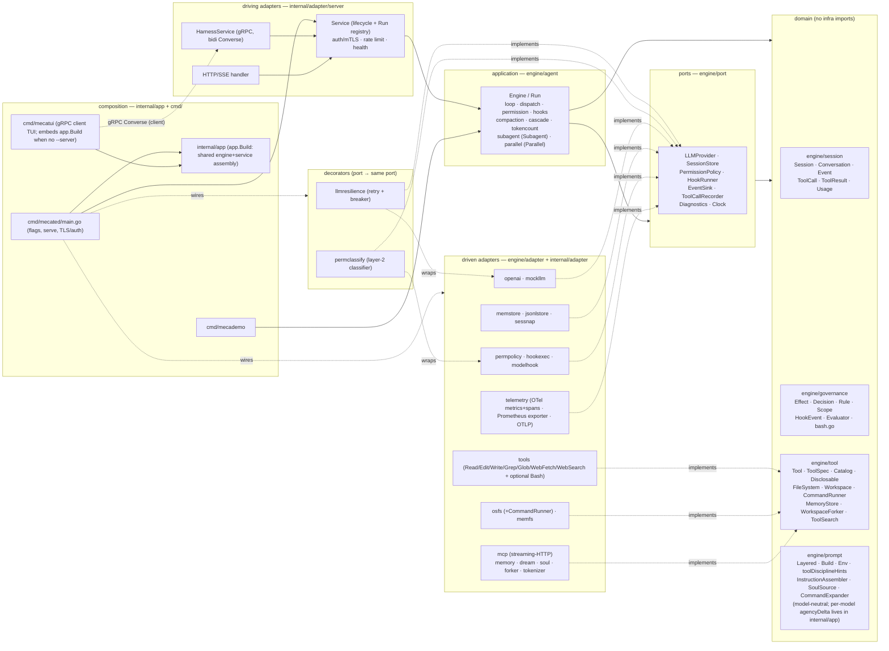
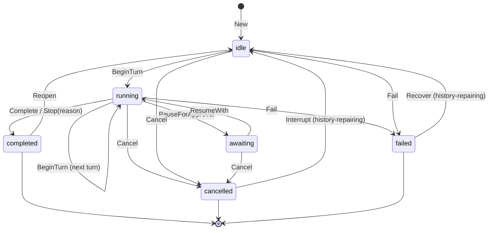
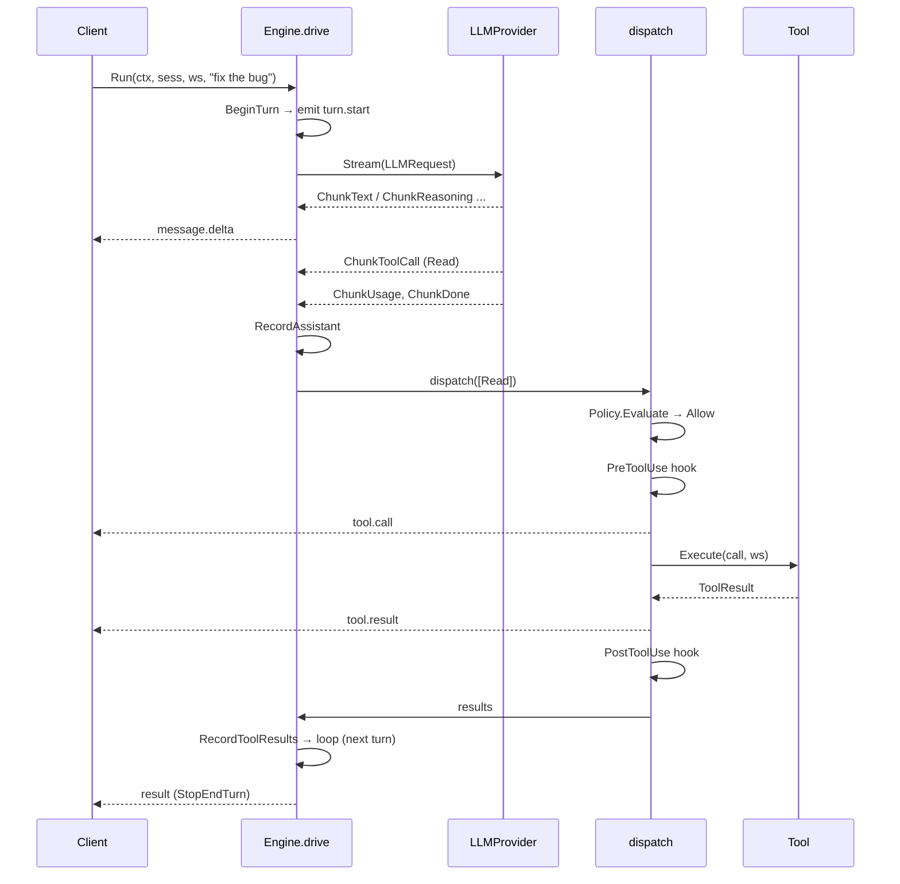
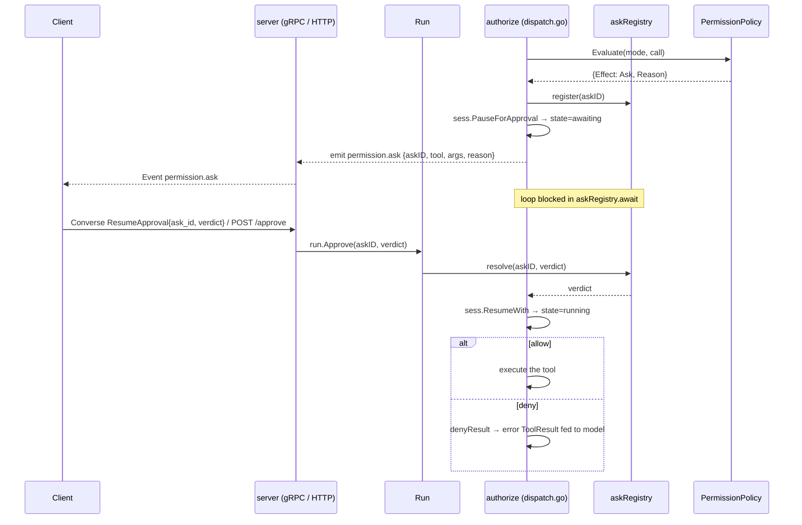

# mecatl — Architecture

> Reader-facing architecture guide. This describes the **code as it exists** in
> `engine/`, `internal/`, `cmd/`, and `contracts/`. Where the design notes in
> `docs/design/` differ from the implementation, this document follows the
> implementation.

## 1. What it is

mecatl is a **headless agentic coding harness**: a service (and library)
that runs the agent loop — call the model, stream its output, execute coding
tools, enforce permissions and hooks, and emit a single typed event stream.
There is no TUI. Clients drive it over **gRPC** (a bidirectional `Converse`
stream) or **HTTP/SSE**. Both surfaces speak one provider-neutral domain
`session.Event` and call the same application service; neither ever sees an
OpenAI type.

The system is built **hexagonally (ports & adapters) with a DDD core**.
Dependencies point inward only: a domain of pure value objects and aggregates
(`session`, `governance`, `tool`, `prompt`), a set of port interfaces the
application consumes (`port`), the application use-case layer that is the agent
loop (`agent`), and adapters that implement the ports (`adapter/*`). The core
tiers (domain, ports, agent loop) plus a small set of stdlib-only REFERENCE
adapters (`engine/adapter/*`: `mockllm`, `memfs`, `nofs`, `memstore`, `sessnap`,
`permpolicy`, `permstore`, `wallclock`, plus the conformance-as-contract suites
`fsconformance`, `memconformance`, `storeconformance`, `sourceconformance`) live
under `engine/` — the
importable core, fully self-contained (tests included: nothing under `engine/`
imports `internal/...`) and intended to be importable as a library by external
consumers — while the heavy adapters and the composition layer stay under
`internal/`. The LLM provider sits behind the `port.LLMProvider` seam, with each
wire format isolated entirely inside its own adapter — the OpenAI Responses API
in `internal/adapter/openai`, the native Anthropic Messages API in
`internal/adapter/anthropic` (§18) — so the core is provider-agnostic and
unit-testable against fakes (`mockllm`, `memfs`, `memstore`).

Around that core, every capability beyond the minimal loop is a **seam with a
default and a swap-in adapter**, so the production build stays static and
network-free unless you wire something in. The current adapters cover, grouped:
**reliability** (`llmresilience` retry/breaker decorator), **observability**
(`telemetry`: OTel metrics + runtime collector via a Prometheus exporter, OTel
spans over OTLP), **security** (server auth/mTLS, rate
limiting, the `permclassify` model-based risk classifier), **context management**
(`tokenizer` + the `CascadeCompactor`), **memory** (`memory` + `dream`),
**parallelism** (`forker` fork-join), and **extensibility** (the `mcp`
streaming-HTTP client). Each is detailed below.

## 2. The big picture



**Dependency direction is inward only.** The allowed-imports rule, stated by the
per-package `doc.go` files and honoured by the code:

| Package | May import |
|---|---|
| `session`, `governance`, `tool`, `prompt` (domain) | stdlib + other domain packages. Never `adapter`, `agent`, `contracts`, `os`, or any third-party library. |
| `port` | domain packages + stdlib (`context`, `io`, `iter`, `time`). |
| `agent` (application) | domain + `port` + stdlib only. Never an adapter or `contracts`. (Tests may import adapters.) |
| `adapter/*` | domain + `port` + the one external lib it adapts. Never `agent`. (Deliberate adapter→adapter carve-outs: (1) `adapter/mcpperf` may import `adapter/telemetry` solely for the `RuntimeSnapshot` data DTO it projects into tool output — a plain JSON struct with no OTel/SDK types, not a behavioural dependency; the DTO stays in `telemetry` by design. (2) `adapter/soul` AND `adapter/memory` import `adapter/skills` for `ScanForInjection` — the conservative role-override deny-list is shared so the soul (load-time) and the user-model RememberUser write path (write-time) reuse the same injection gate rather than copying the regexes. (3) `adapter/{permconfig,skills,agents,soul,memory}` import the leaf `adapter/xdgconfig` for the shared `ResolveEnv`/`UserConfigDir` XDG path-resolution seam — a stdlib-only adapter leaf, extracted to de-duplicate the copies (the user-model store resolves `<xdg>/mecatl/usermodel` through it). (4) `adapter/soul` and `adapter/memory` import the DOMAIN `engine/prompt` for a single compile-time assertion only — `var _ prompt.SoulSource = (*Store)(nil)` (soul→prompt) and `var _ prompt.UserModelSource = (*Store)(nil)` (memory→prompt) — pinning that each adapter satisfies the consumer-local prompt port it is bound to at composition. These are assertion-only edges (no prompt value is constructed or called); the adapters meet the ports structurally, and `engine/prompt` never imports them. |
| `contracts/gen` | generated; protobuf + gRPC runtime. |
| `app` (composition) | the shared engine/service assembly (`app.Build`). MAY import adapters + `agent` + (via `server`) `contracts/gen`. Nothing imports it but the `cmd/` mains. |
| `cmd/*` | flags + serving; consumes `internal/app`. With `app`, the only places concrete adapters meet ports. |
| `cmd/mecatui/{client,ui,theme}` | a gRPC **client**. `contracts/gen` + grpc + `internal/app` appear only in `client`, `embed`, and the `cmd/mecatui` main; `ui` and `theme` import none of them and **never** any `internal/...` package. |

**mecatui — the terminal UI (`cmd/mecatui`).** An optional gRPC *client*. It dials
the `HarnessService`, creates a session, opens the bidi `Converse` stream, and
renders the streamed `Event` envelopes (glamour markdown for assistant text,
themed lipgloss cards for user prompts and tool I/O), resolving permission asks
inline by sending `ResumeApproval` on the same stream. The server it talks to is
either an external `mecated` (`--server`) or one it **hosts in-process** over a
UNIX socket (`cmd/mecatui/embed` → `app.Build`) when none is given — so a single
binary works with no daemon. The render packages stay pure: they render **purely
from proto `Event`s** and are bound by the inward-only layering rule. The
`contracts/gen` + grpc + `internal/app` surface lives only in `cmd/mecatui/client`,
`cmd/mecatui/embed`, and the `cmd/mecatui` main; the `ui` (Bubble Tea
model/update/view) and `theme` (pure styling) packages import no `engine/...` or `internal/...`
package and no proto directly. Usage and theming are documented in `docs/tui.md`.

Two deliberate cycle-breaks worth noting, documented in code:
- `port` imports `tool` and `prompt` (because `LLMRequest` carries
  `[]tool.ToolSpec` and `prompt.Layered`) — see the package note at the top of
  `engine/port/llm.go`.
- `FileSystem`/`Workspace` live in `engine/tool`, **not** `engine/port`,
  because `port` already imports `tool` while `tool.Tool.Execute` takes a
  `Workspace`; defining them in `port` would form a `port↔tool` cycle. See the
  package note in `engine/tool/tool.go`.
- `governance` does **not** import `session` (so `session` can import
  `governance` without a cycle); the `Evaluator` works on primitive args, and
  the `permpolicy` adapter bridges `session` types into it.

## 3. The domain model

### Session aggregate (`engine/session/session.go`)

`Session` is the aggregate root. Outside code holds a `SessionID` and reaches
inner entities only through intention-revealing methods, so the state machine
and stop conditions always hold. There are no public setters for lifecycle
state; mutation flows through methods such as `BeginTurn`, `RecordAssistant`,
`RecordToolResults`, `RecordUserPrompt`, `ReplaceHistory`, `PauseForApproval`,
`ResumeWith`, `Complete`, `Stop`, `Cancel`, `Fail`.

States (`session.State`): `idle`, `running`, `awaiting`, `completed`, `failed`,
`cancelled`. The last three are terminal (`State.IsTerminal()`).



A terminal session can re-enter the loop through one of three intention-revealing
seams (one per terminal state — each is legal ONLY from its own state and they
never widen into each other):
- `completed → (Reopen) → idle` — a clean end-of-run is reopened to accept the
  next prompt, preserving history and resetting per-run `Counters`.
- `cancelled → (Interrupt) → idle` — an interrupted turn is recovered the same
  way, but Interrupt **also repairs the history**: a turn cancelled mid-dispatch
  can leave the trailing assistant message with tool calls that never received a
  result, so `closeOutInterruptedTurn` appends one synthetic error tool result
  per orphaned `ToolCall.ID` before going idle, keeping the replayed history
  provider-valid (no dangling `tool_use`/`function_call`).
- `failed → (Recover) → idle` — a failed run (a transient provider failure, e.g.
  an upstream 5xx that exhausted the resilience layer's retries) recovers with
  the **same history repair** as Interrupt, so the session is retryable instead
  of permanently bricked (issue #51). Recovery makes retry *possible*, not
  guaranteed — a permanent-cause failure simply fails again with the
  conversation context intact.

The service's `loadAndReopen` drives the right seam per state; all three persist
the recovered snapshot.

Notable, code-accurate details:
- `BeginTurn` is legal from `idle` **or** `running` (a follow-up model call in
  the same run) and increments `Counters.Turns`. It does **not** itself enforce
  limits; the loop consults `StopReason()` as a pre-turn guard.
- `Cancel`/`Fail`/`Stop`/`Complete` are legal from any non-terminal state and
  clear any pending ask.
- `ResumeWith()` takes **no** governance argument and returns the resolved
  `PendingAsk`. The aggregate only reconciles its own lifecycle; the loop owns
  acting on the decision. This keeps `session` a clean domain leaf with no
  `governance` dependency in its method signatures.

`Limits` (`MaxTurns`, `MaxToolCalls`, `MaxConsecutiveFailures`) and `Counters`
(`Turns`, `ToolCalls`, `ConsecutiveFailures`) drive stop conditions. A **zero
limit disables** that condition — which is why the composition root injects
non-zero defaults. Three derived predicates:
- `LimitTripped()` — pure; reports the limit-implied stop reason.
- `RecordedStopReason()` — pure; the faithful terminal reason recorded via
  `Stop/Cancel/Fail/Complete` (used by persistence; performs no derivation).
- `StopReason()` — `RecordedStopReason()` first, else `LimitTripped()`; the
  loop's pre-turn guard. Its godoc explicitly warns it conflates the two and is
  not a faithful witness — persistence must use `RecordedStopReason()`.

`PermissionMode`: `default`, `plan` (read-only toolset enforced), `acceptEdits`.

### Conversation / Message / Turn (`engine/session/conversation.go`)

`Conversation` holds the ordered, model-visible `[]Message`. `Message` is an
immutable value object built via `NewUserMessage`, `NewSystemMessage`,
`NewAssistantMessage(text, reasoning, calls)`, `NewToolMessage(result)`. Roles:
`system`, `user`, `assistant`, `tool`. `Message.Reasoning` carries the
provider's opaque reasoning item, replayed back verbatim and never interpreted.
`Message.ProviderPhase` carries the OpenAI Responses **phase** marker
(`commentary`/`final_answer`) under the same discipline — opaque, replayed
verbatim on the assistant message item, never displayed or interpreted (issue
#46: dropping it makes GPT-5.x treat preambles as final answers and stop early).
`Turn` is a value object summarizing one model call plus its results and usage
(defined but not the primary carrier — the loop appends messages directly).

### Value objects

- `ToolCall{ID, Name, Args json.RawMessage}` (`toolcall.go`) — produced by the
  LLM, consumed by tool + governance; `NewToolCall`.
- `ToolResult{CallID, Content, IsError}` — `NewToolResult` / `NewToolError`;
  an error result is still fed back to the model so it can recover.
- `Usage{InputTokens, OutputTokens, CacheReadTokens, CacheWriteTokens}`
  (`usage.go`) with `CacheHitRate()` and an immutable `Add(other) Usage`.

### Event taxonomy (`engine/session/event.go`)

`EventType` is the single, provider-neutral taxonomy shared by the loop and the
API. The real constants:

| EventType value | Const | Emitted when |
|---|---|---|
| `session.init` | `EvSessionInit` | run starts — emitted exactly once, before the SessionStart hook and the first `turn.start` |
| `turn.start` | `EvTurnStart` | beginning of each turn |
| `turn.end` | `EvTurnEnd` | closes a turn's model exchange, carrying the typed `TurnEndPayload` |
| `message.delta` | `EvMessageDelta` | streamed assistant text delta |
| `reasoning.delta` | `EvReasoningDelta` | streamed, display-only reasoning summary text |
| `tool.call` | `EvToolCall` | a tool is about to run |
| `tool.result` | `EvToolResult` | a tool result (incl. denies / hook blocks) |
| `tool.progress` | `EvToolProgress` | transient progress for a long-running tool |
| `permission.ask` | `EvPermissionAsk` | loop paused for client approval |
| `permission.retract` | `EvPermissionRetract` | a previously surfaced ask is withdrawn (e.g. the child that parked it was cancelled) |
| `hook` | `EvHook` | a hook fired (e.g. PreToolUse block) |
| `compaction` | `EvCompaction` | a compaction boundary crossed |
| `no_progress` | `EvNoProgress` | a completed turn produced no tool call and no meaningful text; the loop is nudging (gentle, then a final best-effort extraction) or giving up |
| `result` | `EvResult` | terminal: carries `ResultPayload{Stop, Text, Usage}` |
| `subagent.start/tool/end` | `EvSubagent*` | a `Subagent` child run's REDACTED, metadata-only projection (flat fleet) |
| `team.start/member/tasks/findings/end` | `EvTeam*` | an in-process `Team` run's BOUNDED projection (coordinating roster) |
| `parallel.start/branch/end` | `EvParallel*` | a `Parallel` fork-join run's REDACTED, metadata-only GROUP projection (join + winner + fork paths) |

`Event` carries `Type, Seq, Turn, Text` plus optional pointers `ToolCall`,
`ToolResult`, `Ask *PendingAsk`, `Result *ResultPayload`, `Usage *Usage`,
`Subagent`, `Team`, `Parallel`.

The three DELEGATION families (`subagent.*` / `team.*` / `parallel.*`) project child-loop
lifecycle events and differ in AGGREGATION shape — flat fleet vs coordinating roster vs
fan-out group. Subagent and Parallel are metadata-only; Team is intentionally
fuller-but-bounded because a crew is meant to be watched: `team.member` may carry capped
member text/tool previews, `team.tasks` and `team.findings` carry capped snapshots, and
`team.end` adds terminal per-member dispositions. A member `permission.ask` is still never
projected. The families are deliberately NOT merged; a 4th family is the trip-wire to
extract a shared lifecycle value object (see `docs/design/IMPLEMENTATION-NOTES.md`).
Gauntlet #7 still holds: none of these projections injects branch/child/member transcripts
into the parent conversation — only the delegation tool's final result does (plus, for
Parallel, fork-root path handles).

## 4. The ports (`engine/port`)

Small interfaces, `context.Context` first. Each has a fake adapter so the loop
runs with no network and no disk.

| Port | Responsibility | Signature (verbatim) |
|---|---|---|
| `LLMProvider` (`llm.go`) | provider-agnostic model call; streams neutral chunks | `Stream(ctx context.Context, req LLMRequest) (iter.Seq2[Chunk, error], error)` · `Capabilities() ProviderCapabilities` (multimodal-input flags; decorators must forward the inner provider's) |
| `SessionStore` (`store.go`) | persist/retrieve session state | `Save(ctx context.Context, s *session.Session) error` · `Load(ctx context.Context, id session.SessionID) (*session.Session, error)` — a store may additionally implement the optional `PrunableStore` (`List`/`Delete`) for retention (§11) |
| `HookRunner` (`hookrunner.go`) | run a lifecycle hook → outcome (`hookexec` maps an external process exit code; `modelhook` maps a quarantined checker model's verdict — block/sanitize/advisory) | `Run(ctx context.Context, ev governance.HookEvent) (governance.HookOutcome, error)` |
| `PermissionPolicy` (`permission.go`) | deny→ask→allow across merged scopes; per-session learned allows | `Evaluate(ctx context.Context, sessionID session.SessionID, mode session.PermissionMode, c session.ToolCall, ws tool.WorkspaceReader) governance.PermissionDecision` (ws is the READ-ONLY discovery root for file-based permission config, issue #13; nil = no project config) · `Learn(sessionID session.SessionID, c session.ToolCall)` (the allow-**always** verdict; lowest scope, never overrides a deny or plan mode) |
| `EventSink` (`log.go`) | relay loop events to the API stream | `Emit(ctx context.Context, ev session.Event)` |
| `ToolCallRecorder` (`log.go`) | structured per-tool AUDIT (distinct from `Diagnostics`) | `ToolCall(id session.SessionID, call session.ToolCall, result session.ToolResult, queued, took time.Duration)` |
| `Diagnostics` (`diagnostics.go`) | injected operational-logging seam (NO global slog in `engine/` or `internal/`) | `Log(ctx, level Level, msg string, args ...any)` · `With(args ...any) Diagnostics` |
| `Clock` (`clock.go`) | abstract wall clock | `Now() time.Time` |

The model-call request and stream types (`llm.go`):

```go
type LLMRequest struct {
    System   prompt.Layered    // stable prefix + volatile suffix
    Messages []session.Message
    Tools    []tool.ToolSpec
    Model    string
}

type ChunkKind int
const (
    ChunkText ChunkKind = iota
    ChunkReasoning     // display-only reasoning summary delta
    ChunkReasoningItem // opaque reasoning REPLAY blob → Message.Reasoning
    ChunkToolCall
    ChunkUsage
    ChunkDone
    ChunkPhase         // opaque phase marker → Message.ProviderPhase (issue #46)
)

type Chunk struct {
    Kind     ChunkKind
    Text     string             // text / reasoning summary / replay blob / phase marker, per Kind
    ToolCall *session.ToolCall  // on ChunkToolCall
    Usage    *session.Usage     // on ChunkUsage
    Stop     session.StopReason // on ChunkDone
}
```

The `ChunkReasoning` (display summary) vs `ChunkReasoningItem` (replay blob)
split is deliberate and provider-neutral — Anthropic's thinking delta maps to
the former, its `(thinking,signature)` replay token to the latter; they must
never be conflated. `ChunkPhase` follows the same opaque-replay discipline.

### The tool contract and the FS seam (`engine/tool`)

```go
type Tool interface {
    Spec() ToolSpec
    ReadOnly() bool
    Execute(ctx context.Context, in session.ToolCall, ws Workspace) (session.ToolResult, error)
}
```

`ToolSpec{Name, Description, Schema json.RawMessage}` is what the model sees;
descriptions are documentation (gauntlet #10). `Catalog` (`catalog.go`) is a
name→Tool registry with `Register`/`MustRegister`/`Lookup`/`Tools`. Its
`Specs(mode)` and `Available(mode)` apply **plan-mode filtering at the catalog
level**: in `ModePlan` only `ReadOnly()` tools are exposed, ordered by name.

`FileSystem` and `Workspace` live here (not in `port`) to break the
`port↔tool` cycle. `Workspace` is the session-scoped seam every tool executes
against: it scopes all paths to one root (rejecting `../` escapes), exposes
`Root/Read/Write/Stat/Glob/Grep`, and carries the Edit **read-ledger**
via `RecordRead(path, version)` / `WasReadUnchanged(ctx, path)`. The
read-before-edit invariant is enforced inside the Edit tool against this ledger
(`internal/adapter/tools/edit.go`: invariant #1 via `WasReadUnchanged`, #2
exact match, #3 uniqueness unless `replace_all`).

**Command execution is a separate seam, not part of `Workspace`.**
`tool.CommandRunner` (`Run(ctx, command) (CommandResult, error)`) is the only
chokepoint for shell execution; the agent loop never references it, and only the
Bash tool depends on it. That makes Bash — and therefore *all* command
execution — optional in the catalog: `NewBashTool(runner)` is registered only
when a runner is configured (it panics on a nil runner), and `tools.Register`
deliberately excludes it. The `osfs` adapter ships a local `/bin/sh`
`CommandRunner` (output-capped, context-bounded); a runner may also execute
remotely or refuse with `tool.ErrNoShell`. A shell-less deployment simply omits
Bash, and an OS sandbox would wrap this seam. `tool.MemoryStore` and
`tool.WorkspaceForker` live alongside it for the same layering reason (the tools
that need them depend on the interface, not a `port`).

## 5. The agent loop (`engine/agent`)

`Engine` is built from `Deps` (all ports + the application seams + config) via
`NewEngine`, which supplies network-free defaults for every optional seam:
`Compactor`→`HeuristicCompactor{}`, `CompactionRatio`→`0.8`,
`TokenCounter`→`HeuristicTokenCounter{}`, `Instructions`→`prompt.RootAssembler{}`,
`CommandExpander`→`prompt.NoopExpander{}`. `Engine.Run(ctx, sess, ws, userText)`
returns a `*Run` handle immediately and drives the loop in a background
goroutine; the `Run` exposes:
- `Events() <-chan session.Event` — the primary surface, closed exactly once
  when the run terminates.
- `Approve(askID string, v session.ApprovalVerdict)` — resolves a
  `permission.ask` out-of-band with one of three verdicts: `VerdictDeny` (the
  fail-safe zero value), `VerdictAllowOnce`, or `VerdictAllowAlways` (which
  additionally asks the policy to **learn** a session-scoped allow via
  `PermissionPolicy.Learn`).
- `Cancel()` — cancels the run's context.
- `CancelChild(childID string) bool` — cancels ONE child run (subagent /
  parallel branch / team member) without touching the run itself (§8).

`drive` (in `loop.go`) is the algorithm:

1. **Run-open + SessionStart gate**: emit `session.init` exactly once, before
   anything else; then (first turn only) fire the blocking `SessionStart` hook
   (`fireSessionStart`); a block (or hook error) aborts the run before the
   prompt is even recorded.
2. **Record the prompt** (`recordPrompt`): expand the raw input through
   `CommandExpander.Expand` (slash commands; the `NoopExpander` default leaves it
   unchanged), fire the blocking `UserPromptSubmit` hook **on the expanded text**
   (a block ends the run; a `Mutated` payload replaces the effective prompt), and
   on the first turn assemble project instructions via `Instructions.Assemble`
   (the `RootAssembler` default reads AGENTS.md/CLAUDE.md), recording them + the
   final user text through the aggregate root.
3. **Pre-turn stop guard**: announce any newly-finished background children
   (one harness-note user message, ids + stop labels only; §8); then, if
   `sess.StopReason()` trips, `ctx` is cancelled, or the run **token budget**
   is crossed (below), terminate.
4. `BeginTurn`, emit `turn.start`.
5. **Maybe compact** (`maybeCompact`).
6. **Run the turn** (`runTurn`): build the `LLMRequest`, call `LLM.Stream`,
   consume chunks, emit `message.delta` for text, accumulate reasoning, collect
   tool calls and usage, capture the stop reason; assemble one assistant
   `Message`. `ctx` cancellation mid-stream surfaces as a cancellation.
7. `RecordAssistant`. If there are **no tool calls**, the model is done →
   complete the run.
8. **Dispatch** the tool calls, `RecordToolResults`, `save`, loop back to (3).

The loop terminates the session in exactly one of `Complete`/`Stop`/`Cancel`/
`Fail` and emits exactly one terminal `result` event carrying cumulative usage.

A run-level **token budget** bounds the whole loop: `Deps.MaxRunTokens`
(`--max-run-tokens`, 0 = disabled) is checked at the turn boundary — never
mid-stream, so an in-flight turn always completes — against the run's
accumulated `session.Usage` (input + output; cache tokens excluded). Crossing
it ends the run cleanly with `StopBudget` (a NON-error terminal → `completed`,
Reopen-recoverable, mirroring `StopNoProgress`). Every child engine — Subagent,
Parallel branch, team member, lead synthesis — inherits it; a per-call override
(`RunOptions.MaxRunTokensOverride`, the Subagent `max_tokens` arg) may only
**tighten** it. The team-aggregate counterpart is `--max-team-tokens` (§15).



### Read-parallel / mutate-serial dispatch (`dispatch.go`)

Enforced in `Engine.dispatch`, keyed off `Tool.ReadOnly()`:
- Calls are processed **in original order**, batched into maximal runs of
  consecutive read-only tools.
- A read-only batch (`runReadBatch`) authorizes + runs PreToolUse hooks for
  every call first (permission **asks are sequenced one at a time**, never two
  at once), then executes the cleared calls **concurrently**, one goroutine per
  call, results merged under a mutex.
- A mutating or **unknown** tool (`runOne`) runs **alone, serially**, never
  overlapping anything.
- Results are keyed by `CallID` and re-assembled in input order.

A `cancelled` flag propagates from `dispatch` so the loop terminates as
`StopCancelled` if `ctx` was cancelled mid-await or mid-execution. A
harness-level tool error becomes an error `ToolResult` (the loop never aborts on
one tool failure); a genuinely unknown tool yields an error result too.

## 6. Permission pause / resume

When `Policy.Evaluate` returns `Ask`, `dispatch.go`'s `authorize` pauses the
loop. The handshake is brokered by `askRegistry` (`permission.go`): the loop
**registers the resolution channel before** pausing and emitting, so an
`Approve` that races in cannot be lost. `PauseForApproval` moves the session to
`awaiting`; the loop emits `permission.ask`; `askRegistry.await` blocks on the
buffered channel until `Run.Approve` resolves it or `ctx` is cancelled.



- **Allow (once)** → the call executes normally.
- **Allow always** → the call executes AND the policy **learns** a per-session
  allow rule for the same tool + exact canonical pattern
  (`PermissionPolicy.Learn`; never overrides a deny or plan mode).
- **Deny** → `denyResult` synthesizes a `permission denied: <reason>` error
  `ToolResult`, fed back so the model can adapt. Deny is the verdict's zero
  value, so an abandoned ask fails safe.
- **Cancel while awaiting** → `await` returns `ok=false`; the loop ends as
  `StopCancelled`.

On the wire, `ResumeApproval` carries the three-way `verdict` enum; the legacy
`allow` bool is kept for back-compat (ignored when `verdict` is set; otherwise
`true` maps to allow-once, `false` to deny).

This ties directly to the API: the gRPC `Converse` stream carries the verdict in
a `ResumeApproval` frame on the **same** stream emitting events (no out-of-band
correlation), and the HTTP surface uses `POST /v1/sessions/{id}/approve`. Both
land on `Run.Approve`. The `Service` keeps a registry of in-flight `*agent.Run`
keyed by session id so the verdict reaches the right run
(`server/service.go`: `LookupRun`).

## 7. Hooks

Hook lifecycle phases (`governance/hookevent.go`): `SessionStart`,
`UserPromptSubmit`, `PreToolUse`, `PostToolUse`, `Stop`, `SubagentStop`. **All
six now fire** — the per-tool pair from `dispatch.go`, the run-level trio from
`agent/hooks.go`, and `SubagentStop` from the Subagent tool.

Per-tool placement (`dispatch.go`):
- **PreToolUse** (`preHook`) runs after permission clears, before execution, for
  every call (read-batch and serial). On a hook **block** it emits a `hook`
  event and substitutes an error `ToolResult` (the tool does not run). A hook
  execution error is surfaced to the model as a block annotation rather than
  aborting the run; a cancelled context is the one case that ends the run. A
  non-empty `HookOutcome.Mutated` payload on an allow — interpreted symmetrically
  with the PreToolUse `HookEvent.Input`, i.e. the tool's raw **arguments JSON** —
  **rewrites the call's args before execution**: the loop builds a fresh
  `session.ToolCall` (same CallID and tool Name, new Args) and executes that. A
  malformed (non-JSON) mutation is ignored (original args stand) and a notice
  event is emitted. **Permission ordering (trust):** the policy is evaluated on
  the **original, pre-mutation** args; the mutated args are **not**
  re-permission-checked. This is deliberate — a PreToolUse hook is
  operator-deployed and more trusted than the model, so it may rewrite a call
  past the policy that gated the model's request (matching Claude Code).
- **PostToolUse** (`postHook`) runs best-effort after execution and **before** the
  `tool.result` event is emitted (the emit was moved after `postHook` for this
  reason). A block there only annotates (the tool already ran; a block neither
  undoes nor suppresses the result), and a hook execution error is ignored —
  neither aborts. A non-empty `HookOutcome.Mutated` payload — interpreted
  symmetrically with the PostToolUse `HookEvent.Input`, i.e. the result object
  `{"content", "is_error"}` — **rewrites the result**: the loop builds a fresh
  `session.ToolResult` (same CallID; `NewToolError` when `is_error`, else
  `NewToolResult`). A malformed (non-JSON) mutation is ignored (original result
  stands) with a notice event. Because the **effective** (rewritten) result is what
  is both emitted and returned/recorded, the client stream and the model's history
  agree — there is no hidden divergence. **Trust:** a PostToolUse hook is
  operator-deployed and trusted, so it may rewrite what the model sees the tool
  returned (e.g. redact secrets).

Run-level placement (`agent/hooks.go`). Both pre-prompt phases are **blocking
run-level gates** that fail safe — a block, or a hook **execution error**, ends
the run before any model call with `StopError`, emits a `hook` event, and still
fires `Stop`:
- **SessionStart** (`fireSessionStart`) runs once at the very start of a run,
  before the prompt is recorded; a block (or hook error) **aborts** the run.
- **UserPromptSubmit** (`fireUserPromptSubmit`) runs on the (command-expanded)
  prompt text **before** `RecordUserPrompt`; a block (or hook error) ends the run.
  A non-empty `HookOutcome.Mutated` payload — interpreted symmetrically with the
  `{"prompt": ...}` `HookEvent.Input` — **replaces the effective prompt**: the
  mutated text is what is recorded into the session and sent to the model (a
  malformed mutation is ignored, original text stands). Ordering is preserved:
  command expansion runs first, then the hook, then recording; first-turn
  instruction assembly is unchanged.
- **Stop** (`fireStop`) runs exactly once at the terminal end of any run path,
  even if `ctx` is already cancelled (it is a terminal notification). The Subagent
  subagent mirrors this with **SubagentStop**.

Exit-code semantics live in the `hookexec` adapter
(`internal/adapter/hookexec/hookexec.go`): the `HookEvent` is JSON-serialized to
the hook process's **stdin**; **exit 0 = allow**, **exit 2 = block**
(`HookOutcome.Block = true`, message from stdout/stderr). On an **allow**, if the
hook's stdout is a JSON **object** it is parsed as a control envelope —
`{"mutated": <raw payload>, "message": "..."}` — and `mutated` becomes
`HookOutcome.Mutated` (the rewritten prompt/args payload the loop applies). Plain
(non-JSON-object) stdout is treated as a message exactly as before, so existing
hooks are unaffected. This is what lets **real shell hooks** emit mutations (not
just custom Go `HookRunner` adapters).

## 8. Subagents (`engine/agent/subagent.go`)

`SubagentTool` is a `tool.Tool` (catalog name `Subagent`) that delegates a focused,
self-contained task (multi-step investigation or build/test/git work) to a **child agent loop**. Its `Execute`:
1. **Workspace selection.** When a child forker is wired (`WithChildForker` — the
   composition root wires it **iff** the child catalog includes Bash) it forks the
   incoming `ws` into an **isolated git worktree** (the forker DEFAULT mode — shares
   the base repo's `.git`, so the child sees full history) and runs the child there;
   the worktree is torn down after the child drains. Without a forker the child has
   no Bash and runs against the **parent** `ws`, exactly as before. A fork **failure**
   on the wired path is a tool **error**, never a silent fallback to the shared `ws`
   (running the child's Bash in the shared base is the exact hazard isolation exists
   to prevent).
2. Builds a **fresh** child `session.New(...)` — own conversation, own (tighter)
   `Limits` (`defaultChildLimits`: 50 turns / 200 tool calls / 3 failures —
   half the main session's 100/400, issue #50),
   scoped to the **run** workspace root (the worktree when forked, else the parent).
   **On `resume`** (a Subagent call carrying `resume: <agentId>`) it instead RELOADS the
   persisted child by that id and recovers its terminal state — `completed` → `Reopen()`,
   `cancelled` → `Interrupt()` (history-repair), `failed` is **not** resumable (a
   deliberate subagent-policy fence, unchanged by the main session's `failed →
   Recover → idle` seam: a subagent is a one-shot delegated task, so the parent
   re-delegates instead) — then
   re-homes it onto the fresh fork (`session.Session.Rehome`) and prepends an honest
   staleness note (the conversation survives, the workspace does NOT). Resume runs on the
   **default explorer engine only** (rejected with `agent`/`model`); an in-flight guard
   rejects a concurrent run on the same id.
3. Runs the child via the injected `childEngine.Run(ctx, child, runWS, prompt)`.
4. **Drains the child's entire Event stream inside `Execute`**
   (`drainChildObserved` — the single redaction chokepoint all three delegation
   families share), relaying only the REDACTED, metadata-only
   `subagent.start/tool/end` projection (§3) and **returning only the final
   summary string** as one `ToolResult` (gauntlet #7) — no child transcript
   ever enters the parent conversation.

**Per-call knobs (`subagentArgs`).** Beyond `prompt`/`description`/`agent`, a Subagent call may
supply: `max_turns`/`max_tool_calls`/`max_tokens` (TIGHTEN-ONLY caps — the model can
make its child stricter than the operator's bound, never looser); `timeout_ms` (a
wall-clock deadline → a time-budget tool error); `model` (pin THIS child to a specific
provider model — minted via the composition-supplied `WithSubagentEngineFactory` closure
through the contamination-safe `newChildEngineForProvider` path, NEVER a clone-and-swap;
mutually exclusive with `agent`); and `output_schema` (a model-authored JSON schema —
the child is given a synthetic `SubmitResult` tool whose params ARE the schema, must
call it to deliver, and the submitted payload is validated by `session.ValidateJSON`
with a bounded correction-retry, NO `tool_choice` forcing). The Subagent RESULT is labelled
by terminal reason (success / `[subagent stopped: …]` note / structured-output
validation error / error) and carries an `agentId: <childID>` trailer on every terminal
(model-visible, mirroring the Team-id line) so the parent can discover the child id and
read its persisted transcript via the read-only `InspectSubagent` tool (the id is used
verbatim), or pass it as `resume` to CONTINUE that subagent with a follow-up prompt
(default engine only, fresh fork + staleness note; `failed` is not resumable).
`fork: true` (issue #34) seeds the child from a DEEP COPY of the parent conversation
(via `session.ForkSnapshot` — trailing fork-call orphan stripped — and the idle-only
`session.Session.SeedHistory`) instead of an empty context, TRUST-NEUTRAL (carried
VERBATIM, no re-fence — the child inherits the parent's EXACT raw message posture, the
main loop records tool results unfenced anyway, and the read-only explorer sandbox adds
no new untrusted ingress; re-fencing would also bust the byte-stable prompt-cache
prefix the feature relies on) and SAME-PROVIDER only (mutually exclusive with
`model`/`agent`/`resume`; a forked child runs on the parent's engine). When
neither `agent` nor `model` pins one, a def-less child runs on the global
`--subagent-model` default (the analogue of `CLAUDE_CODE_SUBAGENT_MODEL`; a concrete
id or a `--model-alias` name, resolved same-provider; precedence `def.Model >
--subagent-model > parent model`, empty inheriting the parent's). None of
these widen `port.LLMRequest` — they are `subagentArgs`/`RunOptions`/factory concerns.

**Background, SubagentStatus & per-child cancel (`docs/design/BACKGROUND-SUBAGENTS.md`).**
`background: true` DETACHES the child, RUN-scoped: the call returns an immediate
started-result (agentId trailer first) and a goroutine owns fork → drive → persist →
result-stash in the parent `Run`'s **child-run registry** (`childRunRegistry` — every
run registers ALL children of all three families under their child session ids). The
result body's sole channel is the read-only **`SubagentStatus`** tool (no args → this
run's roster; `agent_id` → state + the stored body, delivered exactly once; `wait_ms`
parks up to 120s) — a turn-boundary harness NOTICE (ids + stop labels only, nothing
child-authored) tells the model when a background child finishes, and ONE
background-pending nudge defers a would-be clean end so results aren't silently lost.
At run end live background children are cancelled, joined (bounded two-phase drain),
sealed (`safeEmit` makes post-seal child emits no-ops), and persisted — resumable
next run. The registry also powers **per-child cancel**: `Run.CancelChild(childID)`
(gRPC `ConverseRequest.cancel_child`, HTTP `POST /v1/sessions/{id}/cancel-child`,
mecatui's `x` key) cancels ONE subagent / parallel branch / team member without
touching the run, retracting any permission ask the child had parked
(`permission.retract`); the child persists and stays resumable. The headless
RunTeam path has its own member cancel: the `CancelTeammate(team_id, member)` unary
(HTTP `POST /v1/teams/{id}/members/cancel`, issue #29) reaches a running team's
member directly through `Supervisor.CancelMember` — no parent registry on that path.

The child is a **read-only explorer with a shell** — capability flows down from the
parent (which has Bash); isolation, not catalog read-only-ness, is the security
boundary:
- The composition layer wires `childEngine` with **Read/Grep/Glob plus Bash**
  (`buildChildEngine` registers Bash via the **sandboxed** runner —
  `buildSandboxedCommandRunner`, the SAME hardening team members get, since the
  worktree shares the parent `.git`), **never `Subagent`/`Parallel`/`ToolSearch`** (no
  recursion / fan-out) and **never Edit/Write** (it inspects, it does not edit the
  project). Per-def Subagent engines keep Bash via `scopedToolNamesMode`'s `allowShell`
  and share the one `SubagentTool` forker. With no runner (`--no-bash`) the child is a
  Bash-less read-only explorer and no forker is wired — the original behaviour. The
  policy is **allow-all** so the child never prompts a human (`internal/app`:
  `buildSubagentTool` / `buildChildEngine` / `buildAgentSubagentEngines`).
- `SubagentTool.ReadOnly()` stays **`true`**, letting the parent run `Subagent` concurrently
  with other read-only tools. This is safe because the child's (mutating-classified)
  Bash writes land in the **isolated worktree**, never the shared base the parent's
  other read-only calls race over; the only shared surface is the `.git` object
  DB/refs (git-locked; config-driven code-exec vectors neutralised via `gitenv`).
- `WithMaxConcurrentChildren` (default 4; `WithMaxConcurrentSubagentShells` is a
  deprecated alias) sizes the **child concurrency gate**, acquired at the top of
  `run()` for ALL children (forking and forker-less) — Subagent is read-parallel, so
  the model can fan many out; each child consumes a session + an LLM slot (and, when
  forked, a worktree). Foreground acquisition blocks; a **background** child's
  acquisition is **fail-fast** (a full gate is a model-addressable error listing the
  live background ids — a background child holds its slot across turns, so blocking
  could deadlock the model against itself).
- A child's permission ask resolves through the **4-step model** (see CLAUDE.md's
  subagent-shell gotcha): read-only-substitution and isolation auto-approve resolve
  most asks in `governance`; what remains is **surfaced to the human** when the parent
  run is interactive (the child parks; `Run.Approve` routes the verdict by the
  child-namespaced askID) or **auto-denied with an accurate model-facing message**
  when headless — never a blanket deny.
- The child run is bounded by the parent `ctx`; `SubagentStop` fires
  best-effort (on a detached short-lived context if the parent is already
  cancelled). `NewSubagentTool` panics on a nil child Engine.

This mirrors the **team-member** worktree treatment (§ below): same `gitenv`
hardening, same untrusted-`.gitattributes` residual. The workspace-trust gate
**shipped** (issue #40), shared by both: an **untrusted** workspace nils the
sandboxed runner, so read-only subagents and team members get NO shell there —
an honest Spec note tells the model, and the gate is narrated once at build.
Mutating members / Parallel branches keep their hardened force-copy shells
(force-copy forking runs no git, so the fork-time checkout hazard the gate
closes cannot fire there).

## 9. The OpenAI Responses adapter (`internal/adapter/openai`)

`Provider` implements `port.LLMProvider` over `POST /v1/responses` using
`github.com/openai/openai-go/v3`. It owns its own conversation state
("strategy B"): every request is **stateless** — `Store: false`, no
`previous_response_id` — and resends the full input item slice.

**Request translation** (`request.go`, `buildParams`):
- `LLMRequest.System` (the `prompt.Layered`) is `Render()`-ed into
  `Instructions`.
- `Tools` → function tools, each spec's JSON `Schema` unmarshalled into the
  SDK's parameter map (`Strict: true`; empty schema → empty object).
- `Messages` → the input item array via `buildInput`: system/user/assistant text
  become message items; tool messages become `function_call_output` items keyed
  by `call_id`. An assistant turn expands (`assistantItems`) in the order
  **reasoning item → function_call item(s) → text message**.
- `Store: false` plus `Include: [reasoning.encrypted_content]` so reasoning
  survives across turns statelessly. `Message.Reasoning` is carried verbatim as
  the reasoning item's `EncryptedContent`.

**SSE → Chunk translation** (`stream.go`, `translate` — a pure function driven
directly from recorded fixtures by `decodeSSE` in tests):
- `response.output_text.delta` → `ChunkText`
- `response.reasoning_summary_text.delta` / `response.reasoning_text.delta` →
  `ChunkReasoning` (the DISPLAY summary)
- `response.output_item.done` (reasoning) → `ChunkReasoningItem` (the
  `encrypted_content` REPLAY blob — distinct from the display summary; the two
  must never be conflated)
- `response.output_item.done` (message) → `ChunkPhase` (the opaque phase
  marker, stored on `Message.ProviderPhase` and replayed verbatim on the
  assistant message item — issue #46)
- `response.output_item.done` (function_call) → `ChunkToolCall` (acts on the
  assembled `.done` payload, not concatenated deltas)
- `response.completed` → `ChunkUsage` then `ChunkDone(end_turn)` (cached tokens
  map into `Usage.CacheReadTokens`)
- `response.incomplete` → `ChunkUsage` then `ChunkDone(error)`
- `response.failed` / `error` → a non-nil stream **error** carrying the
  provider's message verbatim (so the real reason reaches the terminal
  `result`, not an opaque "error")

**Cancellation**: `Stream` (`openai.go`) selects on `ctx.Done()` each iteration
and abandons the underlying stream; a deliberate `ctx` cancel is **not** reported
as a stream error.

**The provider-neutral seam**: the loop only ever sees `port.Chunk`; no OpenAI
type crosses the boundary. The fake `mockllm.Provider` (`engine/adapter/mockllm`,
`New(turns...)`, `TextTurn`) implements the same port for offline loop testing.

**Compatible endpoints**: `WithBaseURL(url)` overrides the host (vLLM, LiteLLM,
a local proxy); the SDK appends `/responses`. `WithAPIKey` and
`WithRequestOption` round out the options. `cmd/mecated` plumbs
`--openai-base-url` through to it.

## 10. The API surface (`internal/adapter/server`, `contracts/proto/mecatl/v1/harness.proto`)

One `Service` (`service.go`) backs two surfaces, both relaying the same domain
`session.Event` mapped to one proto `Event` by `toProto` (`mapper.go`). The
service owns session lifecycle (`CreateSession`, `GetSession`), starts runs
(`StartRun`), and registers/deregisters in-flight `*agent.Run` so approve/cancel
reach the right run.

**gRPC (`harness.proto`, `grpc.go`)** — `HarnessService`:
- `CreateSession(CreateSessionRequest) → CreateSessionResponse` — carries an
  OPTIONAL per-session `provider_id` / `model_id` selector (multi-provider Phase 0; see §18)
  AND an OPTIONAL `profile` (enum-as-string: `""` = default, `"no-fs"`).

  **The filesystem is OPTIONAL per session** (the `"no-fs"` profile, issue #55):
  the workspace requirement is profile-aware — default requires one, no-fs
  requires an EMPTY one (the contradictory combination is a loud
  `InvalidArgument`), and any unknown profile is rejected, never silently
  defaulted. A no-fs session always routes through the per-session engine
  factory (the shared engine has the FS tools baked in): its catalog is the
  default set MINUS exactly {Read, Edit, Write, Grep, Glob, Bash, Parallel,
  SkillDraft} (pinned by `TestNoFSCatalogProfile`), its workspace is the honest
  `engine/adapter/nofs` Workspace (reads fail `fs.ErrNotExist`, searches are
  empty, writes refuse loudly — deliberately NOT memfs, which would silently
  absorb writes nobody can read back), registered as the per-session workspace
  override AT CREATE TIME so the osfs factory never sees the empty root, and
  its Subagent/Team children run the same file-less surface (memory six +
  WebFetch + WebSearch + global MCP) with no forkers and no shell. The model is told via a
  system-prompt posture note and an honest Subagent spec. A REMOTE filesystem
  for such sessions is a future driver concern (`docs/design/DRIVERS.md`), an
  explicit non-goal of the profile itself.
- `GetSession(GetSessionRequest) → GetSessionResponse`
- `ListModels(ListModelsRequest) → ListModelsResponse` — the selectable-model
  inventory: every AVAILABLE provider's catalog models projected to public metadata
  (`ModelInfo{id, provider_id, display_name, image, reasoning, context_limit}`), no
  secrets, (provider_id, id)-sorted. Gated by `ServerCapabilities.model_selection`
  (true iff ≥1 provider is available). See §18.
- `Converse(stream ConverseRequest) → stream ConverseResponse)` — bidirectional.
  The first frame **must** be `prompt`; then zero or more `resume_approval` /
  `cancel` / `cancel_child` control frames. `ConverseRequest` is a `oneof kind
  { Prompt prompt=1; ResumeApproval resume_approval=10; Cancel cancel=11;
  CancelChild cancel_child=12 }`. The server starts the
  run, reads control frames on a side goroutine (`readControl`), and relays
  `Event`s on the main goroutine until the channel closes.
- The full service is wider than this core. Session lifecycle adds
  `CloseSession`; the read-only inventories are `ListAgents`, `ListCommands`,
  `ListSkills`, `GetSoul`, `GetUserModel`; MCP passthrough is
  `ListMcpResources` / `ReadMcpResource` / `ListMcpPrompts` / `GetMcpPrompt` /
  `ListMcpSources` / `ListToolHiveGroups`; and the team family is `CreateTeam`
  / `SpawnTeammate` / `SendTeammateMessage` / `CancelTeammate` (cancel one
  member of a running team) / `RunTeam` (a server-streamed
  `TeamEvent` sequence) / `ListTeam` / `CleanupTeam`.
  `CreateTeamRequest.max_team_tokens` carries the tighten-only team-wide token
  budget (§15).

`ConverseResponse` wraps one `Event`. The proto `Event` mirrors `session.Event`
one-for-one: string `type` plus `ToolCall`, `ToolResult`, `PermissionAsk`,
`Result`, `Usage` submessages. `PermissionAsk.ask_id` is echoed back in
`ResumeApproval.ask_id`. Required-field annotations use `buf.validate.field`;
v1 enforces required checks in the Go server (protovalidate runtime is deferred).

**HTTP/SSE (`http.go`)** — the thin mirror, since grpc-gateway cannot map bidi:

| HTTP | Maps to | Notes |
|---|---|---|
| `POST /v1/sessions` | `CreateSession` | JSON body → `session_id`; optional `provider_id`/`model_id` selector + `profile` (`"no-fs"`) |
| `GET /v1/sessions/{id}` | `GetSession` | JSON snapshot |
| `GET /v1/models` | `ListModels` | JSON selectable-model inventory (available providers only, secret-free) |
| `POST /v1/sessions/{id}/prompt` | start a run | `text/event-stream`; each event is `data: <proto Event as JSON>` |
| `POST /v1/sessions/{id}/approve` | `Run.Approve` | resolves the paused ask (verdict or legacy `allow`) |
| `POST /v1/sessions/{id}/cancel` | `Run.Cancel` | cancels the in-flight run |
| `POST /v1/sessions/{id}/cancel-child` | `Run.CancelChild` | cancels ONE child of the in-flight run |
| `DELETE /v1/sessions/{id}` | `CloseSession` | frees the per-session engine slot |
| `GET /v1/agents` · `/v1/skills` · `/v1/commands` · `/v1/soul` · `/v1/usermodel` | the inventory RPCs | read-only snapshots |
| `GET /v1/mcp/resources` · `/v1/mcp/resources/read` · `/v1/mcp/prompts` · `POST /v1/mcp/prompts/get` · `GET /v1/mcp/sources` · `/v1/mcp/toolhive/groups` | MCP passthrough | mirrors the gRPC MCP family |
| `POST /v1/teams` · `POST /v1/teams/{id}/members` · `POST /v1/teams/{id}/messages` · `POST /v1/teams/{id}/members/cancel` · `POST /v1/teams/{id}/run` · `GET /v1/teams/{id}` · `DELETE /v1/teams/{id}` | the team family | `/run` streams `TeamEvent`s over SSE; `/members/cancel` cancels one member of a running team |

Closing either stream cancels the run: the SSE handler watches
`r.Context().Done()` and calls `run.Cancel()`; the gRPC relay cancels on a send
error. `Run.Cancel` first arms the run's sticky `hardAbort` signal (a short
grace timer, armed before the ctx cancel), so every guarded send — the loop's
`emit`, the child registry's `emitOrAbort`, the team supervisor's member
forward — gives up instead of parking forever behind a consumer that stopped
draining (the explicit unwedge; a cancelled run with a *draining* consumer
still delivers its in-flight events — the grace covers even a backlogged one).
Both relays are drain-to-discard after the FIRST Send/Write error: they record
the error, cancel the run, and keep ranging `run.Events()` (discarding, no
further writes) until the channel closes — a busy run never wedges in its own
emits behind a dead client.

**ACP (`internal/adapter/acp`)** — a THIRD wire surface alongside gRPC and
HTTP/SSE: the Agent Client Protocol, JSON-RPC 2.0 over **stdio**, lets an ACP
editor (Zed, and others) spawn mecatl as a subprocess (wired in `cmd/mecated`
behind `--acp`) and drive the SAME surface-agnostic `server.Service`. It
carries its own JSON — it never imports `contracts/gen` — projecting domain
`session.Event`s onto `session/update` notifications and resolving permission
asks via the outbound `session/request_permission` request (the adapter is
both JSON-RPC server and client; the bidirectional codec lives in `conn.go`).
Prompt content is **multimodal + capability-gated**: every block becomes text,
a `session.Content` part, or a loud `codeInvalidParams` — never a silent drop —
routed through the single `session.NewContent`/`ValidateMediaParts` choke
point and gated on `Service.ProviderCapabilities()`. (This is the harness
speaking an editor protocol delivered over its own stdin/stdout; the project's
no-stdio rule is about MCP servers, which are never `os/exec`-spawned.)

## 11. Observability & persistence

- **EventSink** (`port.EventSink`) — an optional secondary relay.
  `Emit(ctx, ev)` carries the run's `context.Context` so telemetry can parent a
  run span to an inbound request span (the ctx is a **trace/baggage carrier
  only** — sinks must not derive cancellation/deadlines from it, since terminal
  emits deliberately pass an already-cancelled ctx). `Run.emit` always writes to
  the `Events()` channel (the primary surface) and then mirrors the sequenced
  event to `Deps.Sink` when configured (`dispatch.go`'s `Engine.emit`, which
  forwards the per-run `Run.ctx`). `Seq` is a monotonic per-run counter
  (`atomic.Int64`).
- **ToolCallRecorder** (`port.ToolCallRecorder`) — `ToolCall(id, call, result,
  queued, took)` records tool queue + execution timing, the per-tool AUDIT seam,
  distinct from the model-visible conversation. The loop times execution via the
  injected `Clock` (`timeExecute`).
- **Diagnostics** (`port.Diagnostics`) — the injected operational-logging seam
  (composition decisions, degraded-mode warnings, lifecycle notes), DISTINCT from
  the audit (`ToolCallRecorder`) and the event stream (`EventSink`). `engine/` + `internal/`
  take this port and NEVER touch global slog; the `slogdiag` adapter is the only
  slog bridge and composition picks the sink per binary. The ban is `forbidigo`-
  guarded. See `docs/design/DIAGNOSTICS.md`.
- **Telemetry** (`internal/adapter/telemetry`) — one adapter that implements
  **both** `port.EventSink` (deriving counters/gauges from the event stream) and
  `port.ToolCallRecorder` (per-tool counters + a latency histogram). It is built on the
  **OTel metrics SDK**: `telemetry.NewMetrics(metric.MeterProvider)` creates the
  domain instruments from an injected MeterProvider. `telemetry.NewSink` fans one
  Engine `EventSink` out to several sinks; OTel spans model the run/turn/tool
  hierarchy. `telemetry.Setup` returns a `Providers{Tracer, Meter, Registry,
  Shutdown}` struct: **metrics are always on** — Setup always builds an SDK
  MeterProvider with a Prometheus-exporter reader on a fresh `Registry`, installs
  the tool-duration base-2 exponential-histogram view (`telemetry.ToolDurationView`,
  the single source of truth any MeterProvider feeding `NewMetrics` must install),
  and starts the contrib **runtime collector** (goroutines, GC, heap) against that
  provider. `/metrics` is served via the OTel Prometheus exporter using
  `telemetry.MetricsHandler(providers.Registry)`. **Tracing installs only when an
  OTLP endpoint is set**: with `cfg.Endpoint` non-empty Setup builds an OTLP span
  exporter + SDK TracerProvider and installs it globally (wired in `mecated` via
  `--otlp-endpoint` / `--otlp-protocol` / `--otlp-insecure`); with an empty
  endpoint `Providers.Tracer` is the current (no-op) global and only metrics run.
  Child engines (Subagent / team member / Parallel) get **role-tagged metric
  views** when `Config.MetricsRoleScoper` is wired (issue #47): their
  `Deps.Sink`/`ToolCallRecorder` are scoped per role FAMILY — the closed set
  `main|subagent|member|parallel|usermodel|child`, never the raw role (which can
  embed a def name or model id), so label cardinality stays bounded; without a
  scoper they stay nil, byte-identical to the metrics-off posture.
  > A broader performance-observability effort lands incrementally on a
  > **loopback-only, unauthenticated admin listener** (`--metrics-addr`, default
  > `127.0.0.1:9090`): `/metrics`, `/debug/pprof/*`, `/debug/vars` (a curated
  > `runtime/metrics` snapshot), `/debug/flightrecorder` (an execution-trace ring),
  > and — opt-in via `--perf-mcp` — `/mcp`, the read-only **perf MCP server**
  > (`internal/adapter/mcpperf`) that lets an agent introspect this process's
  > runtime/latency/profile state as reduced numeric summaries (slow-turns,
  > profile rankings, FlightRecorder summaries). All of it is **live**. The MCP
  > surface is fail-closed to loopback (it is unauthenticated and can embed
  > goroutine-derived names/timing). See `docs/design/perf-observability.md` (the
  > decided direction) and `docs/perf-measurement-survey.md` (the Go-perf
  > technique reference).
- **SessionStore** — `memstore` (default, in-memory), `jsonlstore`
  (append-only JSONL replay log: `<dir>/<id>.session.jsonl` snapshots +
  `<dir>/<id>.tools.jsonl` tool records; `jsonlstore` also implements
  `ToolCallRecorder`),
  and `grpcdriver.SessionStore` (a **remote store driver** — see below).
  All serialize via **`sessnap`** (`engine/adapter/sessnap`): a `Snapshot` DTO
  that round-trips a `Session` by driving the public state machine on restore
  (so a session saved mid-`awaiting` reloads with its pending ask intact). It
  captures the terminal reason via `RecordedStopReason()` for exact round-trips,
  and (cloud-native Phase 1) the per-session profile, the opaque provider/model
  selector pair, and the cumulative token `usage` — additive fields so a
  restarted process rebuilds the SAME engine and the `MaxRunTokens` budget
  continues across restart (see `docs/design/CLOUD-NATIVE.md`).
  A store may additionally implement the optional **`port.PrunableStore`**
  (`List`/`Delete`; `ErrPruneUnsupported` otherwise) — the retention MECHANISM.
  The POLICY lives in composition (`internal/app/childgc.go`, issue #38):
  persisted CHILD session snapshots (the `subagent-*`/`parallel-*`/`team-*` ids
  behind `InspectSubagent`/`InspectMember`/`resume:`) are GC-swept by age
  (`--child-retention`, default 7d) and per-family count
  (`--child-retention-max-per-family`, default 500), skipping in-flight runs;
  main sessions are never touched.

### Remote store + source drivers (`internal/adapter/grpcdriver`)

> Design rationale — the port/driver pattern, the per-seam lifecycle and
> failure-posture decisions, the deferrals, and the workspace-driver sketch —
> lives in `docs/design/DRIVERS.md`.

The session and memory stores have a **wire seam**: an operator can point
either at a remote, operator-run **driver process** speaking the
`mecatl.driver.v1` protocol (`contracts/proto/mecatl/driver/v1/` —
`SessionStoreService` for `port.SessionStore`, `MemoryStoreService` for
`tool.MemoryStore`). Selection is composition-only (`app.Build`):
`--session-store-url` replaces `--store-dir` (mutually exclusive, fatal at
build), `--memory-store-url` replaces `--memory-dir`; all-empty keeps the
local stores byte-identical. Equal URLs share ONE lazy `ClientConn` (the
build-scoped `driverConns` cache); the user-model store stays local (a Phase B
deferral).

Phase C1 adds the **content-source drivers** on the same protocol:
`SkillSourceService` behind the `tool.SkillSource` port (skills cross as
LOGICAL BUNDLES — metadata, body, payloads by logical name; NO path/dir/root
on the wire) and `SoulSourceService` behind `prompt.SoulSource`.
`--skill-source-url` replaces local skills discovery (mutually exclusive with
`--skills-dir`/`--skills-conventional`); a driver skill's payloads
materialize LAZILY into a build-scoped temp asset cache on first activation
(per-asset 16 MiB / per-bundle 64 MiB caps, logical-name validation +
containment, executable bit honored; the cache dir is the single skill read
root and is removed on shutdown). `--soul-source-url` occupies the USER slot
of the soul selection (mutually exclusive with `--soul-file`; `--no-soul`
wins); the body is RE-VALIDATED client-side (`soul.ValidateBody` — byte cap,
injection scan, fence integrity) because a driver is never trusted to
sanitize, the drift baseline is SKIPPED for driver provenance, and the driver
is probed at build (fatal if unreachable; runtime faults degrade fail-soft).

Phase C2 completes the content-source family: `AgentSourceService` behind the
`tool.AgentDefSource` port (the WHOLE `AgentDef` value object crosses — tools,
limits, model/provider hints, skills, hooks, MCP servers incl. their
SECRET-SHAPED inline headers, which are never logged or projected anywhere and
ride the wire only because driver dials refuse all non-local cleartext; NO
path/dir/root — the old `Path` field is gone, replaced by the adapters'
NON-PORT detail channel `agents.Discovered.Detail`/`Registry.Detail`) and
`CommandSourceService` behind the consumer-local `prompt.CommandSource`.
**The two seams deliberately differ in lifecycle**: agent defs are
SNAPSHOT-at-build (`--agent-source-url`; ONE `ListAgentDefs`, fatal if
unreachable — per-def child engines are baked once, the trust-gate-completeness
posture; mutually exclusive with `--agents-dir`, while the default-on
`--agents-conventional` is simply SUPERSEDED with an INFO narration), whereas
slash commands are LIVE-per-call (`--command-source-url`; consulted on every
expansion/listing, build-time `Probe` fatal, runtime faults fail SOFT — a
transient blip must never latch a command "missing"). The command driver also
COMPOSES instead of replacing: the expander order is file commands →
driver source → MCP prompts (first-that-expands-wins), so a local command
file shadows a same-named driver command. The harness clients re-normalize
defensively (blank/grammar-invalid names dropped, de-dup, sort, single-line +
re-capped descriptions/bodies, hooks/headers re-normalized) and stamp the
driver origin tier UNCONDITIONALLY; the registry is resolved EXACTLY ONCE per
build (`resolveAgentSeam`) and shared by the catalog, the per-session engine
factory, the `ListAgents` snapshot, and the team wiring.

**sessnap IS the wire format** for sessions: the snapshot crosses as an
opaque, format-tagged envelope (`format: "sessnap-json/1"`, payload =
`sessnap.Marshal` output). The driver stores/returns it VERBATIM and never
decodes; the harness rejects an unknown format on Load with an infrastructure
error (never not-found), and a decoded session whose id is not the requested
one (a mis-keyed driver) the same way. Snapshot schema evolution stays
additive in sessnap; the envelope's tag changes only if the encoding itself
is replaced (a future bump must be read-set-accept / write-newest, or stored
sessions brick). **Capacity:** a conforming driver MUST accept payloads up to
`grpcdriver.MaxSnapshotBytes` (64 MiB — media-carrying snapshots far exceed
gRPC's 4 MiB default); the harness client's send/receive limits are raised to
the same value by `Dial`. Error mapping mirrors the local stores: driver
`NOT_FOUND` → `errors.Is(err, port.ErrSessionNotFound)`; a Recall miss is
`found=false`, never an error; deadline passthrough only — no retries, no
default deadline (resilience, if ever needed, is a decorator, the
`llmresilience` precedent).

**Conformance is the contract.** Every store implementation passes a shared
behavioral suite, and the gRPC clients pass the SAME suite over a bufconn
wire (client → server wrapper → reference backend), so a remote driver cannot
drift from the in-process semantics:

| Suite | Backend | Run site |
|---|---|---|
| `storeconformance` (`Run` + `RunPrunable`) | `memstore` | `engine/adapter/memstore/conformance_test.go` |
| `storeconformance` (`Run` + `RunPrunable`) | `jsonlstore` | `internal/adapter/store/jsonlstore/conformance_test.go` |
| `storeconformance` (`Run` + `RunPrunable`) | grpcdriver → bufconn → `NewSessionStoreServer(memstore)` | `internal/adapter/grpcdriver/conformance_test.go` |
| `memconformance` | flock `memory.Store` | `internal/adapter/memory/conformance_test.go` |
| `memconformance` | grpcdriver → bufconn → `NewMemoryStoreServer(memory.Store)` | `internal/adapter/grpcdriver/conformance_test.go` |
| `sourceconformance.RunSkillSource` | in-memory `NewFixtureSource` (self-test) | `engine/adapter/sourceconformance/sourceconformance_selftest_test.go` |
| `sourceconformance.RunSkillSource` | `skills.FSSource` over a written-out fixture tree | `internal/adapter/skills/conformance_test.go` |
| `sourceconformance.RunSkillSource` | grpcdriver → bufconn → `NewSkillSourceServer(NewFixtureSource)` | `internal/adapter/grpcdriver/conformance_test.go` |
| `sourceconformance.RunSoulSource` | `soul.Store` (temp file) | `internal/adapter/soul/conformance_test.go` |
| `sourceconformance.RunSoulSource` | grpcdriver → bufconn → `NewSoulSourceServer(verbatim fake)` | `internal/adapter/grpcdriver/conformance_test.go` |
| `sourceconformance.RunAgentSource` | in-memory `NewAgentFixtureSource` (self-test) | `engine/adapter/sourceconformance/sourceconformance_selftest_test.go` |
| `sourceconformance.RunAgentSource` | `agents.FSSource` over a written-out fixture tree | `internal/adapter/agents/conformance_test.go` |
| `sourceconformance.RunAgentSource` | grpcdriver → bufconn → `NewAgentSourceServer(NewAgentFixtureSource)` | `internal/adapter/grpcdriver/conformance_test.go` |
| `sourceconformance.RunCommandSource` | in-memory `NewCommandFixtureSource` (self-test) | `engine/adapter/sourceconformance/sourceconformance_selftest_test.go` |
| `sourceconformance.RunCommandSource` | grpcdriver → bufconn → `NewCommandSourceServer(NewCommandFixtureSource)` | `internal/adapter/grpcdriver/conformance_test.go` |

(Deliberately NO filesystem row for commands: `prompt.DirCommandExpander` is
the workspace-tier surface — live, workspace-relative, read through the
`tool.Workspace` port — NOT a `CommandSource` implementation.)

## 12. Reliability — provider resilience

The `port.LLMProvider` seam is wrapped by a **decorator**,
`llmresilience.Wrap(inner, Config) port.LLMProvider`, so the loop is unchanged.
It adds retry with exponential backoff and a circuit breaker, configured in
`mecated` via `--llm-max-attempts` / `--llm-per-attempt-timeout` /
`--llm-breaker-threshold` / `--llm-breaker-cooldown`.

Its load-bearing invariant is **no replay after the first chunk**: retries happen
only while *establishing* the stream (connect + first chunk). Once the first
`Chunk` has been yielded, the decorator never re-issues the call, so the model
never re-sees a half-streamed turn. The breaker opens after N consecutive
**transient** establishment failures (rate-limits, timeouts, 5xx, network);
permanent client errors (4xx other than 408/429) and caller cancellations don't
count. It short-circuits with a `BreakerError` until its
cooldown half-opens it; exhausted retries surface as an `ExhaustedError`. Both
flow back to the client as a terminal `result` event — `session.ResultPayload`
now carries an **`Error`** field, so a provider failure is reported to the caller
rather than swallowed.

Mid-stream stalls are bounded separately, by `Config.StreamIdleTimeout`
(`--llm-stream-idle-timeout`, default 120s, 0 disables), NOT by
`PerAttemptTimeout`: after the first chunk a per-chunk watchdog caps the idle
gap between consecutive chunks and synthesizes a terminal `*StreamIdleError`
(`errors.Is(_, context.DeadlineExceeded)`) when it fires — the wrapper must
synthesize it because the adapters deliberately swallow the ctx error on
cancel and would otherwise yield nothing. The stall is TERMINAL, never retried
(no-replay-after-first-chunk holds); pre-first-chunk stalls stay on
`PerAttemptTimeout` + retry, unchanged.

Auto-resume complements this: `GetSession`/`Approve`/`Cancel` fall back to
`SessionStore.Load`, and the service persists at create, on entering `awaiting`,
and at run end. With `--store-dir` (jsonlstore) a session survives a restart and
is loadable; the in-flight *stream* itself is not resumed (the `*agent.Run` is
in-memory), and an approve/cancel against a stored-but-runless session returns
`ErrNoActiveRun` (HTTP 409 / gRPC `FailedPrecondition`).

## 13. Context management — tokens & the compaction cascade

Two seams keep a long run inside the model's context window:

- **`TokenCounter`** (`agent/tokencount.go`) estimates message-slice token cost.
  The default `HeuristicTokenCounter` (≈chars/4) needs no dependencies; the
  offline **`tokenizer.Counter`** (`internal/adapter/tokenizer`, tiktoken BPE
  tables embedded — no network, no CGO) is the accurate swap-in, selected with
  `--tokenizer=tiktoken`.
- **`Compactor`** (`agent/compaction.go`) compresses the conversation once it
  crosses the trigger ratio. The default `HeuristicCompactor` is single-summary:
  it preserves the goal + touched file paths, truncates large tool bodies, and
  keeps the last N messages. The swap-in `CascadeCompactor` (`agent/cascade.go`,
  `--compaction=cascade`) runs a **cheapest-first tiered cascade** —
  snip → strip tool bodies → collapse large file bodies → summarize — stopping as
  soon as the slice fits the token budget, with trigger/target **hysteresis** so
  it does not thrash near the threshold.

  Both compactors **back-snap the kept-tail boundary to recent user turns** (the
  shared `snapCutToRecentUserTurn` helper) so the most-recent user instruction(s)
  survive verbatim instead of falling into the summarised head — the role-blind
  count-tail bug (during heavy tool use the last N messages are all assistant/tool,
  so the user's actual task was lost). The first user message stays pinned, the
  back-snap pulls up to `recentUserTurnsKept` recent user turns into the tail
  (bounded by `maxUserSnapLookback` so an ancient lone turn can't drag everything
  in), and tier-4 summarises older/superseded intent under a dedicated
  `## User instructions and intent` section (prior art: Codex, gemini-cli). They
  then **snap the kept-tail boundary past leading tool results** (the shared
  `snapCutToTurnBoundary` helper, applied LAST) so the preserved tail never STARTS on
  a `RoleTool` message whose matching assistant tool call was dropped into the head —
  an orphaned tool result draws a provider HTTP 400 on replay. As a final guard
  each compactor **self-validates** the assembled slice with
  `session.ValidateToolPairing` (bidirectional: no orphaned results, no dangling
  calls) and, on failure, **aborts to the original history** with the
  `agent.ErrCompactionWouldOrphan` sentinel; the loop treats it like any other
  compaction failure (keep the uncompacted history, WARN, continue). The aggregate
  itself backstops this: `Session.ReplaceHistory` rejects an unpaired slice.

## 14. Memory — cross-session recall & consolidation (pattern 3 / 4)

`tool.MemoryStore` (`RememberEntry`/`Recall`/`List`/`Forget`/`Index`/`Search`) is
the seam for conservative, **per-project** memory (every implementation must pass
the shared `engine/adapter/memconformance` conformance suite). The file-backed
`internal/adapter/memory` implementation persists entries scoped to a project
directory and exposes them to the model as the **Remember**, **Recall**, and
**SearchMemory** tools
(opt-in via `memory.Register`, `--memory-dir`). On top of it, `internal/adapter/dream` is an opt-in background
**consolidation** ("sleep") service: `dream.Consolidator` distills the stored
memory with an LLM call — merging duplicates and dropping stale entries — but is
deliberately conservative (it never invents keys and is fail-safe on error), run
once or on a ticker via `RunPeriodically` (`--memory-consolidate-interval`).

**User model (issue #14 Phase 2).** A SECOND `memory.Store` — user-scoped and
**cross-project** (`<xdg>/mecatl/usermodel`, distinct from the per-project store) —
holds durable FACTS about the operator. It is exposed (2a, default-on) as the
**RememberUser/RecallUser/SearchUserModel** tool family (the parameterized memory tool
structs, not duplicates) under an enforced `user/` key prefix, plus a turn-0
`<user-model>` block (`prompt.UserModelAssembler`, injected LAST — soul → memory index →
user model). RememberUser injection-scans the value AND the effective description at write time (`skills.ScanForInjection`) and rejects the `</user-model>` fence close-tag in either,
guarding the block against transcript-sourced poisoning. An OPT-IN (off by default,
`--user-model-review`) Stop-triggered background reviewer (`agent.UserModelReviewer`,
wired via a composition-layer Stop-hook decorator) re-reads a finished session's
transcript and extracts operator facts via a FRESH single-shot child — it **never
reopens the user's terminal session** (R10). A `--user-model-consolidate-interval`
drives a separate `dream.Consolidator{Prefix:"user/"}`. The user-model is a writable
instruction FRAGMENT of FACTS, NEVER a governance scope; behaviour comes from the soul +
system rules, not this block.

## 15. Parallelism — fork-join (pattern 8)

`tool.WorkspaceForker` (`tool/isolation.go`) is the workspace-isolation seam:
`Fork(ctx, base, label)` returns an isolated child `Workspace` plus a cleanup
func. The default `internal/adapter/forker` picks its strategy per base —
a **git worktree** (`git worktree add --detach … HEAD`) when the root is inside a
repo, else a **recursive copy** — so a child can never write back into the
parent's tree. `agent.NewParallelTool(childEngine, forker, …)` is the fan-out tool
(catalog name `Parallel`): it runs several isolated child loops on independent
branches and joins their results. It is default-on (`--enable-parallel`, disable
with `--enable-parallel=false`); like Subagent,
the children's intermediate events are drained internally. Each branch's child session
is best-effort persisted (`WithParallelStore`) and the joined result text surfaces a
`branch id:` line per branch (the deterministic `parallel-<callID>-<i>`) so the parent
can pull any branch's bounded transcript via `InspectSubagent` — the same PULL channel as
the Subagent `agentId:` trailer (issue #30; `InspectSubagent`'s gate admits both the
`subagent-` and `parallel-` families, `team-` staying with `InspectMember`).

The same seam serves **agent teams** (`agent.Supervisor`/`TeamTool`) with a
**three-tier** member workspace policy. A Mutating member forks **force-copy** (own
`.git`, via `forker.WithForceCopy`) and gets Edit/Write/Bash; a read-only member the
factory marks `MemberBuild.IsolateReadOnly` forks **worktree** (the forker DEFAULT —
shares the base repo's `.git`, so it sees full history) and gets Read/Grep/Glob +
Bash but never Edit/Write, so it can `git log`/`git show`/build/test confined to a
throwaway checkout; a base-sharing read-only member (no forker wired) gets NO shell.
The Supervisor holds two forkers (`s.forker` force-copy, `s.roForker` worktree); the
mutating-tool backstop gates on base-sharing, exempting any isolated member. A
read-only member's Bash runs through a **sandboxed** runner
(`buildSandboxedCommandRunner`) that neutralises git config-driven code execution in
the shared `.git`. The single neutralizing env lives in the stdlib-only leaf
`internal/adapter/gitenv` (`Scrub`) so the **forker's own git** (whose `git worktree
add` would otherwise fire the base repo's `post-checkout` hook at fork time) and the
member runner share it and can't drift: `Scrub` drops inherited `GIT_*` danger
(`GIT_EXTERNAL_DIFF`/`GIT_SSH_COMMAND`/…) and forces `core.hooksPath=/dev/null`,
`core.pager=cat`, `core.fsmonitor=false`, empty `diff.external`, `GIT_PAGER`/`PAGER=cat`,
`GIT_CONFIG_NOSYSTEM`. The main session keeps its unhardened runner. **The Subagent
subagent (§8) shares this exact treatment**: when Bash is configured `SubagentTool` holds
its own worktree forker (`WithChildForker`) and forks each child into a throwaway
worktree, with the SAME `buildSandboxedCommandRunner` + `gitenv` hardening and the
SAME untrusted-`.gitattributes` residual; the workspace-trust gate (issue #40,
shipped — see §8) covers both the same way: an untrusted workspace yields no
read-only-member/subagent shell at all.

A team's **returned deliverable** is the **lead's consolidated synthesis**, not a
concatenation of member `LastText`: after the scheduling loop, `Supervisor.Run` drives
ONE final synthesis turn on the lead whose output is `TeamOutcome.Report` (the Team
tool's `ToolResult`; the gRPC `RunTeam` carries it on the outcome). The synthesis
prompt reads three fenced-UNTRUSTED layers — the **findings ledger** (members append
with the `RecordFinding` tool, the primary channel), a **LastText/completed-task
digest** for non-recording members, and the **lead's inbox** — never the members' full
transcripts (context isolation holds). Member sessions persist to the `port.SessionStore`
under `MemberSessionID(teamID, member)` (`team-<teamID>-<member>`, collision-free across
concurrent teams); the parent catalog's read-only **`InspectMember`** tool pulls ONE
member's bounded transcript on demand (PULL — never auto-injected). A `team.findings`
event projects the ledger onto the stream, mirroring `team.tasks`. The stream projection
is intentionally fuller than Subagent/Parallel but structurally bounded: `team.member`
forwards only capped member message/tool previews (never a `permission.ask`), task/finding
snapshots are capped value types, and `team.end` carries aggregate usage plus closed-enum
member dispositions (`done` or `stopped` for `error`/`cancelled`/`budget`).

A team-wide **token budget** complements the per-run one (§5):
`Supervisor.WithTeamTokenBudget` (`--max-team-tokens`; gRPC
`CreateTeamRequest.max_team_tokens`; a per-call Team `max_team_tokens` arg may
only tighten it) is a supervisor-level ceiling checked at the ROUND boundary
before scheduling — the in-flight round and the lead's synthesis still
complete, and members are never individually stopped — accumulating each
member's per-drive usage and surfacing via `TeamOutcome.BudgetExhausted` plus
a `StopBudget` team stop. It is orthogonal to `--max-run-tokens`, which each
member inherits per-run.

## 16. Extensibility — MCP, tools & progressive disclosure

The `tool.Catalog` is the single registration seam, so every tool — core, remote,
or generated — is one uniform `tool.Tool`.

**MCP client** (`internal/adapter/mcp`) — remote tools register here. The
transport is **streaming-HTTP only** (the project's hard constraint): the
stdio/command transport is never used, so no MCP server is ever `os/exec`-spawned.
`mcp.Connect` / `mcp.NewManager` dial the configured servers, and the discovered
tools are registered into the catalog **namespaced** `mcp__<server>__<tool>` so a
remote tool can never collide with or shadow a built-in.

**Progressive tool disclosure** (pattern 9) — a tool may optionally implement
`tool.Disclosable`; the built-in `tool.Search` tool (catalog name `ToolSearch`,
`tool.NewToolSearch`) hydrates hidden tools on demand by searching the catalog. A
tool that does not implement `Disclosable` is always listed, so this is opt-in and
backwards-compatible (gated by the `ProgressiveTools` flag on the Engine `Deps`).

**Skills** (`internal/adapter/skills`) — pattern 9 applied to *instructions*
instead of tool schemas. A skill is a progressive-disclosure instruction unit: a
`SKILL.md` file with YAML frontmatter (`name` + `description`) and a markdown
body, laid out as `<skills-dir>/<name>/SKILL.md` (matching the Agent Skills
ecosystem; see the format references under `docs/examples/skills/`).
`skills.Discover` scans the directory and parses each file into a pure
`skills.Skill` value object; discovery is forgiving — a malformed or
frontmatter-less file is **skipped and reported** (`skills.SkipError`), never
fatal, and a kept skill whose **always-in-context description** exceeds a cap
(`maxDescriptionBytes`) is rune-safe truncated with a warning (so one oversized
description cannot bloat every request and break the byte-stable prompt prefix);
an oversized body is flagged too (it is truncated on activation). A single
read-only `Skill` tool (`skills.NewTool`, catalog name `Skill`,
`ReadOnly()==true`) exposes them: its `Spec().Description` **enumerates every
discovered skill's name + one-line description** — the cheap, always-in-context,
cache-stable metadata layer — while `Execute({name})` returns that skill's full
**body** only when the model activates it (the load-on-activation layer),
prefixed by a small header carrying the skill's canonical **base directory** plus
one line of bundled-files guidance. The header is the runtime-discoverability
half of the out-of-workspace fix: a user-scope skill lives outside the workspace,
and without the path in the result the model can only guess. The enforcement half
is the **read-root allowlist**: composition computes the unique per-skill
directories from the discovered set (`internal/app.skillReadRoots`, stashed once
on `catalogAssets.skillReadRoots`) and constructs every production osfs
`Workspace` — the per-session factory and all fork closures — with
`osfs.WithReadRoots`, so `Read`/`Stat` (and only they) serve those absolute paths
through a per-root `os.Root` with the same symlink containment as the workspace
root; every other absolute path keeps the byte-identical escape error. Because
the tool is read-only it is also available in plan mode. The tool is registered
**only when at least one valid skill is discovered** — an empty inventory
advertises nothing.

The discovered set is *also* projected into a server-side inventory snapshot
(`internal/app.skillSnapshot`, name-sorted, name+description only — no body),
carried on `server.Config.Skills` and served read-only by the **`ListSkills`
RPC** (`HarnessService.ListSkills` / `GET /v1/skills`). It mirrors `ListAgents`
rather than `ListCommands`: skills are discovered once at build time and
immutable for the process lifetime, so the snapshot is a pure read, never a live
re-scan. The mecatui TUI consumes it for the `/skills` browser panel (gated on
`caps.Skills` plus a wired `client.SkillLister`); activation stays the model's
concern, so the panel is discovery only.

*Where skills come from* is itself a seam: `skills.Source`
(`Skills(ctx) ([]Skill, []SkipError, error)`) is the **pluggable extensibility
point**. `skills.DirSource{Dir, Label}` is the default local-filesystem
implementation (the `<dir>/<name>/SKILL.md` layout); `skills.MultiSource`
composes an **ordered** list of sources with a defined precedence — **earlier
source wins** on name collisions, the loser dropped with a "shadowed by a
higher-precedence source" `SkipError`. A future embedded-defaults or remote
registry source just implements `Source` and slots into the `MultiSource`; the
consumer (`skills.RegisterSource`) is unchanged. Two seams now exist at
different altitudes. **`tool.SkillSource`** (`engine/tool/skillsource.go`) is
the DOMAIN port skills cross as **logical bundles** — identity/metadata
(`SkillMeta`), body, and payloads addressed by logical name
(`SkillAsset`, `ListSkillAssets`/`ReadSkillAsset`) — never a path/dir/root;
both the FS adapter (`skills.FSSource`) and the remote driver
(`SkillSourceService`, §11) implement it, and the conformance suite holds them
to the same semantics. `skills.Source` remains the **adapter-local**
discovery/composition seam underneath it (where a skill's files live is the FS
adapter's non-port business — `FSSource.AssetDirs` feeds the read-root
allowlist above); nothing in the agent loop consumes skills directly (they are
packaged into a `tool.Tool` at composition time).

**The self-improving skill loop** (`skills.Drafter`, opt-in) closes the loop so
durable skills can *come into being from the agent's own experience*. A single
writable tool, **`SkillDraft`** (`skills.NewDraftTool`, catalog name `SkillDraft`,
`ReadOnly()==false`), lets the model PROPOSE a skill; its `skills.Drafter` write
seam (mirroring `Source`, in the adapter package — nothing in domain/agent consumes
or produces skills) validates and sanitizes the untrusted candidate and writes it
to a **quarantine directory that is NEVER registered as a catalog `Source`**. The
default `DirDrafter` is fully offline: it reuses `parseSkill`/`validateName`, an
exported injection scan (`ScanForInjection`, run on both the always-in-context
description and the body), a name regex (lowercase Agent-Skills style, blocking
traversal), the existing size caps, a path-containment assert, an atomic
temp+rename write, and an offline **2-gram Jaccard** novelty check
(`Jaccard2Gram`) that *warns* (never blocks) on near-duplicate descriptions. Every
quarantined `SKILL.md` is provenance-stamped (`origin: model`, `drafted_at`) for the
reviewer; `parseSkill` ignores those keys so they never reach context. **The trust
boundary** (stated in `skills/doc.go`): the model can author a candidate but can
never activate its own proposal in any session. It rests on two invariants, both
enforced in `cmd/mecated` (`validateSkillDraftConfig`, fatal on a misconfig):
(1) the quarantine dir must live **outside the workspace root**, so the model's
workspace-confined `Write`/`Edit` structurally cannot reach it — a candidate only
ever enters quarantine via the `Drafter`; and (2) the dir must be **disjoint from
every active skills dir**. Promotion from quarantine to an active `--skills-dir` is
an **operator** action (`skills.Promote`, the `mecated skills promote` subcommand),
which **shows the full candidate, requires confirmation** (`--yes` for scripted use),
**verifies `origin: model` provenance**, and re-runs structural validation + the
injection scan before moving it (refusing to overwrite an existing name). The
convention is **author in session N → operator promotes → active in N+1**: drafts
never enter the live catalog or perturb the byte-stable prompt prefix (it is built
once at startup from operator-trusted sources only). `SkillDraft` is opt-in via
`--skills-draft-dir` (empty ⇒ tool not registered, like `--memory-dir` gating
Remember). **Residual** (documented, not hidden): absent the deferred OS sandbox the
`Bash` tool can write to any path, so the structural boundary covers `Write`/`Edit`
only — `mecated` warns when `SkillDraft` and `Bash` are enabled together; the fully
structural deployment is shell-less or sandboxed. `SkillDraft` itself defaults to **ask** so a
human reviews authorship, and being mutating it is filtered out of plan mode.

It stays **opt-in**: `mecated` wires it via a repeatable `--skills-dir`
(highest precedence) and an opt-in `--skills-conventional` that adds Claude-Code-
style **known paths** (`skills.ResolveSources`): project-level
`<workspace>/.mecatl/skills` and `<workspace>/.claude/skills`, then user-level
`$XDG_CONFIG_HOME/mecatl/skills` (or `~/.config/mecatl/skills`) and `~/.claude/skills`,
with precedence **explicit > project > user**. With neither flag set, the resolver
yields no sources and nothing is read. Discovery (reading files, YAML parsing via
`go.yaml.in/yaml/v3`) is an adapter concern; nothing in this package is imported
by a domain package — it merely implements the domain `tool.Tool` interface.

### Seam summary

Every capability above is a default-on (or opt-in) interface; the core never
changes when one is swapped:

| Seam | Where | Default → swap-in |
|---|---|---|
| `port.LLMProvider` | `engine/port/llm.go` | `openai`/`mockllm`; decorated by `llmresilience`; other vendors slot in unchanged |
| `port.PermissionPolicy` | `engine/port/permission.go` | `permpolicy` (layer-1 rules), optionally decorated by `permclassify` (layer-2 model classifier) |
| `Compactor` | `agent/compaction.go` | `HeuristicCompactor` → `CascadeCompactor` |
| `TokenCounter` | `agent/tokencount.go` | `HeuristicTokenCounter` → `tokenizer.Counter` |
| `InstructionAssembler` | `prompt/instructions.go` | `RootAssembler` (AGENTS.md/CLAUDE.md) → `MultiAssembler` composing `RootAssembler` → `SoulAssembler` (persona) → `MemoryIndexAssembler` (saved project facts) → `UserModelAssembler` (operator FACTS), all as turn-0 user messages |
| `prompt.SoulSource` | `prompt/soul.go` (impl `internal/adapter/soul`) | nil (off) → `*soul.Store`; agent-READ-ONLY (no write path), env-injected (not the WorkspaceReader — the file is outside any session root), injection-scanned + byte-capped, fail-soft; on by default, `--soul-file`/`--no-soul`. **Two provenances + trust gate (issue #14, Phase 3, Item 2):** a USER soul (`<xdg>/mecatl/soul.md` or `--soul-file PATH`) is always trusted; a PROJECT soul (a discovered `<workspace>/.mecatl/soul.md`, parallel to `.mecatl/settings.yaml`) is **untrusted by default** and honoured only with `--trust-project` (the SAME issue-#13 gesture — not a new flag, not routed through governance: the soul is fenced DATA). **USER-WINS precedence** (single identity anchor, not a merge): a present user soul is used and the project soul is ignored; an untrusted project soul is dropped + WARN-narrated (via the injected `port.Diagnostics`). The selection (provenance/trusted/drift metadata) lives in `internal/app/soulselect.go`; `engine/prompt` stays trust-unaware. **Drift baseline (Item 1):** `soul.LoadWithMeta` computes the sha256 of the clean body in the same read; `internal/app/soulguard` records it as a harness-owned sidecar `<soulPath>.sha256` trust-on-first-use (against WHICHEVER soul wins), WARNs on a later mismatch, and (with `--soul-strict`) drops a drifted soul. `--approve-soul` re-baselines. The WRITE lives ONLY in the composition layer — the adapter stays write-free. |
| `prompt.UserModelSource` | `prompt/usermodel.go` (impl `internal/adapter/memory`) | nil (off) → a SECOND, user-scoped, **cross-project** `*memory.Store` over `<xdg>/mecatl/usermodel`; durable operator FACTS exposed as RememberUser/RecallUser/SearchUserModel (enforced `user/` prefix; write-time injection scan) + the turn-0 `<user-model>` block; on by default, `--user-model-dir`/`--no-user-model`. Writable FACTS, not a governance scope. OPT-IN Stop-triggered reviewer via `--user-model-review` (never reopens the user session) |
| `CommandExpander` | `prompt/command.go` | `NoopExpander` → `DirCommandExpander` (slash commands) |
| `tool.Disclosable` + `ToolSearch` | `engine/tool` | always-listed → progressive disclosure |
| `Skill` tool (skills) | `internal/adapter/skills` (impl) | off → opt-in `--skills-dir`; progressive disclosure of *instructions* (metadata always in context, body on activation) |
| `skills.Source` (adapter) / `tool.SkillSource` (domain port) | `internal/adapter/skills/source.go` / `engine/tool/skillsource.go` | `DirSource` (one dir) → `MultiSource` (ordered, earlier-wins); known-path resolver (`--skills-conventional`: project `.mecatl`/`.claude`, user XDG/`~/.claude`); the domain port carries skills as logical bundles (metadata/body/assets, no paths) — implemented by `skills.FSSource` and the remote `SkillSourceService` driver |
| `skills.Drafter` (self-improving loop) | `internal/adapter/skills/drafter.go` | off → opt-in `--skills-draft-dir`; default `DirDrafter` (offline: validate/sanitize/2-gram-Jaccard novelty → out-of-workspace quarantine, NEVER a catalog Source). WRITE side is pluggable (a future LLM-vetting decorator slots in); promotion is filesystem-only in the MVP — operator `mecated skills promote` is the gate (shows content, confirms, verifies provenance; author N → promote → active N+1) |
| `tool.CommandRunner` | `engine/tool/tool.go` (impl `osfs`) | the command-execution chokepoint; an OS sandbox wraps here |
| `tool.MemoryStore` | `engine/tool/tool.go` (impl `memory`; conformance `engine/adapter/memconformance`) | cross-session memory + `dream` consolidation |
| `tool.WorkspaceForker` | `tool/isolation.go` (impl `forker`) | fork-join isolated branches |
| `tool.Catalog` | `engine/tool/catalog.go` | core tools + MCP (streaming-HTTP) |
| `mcpperf.Deps` (perf MCP server) | `internal/adapter/mcpperf` | opt-in `--perf-mcp`; a read-only MCP `http.Handler` mounted at `/mcp` on the loopback admin listener (both composition roots: `cmd/mecated` and `cmd/mecatui/embed`). Built by DI — `Snapshot`/`Gatherer`/`Profiler` from `telemetry`, a slow-turn ring buffer (`telemetry.SlowTurnBuffer`) bridged at the cmd boundary to the `mcpperf.SlowTurnSource` seam (telemetry never imports mcpperf — the dependency points inward). Fail-closed to loopback (unauthenticated) |
| `SessionStore` + AGENTS.md/CLAUDE.md discovery | `port` + `prompt/builder.go` | file-as-memory; AGENTS.md wins over CLAUDE.md, injected as a **user** message, never system |

**Remaining non-goals / deliberate deferrals**: an **OS-level sandbox**
(Landlock/seccomp/Seatbelt) is the one explicitly-deferred item — the
`CommandRunner` seam is the place it wraps, and shell-less deploys avoid the
surface entirely. **stdio MCP is never supported**. Embeddings remain unbuilt
(multi-provider routing shipped — §18); **skills**
exist as progressive-disclosure instruction units (see above), with bundled
*packaging* shipped as logical assets on the `tool.SkillSource` port
(`SkillAsset`, `ListSkillAssets`/`ReadSkillAsset` — never a path on the wire),
served through the skill read-root allowlist. The guiding restraint still holds: build the shape, instrument it,
and resist features before the loop, tools, permissions, hooks, and cache all work.

## 17. Deployment & server hardening

The server (`internal/adapter/server`) is hardened for off-loopback operation,
and `cmd/mecated` wires the knobs:

- **Authentication** — optional bearer token (`--auth-token` / `MECATL_AUTH_TOKEN`,
  constant-time compared) enforced by a gRPC interceptor + HTTP middleware
  (`server/authn.go`); optional **TLS / mTLS** (`--tls-cert` / `--tls-key` /
  `--client-ca`). The server still **warns loudly** if it binds a non-loopback
  address with no auth configured.
- **Rate limiting** — per-client + global token-bucket (`--rate-limit` /
  `--rate-burst`), bounded and idle-evicting.
- **Health** — HTTP `/healthz` (liveness) + `/readyz` (readiness) mounted outside
  auth/rate-limit, plus standard `grpc_health_v1` `SERVING` (`server/health.go`).
- **Graceful shutdown** — gRPC `GracefulStop` + HTTP `Shutdown`.

Deployment artifacts: a hardened **GitHub Actions** CI plus a **ko**-based release
that signs images with **cosign** and emits an **SBOM** and **SLSA provenance**
(`.github/workflows`, `.ko.yaml`); `deploy/` carries PSS-restricted manifests
(health probes can switch TCP→httpGet against the endpoints above). A **live
BDD e2e suite** (`e2e/`, `task e2e`, the `e2e-live.yml` workflow) exercises the
harness against a real model; it is opt-in (real money) and deliberately not
part of `task test`.

### Permission & bash governance details (`engine/governance`)

The `permpolicy` adapter wraps `governance.Evaluator`. Resolution
(`evaluator.go`): a **Deny in any scope beats Ask beats Allow**; among rules of
the same effect the highest-precedence `Scope` wins (`Managed > CLI >
LocalProject > SharedProject > User > BuiltinDefault`); **no matching rule
defaults to Ask** (the
harness never silently allows an unconfigured call). Plan mode (`ModePlan`)
denies mutating tools (`Edit`, `Write`) and non-read-only `Bash` up front.
`ScopeBuiltinDefault` is the harness's built-in floor (read-allow /
mutate-ask), with ONE narrow exception to the same-effect tie-break: a
higher-scope configured Allow may loosen **only** a built-in-default Ask —
never a *configured* Ask. The floor also carries pre-approved (but
config-overridable) Allows for the memory tool family, the synthetic
`soul:apply` action, and the three read-only child-observability tools
(`InspectSubagent`/`InspectMember`/`SubagentStatus`, issue #37) — they loosen
no other tool's Ask. A client's allow-**always** verdict feeds
`PermissionPolicy.Learn` (over `engine/adapter/permstore`): a per-session
allow consulted at the lowest scope only, never overriding a deny or plan
mode.

The allow-all operator posture (`--yolo`, `app.Config.AllowAllTools`)
is **not** an evaluator bypass: it injects a single `ScopeCLI` allow-all rule into the
**main** engine's static ruleset (`mainRules` in `internal/app/build.go`), which loosens
only the `ScopeBuiltinDefault` mutate-ask floor — deny-dominance and the honouring of any
deliberately configured `Ask` are preserved exactly (see `docs/design/ALLOW-ALL-POSTURE.md`).

For Bash, `bash.go` splits compound lines (`SplitCommands`, honouring quotes and
splitting on `&&`, `||`, `;`, `|`, a bare `&`, and newlines) and evaluates
**every** sub-command, taking the worst outcome — so a deny on `rm` blocks
`git status && rm -rf /`. `Canonicalize` strips a **closed, audited** set of
transparent wrappers (`timeout`, `time`, `nice`, `env`, `stdbuf`, `ionice`) but
deliberately **never** strips re-entrant launchers (`docker exec`, `npx`,
`sudo`, `devbox run`). `HasSubstitutionOrGrouping` flags `$(...)`, backticks,
`<(...)`, and `(`/`{` grouping and floors such segments at Ask (fail-safe) —
unless `SubstitutionReadOnly` clears it: a segment whose every
recursively-extracted inner command AND whose blanked outer are all read-only
resolves by the ordinary rule fold instead (global, main + children). For
ISOLATED children (worktree/force-copy forks), `IsolationApprovable`
additionally auto-approves read-only plus a minimal worktree-safe verb set —
the §8 4-step child-ask model.
`ReadOnlyBash` classifies a command line as read-only for plan-mode gating and
is deliberately a SEPARATE, unchanged classifier.

### Workspace trust (`internal/app/trust.go`, `internal/adapter/workspacetrust`)

Whether a *project's* contributions are admitted — the **project authority set** —
is a **composition** decision, not a governance scope
(`governance`/`session`/`prompt`/`tool` stay trust-unaware). The project authority
set is: the project permission **ALLOW** rules, the project **soul**, and (Phase 2a)
the **project tier** of agent definitions, slash commands, and skills
(`<workspace>/.mecatl/*`, `<workspace>/.claude/*`). The decision is
produced once per process by `resolveTrust(cfg) TrustDecision` (MUST-FIX 2 of the
workspace-trust design), which folds, highest first:

1. `--trust-project` — the per-invocation operator flag (`TrustFlag`);
2. a **declarative** `trustedWorkspaces:` match (`TrustDeclared`) — Phase 1: the
   `internal/adapter/workspacetrust` leaf reads an operator-authored, **read-only**
   list of absolute workspace paths from the user-global `settings.yaml` (via the
   shared `xdgconfig` env seam) and answers "is this workspace declared-trusted?";
3. a **remembered** `trust.yaml` entry (`TrustRemembered`) — Phase 2b: a
   machine-written registry entry whose stored **identity-anchor hash** still
   matches the workspace's live identity surface. A present entry whose anchor
   **mismatches** ⇒ `Drifted` (and `Trusted=false` — fail-safe);
4. otherwise `TrustNone`.

`Build` collapses `decision.Trusted` back onto `cfg.TrustProject` before the
downstream build, so the existing consumers — `permconfig.Options.TrustProject`
and the soul provenance gate (`soulselect.go`) — honour declared trust through the
**exact same admission path** as the flag, with no adapter signature churn and no
bypass. The composition narrates the decision (a `workspace trust` INFO fact via
the injected `port.Diagnostics`: `trusted=… source=… drifted=…`), mirroring the
soul-selection narration.

**Phase 2a — the project-tier authority gate.** When the folded decision is
**untrusted**, composition also withholds the **PROJECT TIER ONLY** of
agents/commands/skills, mirroring how the project ALLOWs and project soul are gated:
the `agents`/`skills` adapters gained an additive `ResolveOptions.IncludeProjectTier`
(set to `cfg.TrustProject`; the three `internal/app` skills callers —
`resolveSkills`, the agent-def skill-preload `resolveSkillIndex`, and the
draft-overlap `activeSkillDirs` — all pass it), and `buildDirCommandExpander` drops
the default project-tier command dirs (`.mecatl/commands`, `.claude/commands`) when
`cfg.Workspace != "" && !cfg.TrustProject`, degrading to the `NoopExpander` so raw
text still passes through. The **user tier** (`$XDG_CONFIG_HOME/mecatl/*`,
`~/.claude/*`), the built-in tools, the base prompt, every Deny/Ask, the permission
prompt, and any **explicit** `--commands-dir`/`--agents-dir`/`--skills-dir`
(operator-supplied, not repo-injected) stay active — an untrusted repo degrades to
**"ask the human"**, never **"do nothing"**. The project soul carries a **double
gate** (trust provenance AND the `soul:apply` policy — a logical AND, reconciled in
`selectSoulSource`'s doc comment).

**Settings-vs-state split.** `trustedWorkspaces:` is config **DATA**, not a
governance `Rule`, and lives in the **human-authored** `settings.yaml` that mecatl
only ever *reads*. The **machine-written** trust registry (Phase 2b) is a
**separate** file — `<xdg>/mecatl/trust.yaml`, a sibling of but never inside
`settings.yaml`. `workspacetrust` reads it (`Remembered`) and writes it
(`Remember`, the only write path); `mecated` reads it declaratively and **never**
writes or prompts. Each entry is keyed by `realpath` and stores the
**identity-anchor hash** captured at trust time plus a `trustedAt` timestamp (the
timestamp is injected by composition — the adapter never calls `time.Now()`, so the
write is deterministic in tests). The **identity anchor** (`anchor.go`) is a
deterministic fold of the project **soul** ⊕ project-tier **agent** ⊕ **command** ⊕
**skill** definitions (sorted file set, per-file content hashes), and **explicitly
excludes `settings.yaml`** — permissions change every commit, so anchoring drift on
them would nag-fatigue the operator (they re-resolve live via permconfig's mtime
cache instead). A drift (entry present, anchor mismatched) re-gates to untrusted +
a WARN; the interactive re-prompt is the `mecatui` first-encounter prompt
(shipped — `cmd/mecatui/trust.go`), which prompts on first encounter or drift
and remembers via `workspacetrust.Remember`. The registry **write** uses `O_NOFOLLOW` + `0o600` +
temp-then-rename (mirroring `soulguard`'s sidecar write, CWE-59), and a corrupt /
oversized / wrong-version registry fails safe to untrusted. The SHA-256 primitive is
shared with `soulguard` via the `internal/adapter/hashutil` leaf (`SHA256Hex`) —
**only** the primitive is shared; the soul drift baseline (a soul-only `.sha256`
sidecar, re-blessed by `--approve-soul`) and the trust identity anchor (the
registry-stored fold, re-blessed by re-answering the prompt) stay **parallel**
mechanisms. **Path keying** is cleaned + absolute +
symlink-resolved (`filepath.Abs` then `EvalSymlinks`) on both sides, so a
moved/symlinked path cannot forge or inherit trust; an unresolvable entry is
skipped. Trust is **monotonic-positive**: it only ever *grants* admission of a
project's ALLOWs/soul — it never overrides a Deny or a configured Ask (those remain
deny-dominant in the evaluator). A missing/malformed/unparseable `settings.yaml`
**or** `trust.yaml` fails safe to untrusted (a corrupt config never grants trust).
See `docs/design/WORKSPACE-TRUST-SPIKE.md`.

## 18. Multi-provider — registry, per-session routing & model inventory

mecatl can serve more than one LLM provider in one process and bind a **provider +
model per session**. The wiring lives entirely in the composition layer
(`internal/app`); the domain/agent/server never see a registry — they receive a bare
`port.LLMProvider`.

**The registry (`internal/app/registry.go`).** `buildProviderRegistry` constructs,
once at `Build`, the set of AVAILABLE providers — a provider is available iff one of
its credential env vars resolves (the var NAMES come from the embedded models.dev
catalog, `internal/adapter/providercatalog`; `OPENAI_API_KEY`/`OPENROUTER_API_KEY`/`ANTHROPIC_API_KEY`).
Only available providers are held (an unkeyed provider is omitted — its availability
is itself sensitive, CWE-200). OpenRouter rides the SAME stateless openai adapter with
the OpenRouter base URL substituted. **Anthropic (P1) is the first native non-OpenAI
wire adapter** (`internal/adapter/anthropic`, on the official MIT `anthropic-sdk-go`):
the native Messages API, also STATELESS full-replay, wired via `newAnthropicEntry`. It
validated the provider abstraction — it shipped with NO domain/agent/server/acp/proto
edit; `engineDepsForProvider`, per-session routing, the capability intersection, and
per-sub-agent-provider switching all treat it as data. Its wire-divergences (the
REQUIRED `max_tokens`, the model-class-dependent extended-thinking config which is ON
and model-aware, and the `(thinking,signature[],redacted)` reasoning-replay list packed
into the opaque `Message.Reasoning` STRING) are absorbed at adapter-construction, not in
the DTO. `UseMock` short-circuits to a single synthetic
`mock` entry (offline). The zero-keys case is the named, actionable `errNoProvider`.
`buildProvider` returns the registry **and** its default provider so the shared engine
+ every child/fork/team engine keep receiving the single default provider exactly as
before (the default path is byte-identical). A composition-only `providerConstructor`
seam (mirroring `envDetector`) lets the offline e2e back two real provider ids with
mocks; production leaves it nil.

**Per-session routing (`sessionEngineFactory`).** `CreateSession` carries an OPTIONAL
`provider_id`/`model_id` selector, expressed at the server boundary as the NEUTRAL
`server.ProviderSelector` (the server adapter imports neither the registry nor the
catalog). The widened `SessionEngineFactory func(ctx, sel, specs)` is the ONE seam for
a per-session engine — it serves BOTH a non-default provider/model AND client-provided
MCP servers (orthogonal inputs → ONE engine over ONE catalog). The composition factory
resolves the selector against the registry and builds Deps via
**`engineDepsForProvider`**, which re-derives EVERY provider/model-closing field
(LLM, Compactor, Model, model-keyed TokenCounter, `PromptConfig.Env.Model`, and the
**ContextWindowTokens** — looked up from the catalog's `ContextLimit()` for the
selected model so the compaction trigger AGREES with the `ListModels`-advertised
`context_limit`; an uncatalogued passthrough model or the default provider falls back
to the 128k default). This is the contamination fix: a shallow clone swapping only the
LLM would compact/count through the wrong model. The resolution table:

| `provider_id` | `model_id` | Outcome |
|---|---|---|
| `""` | `""` | **Shared engine** (default provider, no per-session build) — today's path. The default itself resolves `--model` → the server-configured deployment default (`--default-provider`/`--default-model`, issue #21; validated **fail-fast** at build) → the per-provider built-in |
| `""` | set | **InvalidArgument** — a bare model on the env-derived default provider is ambiguous |
| known+available | `""` | per-session engine on that provider's default model |
| known+available | catalogued | per-session engine bound to (provider, model) |
| known+available | NOT catalogued | **passthrough** — the model string reaches the provider verbatim (catalog gates nothing) |
| unknown/unavailable | any | **InvalidArgument** — `"unknown or unavailable provider"`, never a silent fallback |

The provider is **fixed for the session lifetime** (reasoning-replay + the byte-stable
prefix are provider-private; "switch provider" = new session). `session.Session` is
NOT widened — the selector resolves to an ENGINE at create time, registered in the same
`sessionEngines` map (and selected the same way by `StartRunContent`) the client-MCP
path uses; `loadAndReopen` is untouched. That map is **capped** at
`Config.MaxSessionEngines` (default 1024): the gRPC/HTTP surfaces have no
connection-teardown drain, so without a cap a client creating selector sessions and
never calling `CloseSession`/`EndSession` could grow it unbounded (CWE-770). Past the
cap, `createSession` returns `ErrTooManySessionEngines` (gRPC `ResourceExhausted` /
HTTP 429); `CloseSession`/`EndSession` frees a slot. (Keys are NEVER on the wire — only
the provider id.)

**Model inventory (`ListModels` / `internal/app/modelsnapshot.go`).** `modelSnapshot`
joins the registry's AVAILABLE providers to the embedded catalog and projects each
model into the proto `ModelInfo` (public metadata only — id, provider_id, display_name,
image/reasoning flags, context_limit — never a key/env/base-URL). The composition root
injects the snapshot into `server.Config.Models`; the server adapter holds only the
proto slice (mirroring the `ListAgents` idiom). The `mock` provider advertises no
selectable models. `ServerCapabilities.model_selection` is true iff the snapshot is
non-empty, gating the client's model picker the way `agents` gates `/agents`. Provider
key/base-URL flags landed in `cmd/mecated` earlier; the picker UX is a client concern.

**Capability single-source (`internal/app/capability.go`).** A model's true input
capability is the INTERSECTION `catalog-per-model-modalities ∩ adapter-Capabilities()`,
computed by `modelCapability` in composition (the only layer holding both inputs). That
ONE neutral `port.ProviderCapabilities` feeds three sinks so they cannot disagree:
`ModelInfo.image` (ListModels), the `CreateSessionResponse.session_capabilities` echo
(per-session), and the ACP gate (`Service.ProviderCapabilities()`, the default caps).
The server/acp adapters receive only the computed value — no catalog/registry type
crosses inward. Keys are never on the wire — only the provider id.

**Per-sub-agent provider (shipped).** A Subagent agent def or team member may pin a
`provider:` (orthogonal to `model:`) to run its child engine on a DIFFERENT provider
than the parent, and a provider-selected session propagates its provider to the
sub-agents it spawns (which it now CAN — Half B builds it a per-session Subagent/Team
tool). Precedence: `def.Provider > session-selected provider > build-time default`;
every child routes through `engineDepsForProvider` so it never contaminates the
parent's compactor/counter. Composition-only — the registry never reaches the child
engine (a bare `port.LLMProvider` is handed down).

**Full design: see `docs/design/MULTI-PROVIDER.md`** (registry, catalog-as-data, DTO
neutrality, selection primitive, per-session engine, capability intersection,
disclosure posture + per-client key custody, per-sub-agent provider, and the P0→P3
phasing).
