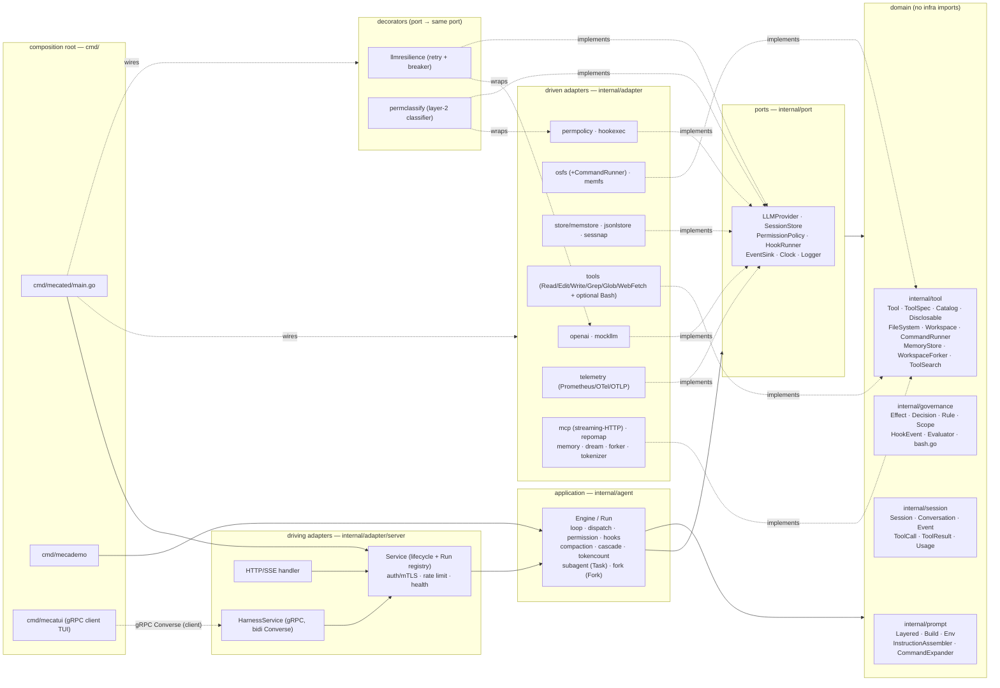
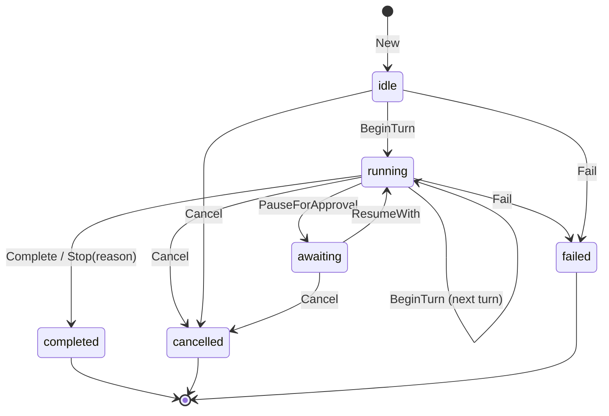
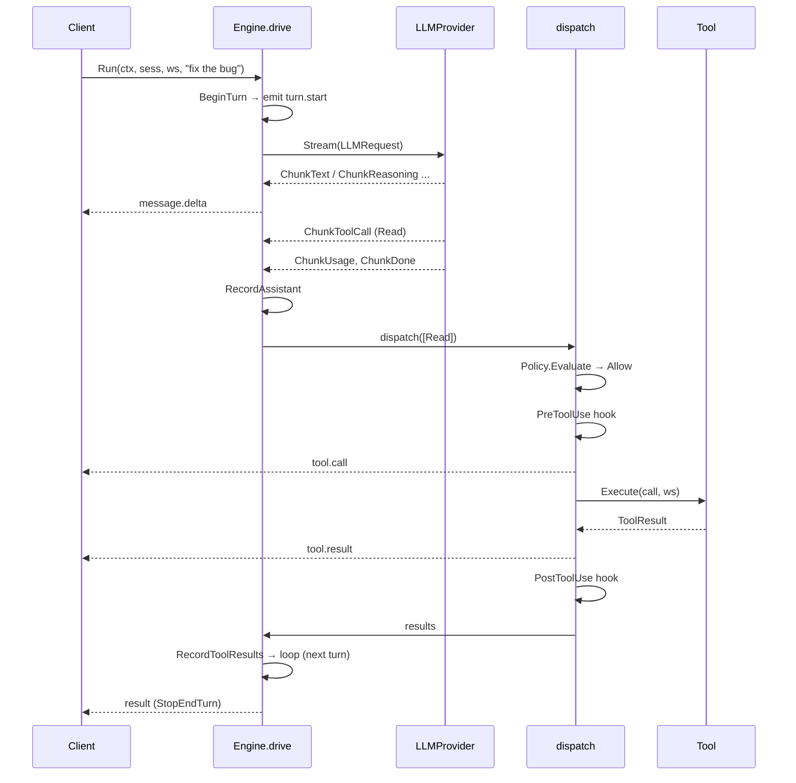
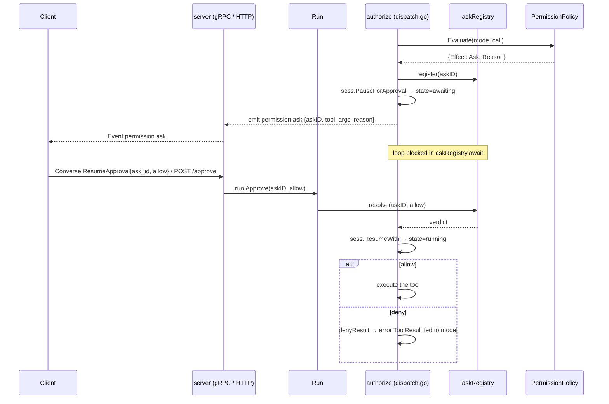

# mecatl — Architecture

> Reader-facing architecture guide. This describes the **code as it exists** in
> `internal/`, `cmd/`, and `contracts/`. Where the design notes in
> `docs/design/` differ from the implementation, this document follows the
> implementation.

## 1. What it is

mecatl is a **headless agentic coding harness**: a service (and library)
that runs the agent loop — call the model, stream its output, execute coding
tools, enforce permissions and hooks, and emit a single typed event stream.
There is no TUI. Clients drive it over **gRPC** (a bidirectional `Converse`
stream) or **HTTP/SSE**. Both surfaces speak one provider-neutral domain
`session.Event` and call the same application service; neither ever sees an
OpenAI type.

The system is built **hexagonally (ports & adapters) with a DDD core**.
Dependencies point inward only: a domain of pure value objects and aggregates
(`session`, `governance`, `tool`, `prompt`), a set of port interfaces the
application consumes (`port`), the application use-case layer that is the agent
loop (`agent`), and adapters that implement the ports (`adapter/*`). The LLM
provider sits behind the `port.LLMProvider` seam, with the OpenAI Responses API
isolated entirely inside `internal/adapter/openai`, so the core is
provider-agnostic and unit-testable against fakes (`mockllm`, `memfs`,
`memstore`).

Around that core, every capability beyond the minimal loop is a **seam with a
default and a swap-in adapter**, so the production build stays static and
network-free unless you wire something in. The current adapters cover, grouped:
**reliability** (`llmresilience` retry/breaker decorator), **observability**
(`telemetry`: Prometheus, OTel spans, OTLP), **security** (server auth/mTLS, rate
limiting, the `permclassify` model-based risk classifier), **context management**
(`tokenizer` + the `CascadeCompactor`), **memory** (`memory` + `dream`),
**parallelism** (`forker` fork-join), and **extensibility** (the `mcp`
streaming-HTTP client and the `repomap` tool). Each is detailed below.

## 2. The big picture



**Dependency direction is inward only.** The allowed-imports rule, stated by the
per-package `doc.go` files and honoured by the code:

| Package | May import |
|---|---|
| `session`, `governance`, `tool`, `prompt` (domain) | stdlib + other domain packages. Never `adapter`, `agent`, `contracts`, `os`, or any third-party library. |
| `port` | domain packages + stdlib (`context`, `io`, `iter`, `time`). |
| `agent` (application) | domain + `port` + stdlib only. Never an adapter or `contracts`. (Tests may import adapters.) |
| `adapter/*` | domain + `port` + the one external lib it adapts. Never `agent`. |
| `contracts/gen` | generated; protobuf + gRPC runtime. |
| `cmd/*` | everything — this is the only place concrete adapters meet ports. |
| `cmd/mecatui/{client,ui,theme}` | a gRPC **client** of mecated. `contracts/gen` + grpc appear only in `client` (and the `cmd/mecatui` composition root); `ui` and `theme` import neither and **never** any `internal/...` package. |

**mecatui — the terminal UI (`cmd/mecatui`).** A separate, optional gRPC *client*
of a running `mecated`; it is not part of the server build. It dials the
`HarnessService`, creates a session, opens the bidi `Converse` stream, and
renders the streamed `Event` envelopes (glamour markdown for assistant text,
themed lipgloss cards for user prompts and tool I/O), resolving permission asks
inline by sending `ResumeApproval` on the same stream. It renders **purely from
proto `Event`s** and is bound by the same inward-only layering rule: the
`contracts/gen` + grpc surface lives only in `cmd/mecatui/client` and the
`cmd/mecatui` main; the `ui` (Bubble Tea model/update/view) and `theme` (pure
styling) packages import no `internal/...` package and no proto directly. Usage
and theming are documented in `docs/tui.md`.

Two deliberate cycle-breaks worth noting, documented in code:
- `port` imports `tool` and `prompt` (because `LLMRequest` carries
  `[]tool.ToolSpec` and `prompt.Layered`) — see the package note at the top of
  `internal/port/llm.go`.
- `FileSystem`/`Workspace` live in `internal/tool`, **not** `internal/port`,
  because `port` already imports `tool` while `tool.Tool.Execute` takes a
  `Workspace`; defining them in `port` would form a `port↔tool` cycle. See the
  package note in `internal/tool/tool.go`.
- `governance` does **not** import `session` (so `session` can import
  `governance` without a cycle); the `Evaluator` works on primitive args, and
  the `permpolicy` adapter bridges `session` types into it.

## 3. The domain model

### Session aggregate (`internal/session/session.go`)

`Session` is the aggregate root. Outside code holds a `SessionID` and reaches
inner entities only through intention-revealing methods, so the state machine
and stop conditions always hold. There are no public setters for lifecycle
state; mutation flows through methods such as `BeginTurn`, `RecordAssistant`,
`RecordToolResults`, `RecordUserPrompt`, `ReplaceHistory`, `PauseForApproval`,
`ResumeWith`, `Complete`, `Stop`, `Cancel`, `Fail`.

States (`session.State`): `idle`, `running`, `awaiting`, `completed`, `failed`,
`cancelled`. The last three are terminal (`State.IsTerminal()`).



Notable, code-accurate details:
- `BeginTurn` is legal from `idle` **or** `running` (a follow-up model call in
  the same run) and increments `Counters.Turns`. It does **not** itself enforce
  limits; the loop consults `StopReason()` as a pre-turn guard.
- `Cancel`/`Fail`/`Stop`/`Complete` are legal from any non-terminal state and
  clear any pending ask.
- `ResumeWith()` takes **no** governance argument and returns the resolved
  `PendingAsk`. The aggregate only reconciles its own lifecycle; the loop owns
  acting on the decision. This keeps `session` a clean domain leaf with no
  `governance` dependency in its method signatures.

`Limits` (`MaxTurns`, `MaxToolCalls`, `MaxConsecutiveFailures`) and `Counters`
(`Turns`, `ToolCalls`, `ConsecutiveFailures`) drive stop conditions. A **zero
limit disables** that condition — which is why the composition root injects
non-zero defaults. Three derived predicates:
- `LimitTripped()` — pure; reports the limit-implied stop reason.
- `RecordedStopReason()` — pure; the faithful terminal reason recorded via
  `Stop/Cancel/Fail/Complete` (used by persistence; performs no derivation).
- `StopReason()` — `RecordedStopReason()` first, else `LimitTripped()`; the
  loop's pre-turn guard. Its godoc explicitly warns it conflates the two and is
  not a faithful witness — persistence must use `RecordedStopReason()`.

`PermissionMode`: `default`, `plan` (read-only toolset enforced), `acceptEdits`.

### Conversation / Message / Turn (`internal/session/conversation.go`)

`Conversation` holds the ordered, model-visible `[]Message`. `Message` is an
immutable value object built via `NewUserMessage`, `NewSystemMessage`,
`NewAssistantMessage(text, reasoning, calls)`, `NewToolMessage(result)`. Roles:
`system`, `user`, `assistant`, `tool`. `Message.Reasoning` carries the
provider's opaque reasoning item, replayed back verbatim and never interpreted.
`Turn` is a value object summarizing one model call plus its results and usage
(defined but not the primary carrier — the loop appends messages directly).

### Value objects

- `ToolCall{ID, Name, Args json.RawMessage}` (`toolcall.go`) — produced by the
  LLM, consumed by tool + governance; `NewToolCall`.
- `ToolResult{CallID, Content, IsError}` — `NewToolResult` / `NewToolError`;
  an error result is still fed back to the model so it can recover.
- `Usage{InputTokens, OutputTokens, CacheReadTokens, CacheWriteTokens}`
  (`usage.go`) with `CacheHitRate()` and an immutable `Add(other) Usage`.

### Event taxonomy (`internal/session/event.go`)

`EventType` is the single, provider-neutral taxonomy shared by the loop and the
API. The real constants:

| EventType value | Const | Emitted when |
|---|---|---|
| `session.init` | `EvSessionInit` | run starts (declared; loop emits `turn.start` first) |
| `turn.start` | `EvTurnStart` | beginning of each turn |
| `message.delta` | `EvMessageDelta` | streamed assistant text delta |
| `tool.call` | `EvToolCall` | a tool is about to run |
| `tool.result` | `EvToolResult` | a tool result (incl. denies / hook blocks) |
| `permission.ask` | `EvPermissionAsk` | loop paused for client approval |
| `hook` | `EvHook` | a hook fired (e.g. PreToolUse block) |
| `compaction` | `EvCompaction` | a compaction boundary crossed |
| `result` | `EvResult` | terminal: carries `ResultPayload{Stop, Text, Usage}` |

`Event` carries `Type, Seq, Turn, Text` plus optional pointers `ToolCall`,
`ToolResult`, `Ask *PendingAsk`, `Result *ResultPayload`, `Usage *Usage`.

## 4. The ports (`internal/port`)

Small interfaces, `context.Context` first. Each has a fake adapter so the loop
runs with no network and no disk.

| Port | Responsibility | Signature (verbatim) |
|---|---|---|
| `LLMProvider` (`llm.go`) | provider-agnostic model call; streams neutral chunks | `Stream(ctx context.Context, req LLMRequest) (iter.Seq2[Chunk, error], error)` |
| `SessionStore` (`store.go`) | persist/retrieve session state | `Save(ctx context.Context, s *session.Session) error` · `Load(ctx context.Context, id session.SessionID) (*session.Session, error)` |
| `HookRunner` (`hookrunner.go`) | run a lifecycle hook, map exit code to outcome | `Run(ctx context.Context, ev governance.HookEvent) (governance.HookOutcome, error)` |
| `PermissionPolicy` (`permission.go`) | deny→ask→allow across merged scopes | `Evaluate(ctx context.Context, mode session.PermissionMode, c session.ToolCall) governance.PermissionDecision` |
| `EventSink` (`log.go`) | relay loop events to the API stream | `Emit(ev session.Event)` |
| `Logger` (`log.go`) | structured tool-execution observability | `ToolCall(id session.SessionID, call session.ToolCall, result session.ToolResult, took time.Duration)` |
| `Clock` (`clock.go`) | abstract wall clock | `Now() time.Time` |

The model-call request and stream types (`llm.go`):

```go
type LLMRequest struct {
    System   prompt.Layered    // stable prefix + volatile suffix
    Messages []session.Message
    Tools    []tool.ToolSpec
    Model    string
}

type ChunkKind int
const (
    ChunkText ChunkKind = iota
    ChunkReasoning
    ChunkToolCall
    ChunkUsage
    ChunkDone
)

type Chunk struct {
    Kind     ChunkKind
    Text     string             // text on ChunkText, reasoning on ChunkReasoning
    ToolCall *session.ToolCall  // on ChunkToolCall
    Usage    *session.Usage     // on ChunkUsage
    Stop     session.StopReason // on ChunkDone
}
```

### The tool contract and the FS seam (`internal/tool`)

```go
type Tool interface {
    Spec() ToolSpec
    ReadOnly() bool
    Execute(ctx context.Context, in session.ToolCall, ws Workspace) (session.ToolResult, error)
}
```

`ToolSpec{Name, Description, Schema json.RawMessage}` is what the model sees;
descriptions are documentation (gauntlet #10). `Catalog` (`catalog.go`) is a
name→Tool registry with `Register`/`MustRegister`/`Lookup`/`Tools`. Its
`Specs(mode)` and `Available(mode)` apply **plan-mode filtering at the catalog
level**: in `ModePlan` only `ReadOnly()` tools are exposed, ordered by name.

`FileSystem` and `Workspace` live here (not in `port`) to break the
`port↔tool` cycle. `Workspace` is the session-scoped seam every tool executes
against: it scopes all paths to one root (rejecting `../` escapes), exposes
`Root/Read/Write/Stat/Glob/Grep`, and carries the Edit **read-ledger**
via `RecordRead(path, version)` / `WasReadUnchanged(ctx, path)`. The
read-before-edit invariant is enforced inside the Edit tool against this ledger
(`internal/adapter/tools/edit.go`: invariant #1 via `WasReadUnchanged`, #2
exact match, #3 uniqueness unless `replace_all`).

**Command execution is a separate seam, not part of `Workspace`.**
`tool.CommandRunner` (`Run(ctx, command) (CommandResult, error)`) is the only
chokepoint for shell execution; the agent loop never references it, and only the
Bash tool depends on it. That makes Bash — and therefore *all* command
execution — optional in the catalog: `NewBashTool(runner)` is registered only
when a runner is configured (it panics on a nil runner), and `tools.Register`
deliberately excludes it. The `osfs` adapter ships a local `/bin/sh`
`CommandRunner` (output-capped, context-bounded); a runner may also execute
remotely or refuse with `tool.ErrNoShell`. A shell-less deployment simply omits
Bash, and an OS sandbox would wrap this seam. `tool.MemoryStore` and
`tool.WorkspaceForker` live alongside it for the same layering reason (the tools
that need them depend on the interface, not a `port`).

## 5. The agent loop (`internal/agent`)

`Engine` is built from `Deps` (all ports + the application seams + config) via
`NewEngine`, which supplies network-free defaults for every optional seam:
`Compactor`→`HeuristicCompactor{}`, `CompactionRatio`→`0.8`,
`TokenCounter`→`HeuristicTokenCounter{}`, `Instructions`→`prompt.RootAssembler{}`,
`CommandExpander`→`prompt.NoopExpander{}`. `Engine.Run(ctx, sess, ws, userText)`
returns a `*Run` handle immediately and drives the loop in a background
goroutine; the `Run` exposes:
- `Events() <-chan session.Event` — the primary surface, closed exactly once
  when the run terminates.
- `Approve(askID string, allow bool)` — resolves a `permission.ask`
  out-of-band.
- `Cancel()` — cancels the run's context.

`drive` (in `loop.go`) is the algorithm:

1. **SessionStart gate** (`fireSessionStart`, first turn only): fire the blocking
   `SessionStart` hook before anything else; a block (or hook error) aborts the
   run before the prompt is even recorded.
2. **Record the prompt** (`recordPrompt`): expand the raw input through
   `CommandExpander.Expand` (slash commands; the `NoopExpander` default leaves it
   unchanged), fire the blocking `UserPromptSubmit` hook **on the expanded text**
   (a block ends the run; a `Mutated` payload replaces the effective prompt), and
   on the first turn assemble project instructions via `Instructions.Assemble`
   (the `RootAssembler` default reads AGENTS.md/CLAUDE.md), recording them + the
   final user text through the aggregate root.
3. **Pre-turn stop guard**: if `sess.StopReason()` trips or `ctx` is cancelled,
   terminate.
4. `BeginTurn`, emit `turn.start`.
5. **Maybe compact** (`maybeCompact`).
6. **Run the turn** (`runTurn`): build the `LLMRequest`, call `LLM.Stream`,
   consume chunks, emit `message.delta` for text, accumulate reasoning, collect
   tool calls and usage, capture the stop reason; assemble one assistant
   `Message`. `ctx` cancellation mid-stream surfaces as a cancellation.
7. `RecordAssistant`. If there are **no tool calls**, the model is done →
   complete the run.
8. **Dispatch** the tool calls, `RecordToolResults`, `save`, loop back to (3).

The loop terminates the session in exactly one of `Complete`/`Stop`/`Cancel`/
`Fail` and emits exactly one terminal `result` event carrying cumulative usage.



### Read-parallel / mutate-serial dispatch (`dispatch.go`)

Enforced in `Engine.dispatch`, keyed off `Tool.ReadOnly()`:
- Calls are processed **in original order**, batched into maximal runs of
  consecutive read-only tools.
- A read-only batch (`runReadBatch`) authorizes + runs PreToolUse hooks for
  every call first (permission **asks are sequenced one at a time**, never two
  at once), then executes the cleared calls **concurrently**, one goroutine per
  call, results merged under a mutex.
- A mutating or **unknown** tool (`runOne`) runs **alone, serially**, never
  overlapping anything.
- Results are keyed by `CallID` and re-assembled in input order.

A `cancelled` flag propagates from `dispatch` so the loop terminates as
`StopCancelled` if `ctx` was cancelled mid-await or mid-execution. A
harness-level tool error becomes an error `ToolResult` (the loop never aborts on
one tool failure); a genuinely unknown tool yields an error result too.

## 6. Permission pause / resume

When `Policy.Evaluate` returns `Ask`, `dispatch.go`'s `authorize` pauses the
loop. The handshake is brokered by `askRegistry` (`permission.go`): the loop
**registers the resolution channel before** pausing and emitting, so an
`Approve` that races in cannot be lost. `PauseForApproval` moves the session to
`awaiting`; the loop emits `permission.ask`; `askRegistry.await` blocks on the
buffered channel until `Run.Approve` resolves it or `ctx` is cancelled.



- **Allow** → the call executes normally.
- **Deny** → `denyResult` synthesizes a `permission denied: <reason>` error
  `ToolResult`, fed back so the model can adapt.
- **Cancel while awaiting** → `await` returns `ok=false`; the loop ends as
  `StopCancelled`.

This ties directly to the API: the gRPC `Converse` stream carries the verdict in
a `ResumeApproval` frame on the **same** stream emitting events (no out-of-band
correlation), and the HTTP surface uses `POST /v1/sessions/{id}/approve`. Both
land on `Run.Approve`. The `Service` keeps a registry of in-flight `*agent.Run`
keyed by session id so the verdict reaches the right run
(`server/service.go`: `LookupRun`).

## 7. Hooks

Hook lifecycle phases (`governance/hookevent.go`): `SessionStart`,
`UserPromptSubmit`, `PreToolUse`, `PostToolUse`, `Stop`, `SubagentStop`. **All
six now fire** — the per-tool pair from `dispatch.go`, the run-level trio from
`agent/hooks.go`, and `SubagentStop` from the Task tool.

Per-tool placement (`dispatch.go`):
- **PreToolUse** (`preHook`) runs after permission clears, before execution, for
  every call (read-batch and serial). On a hook **block** it emits a `hook`
  event and substitutes an error `ToolResult` (the tool does not run). A hook
  execution error is surfaced to the model as a block annotation rather than
  aborting the run; a cancelled context is the one case that ends the run. A
  non-empty `HookOutcome.Mutated` payload on an allow — interpreted symmetrically
  with the PreToolUse `HookEvent.Input`, i.e. the tool's raw **arguments JSON** —
  **rewrites the call's args before execution**: the loop builds a fresh
  `session.ToolCall` (same CallID and tool Name, new Args) and executes that. A
  malformed (non-JSON) mutation is ignored (original args stand) and a notice
  event is emitted. **Permission ordering (trust):** the policy is evaluated on
  the **original, pre-mutation** args; the mutated args are **not**
  re-permission-checked. This is deliberate — a PreToolUse hook is
  operator-deployed and more trusted than the model, so it may rewrite a call
  past the policy that gated the model's request (matching Claude Code).
- **PostToolUse** (`postHook`) runs best-effort after execution; a block there
  only annotates (the tool already ran).

Run-level placement (`agent/hooks.go`). Both pre-prompt phases are **blocking
run-level gates** that fail safe — a block, or a hook **execution error**, ends
the run before any model call with `StopError`, emits a `hook` event, and still
fires `Stop`:
- **SessionStart** (`fireSessionStart`) runs once at the very start of a run,
  before the prompt is recorded; a block (or hook error) **aborts** the run.
- **UserPromptSubmit** (`fireUserPromptSubmit`) runs on the (command-expanded)
  prompt text **before** `RecordUserPrompt`; a block (or hook error) ends the run.
  A non-empty `HookOutcome.Mutated` payload — interpreted symmetrically with the
  `{"prompt": ...}` `HookEvent.Input` — **replaces the effective prompt**: the
  mutated text is what is recorded into the session and sent to the model (a
  malformed mutation is ignored, original text stands). Ordering is preserved:
  command expansion runs first, then the hook, then recording; first-turn
  instruction assembly is unchanged.
- **Stop** (`fireStop`) runs exactly once at the terminal end of any run path,
  even if `ctx` is already cancelled (it is a terminal notification). The Task
  subagent mirrors this with **SubagentStop**.

Exit-code semantics live in the `hookexec` adapter
(`internal/adapter/hookexec/hookexec.go`): the `HookEvent` is JSON-serialized to
the hook process's **stdin**; **exit 0 = allow**, **exit 2 = block**
(`HookOutcome.Block = true`, message from stdout/stderr). On an **allow**, if the
hook's stdout is a JSON **object** it is parsed as a control envelope —
`{"mutated": <raw payload>, "message": "..."}` — and `mutated` becomes
`HookOutcome.Mutated` (the rewritten prompt/args payload the loop applies). Plain
(non-JSON-object) stdout is treated as a message exactly as before, so existing
hooks are unaffected. This is what lets **real shell hooks** emit mutations (not
just custom Go `HookRunner` adapters).

## 8. Subagents (`internal/agent/subagent.go`)

`TaskTool` is a `tool.Tool` (catalog name `Task`) that delegates a focused
read-only investigation to a **child agent loop**. Its `Execute`:
1. Builds a **fresh** child `session.New(...)` — own conversation, own (tighter)
   `Limits` (`defaultChildLimits`: 12 turns / 40 tool calls / 3 failures),
   scoped to the **same workspace root** as the parent.
2. Runs the child via the injected `childEngine.Run(ctx, child, ws, prompt)`.
3. **Drains the child's entire Event stream inside `Execute`** (`drainChild`),
   discarding every intermediate `turn.start`/`message.delta`/`tool.call`/
   `tool.result`/`hook`/`compaction` event, and **returns only the final
   summary string** as one `ToolResult` (gauntlet #7).

Read-only-child invariants, enforced by construction and defended at runtime:
- The composition root wires `childEngine` with a **read-only explorer catalog
  (Read, Grep, Glob only)** that **never includes `Task`** — so a subagent
  cannot recurse — and an **allow-all** policy so the child never prompts a
  human (`cmd/mecated/main.go`: `buildTaskTool`).
- `TaskTool.ReadOnly()` returns `true`, letting the parent run `Task`
  concurrently with other read-only tools. Its godoc states the invariant
  explicitly: this is safe only while the child catalog stays read-only.
- Defensively, `drainChild` **auto-denies** any permission ask the child raises,
  so a child can never block on a human regardless of policy.
- The child run is bounded by the parent `ctx`; `SubagentStop` fires
  best-effort (on a detached short-lived context if the parent is already
  cancelled). `NewTaskTool` panics on a nil child Engine.

## 9. The OpenAI Responses adapter (`internal/adapter/openai`)

`Provider` implements `port.LLMProvider` over `POST /v1/responses` using
`github.com/openai/openai-go/v3`. It owns its own conversation state
("strategy B"): every request is **stateless** — `Store: false`, no
`previous_response_id` — and resends the full input item slice.

**Request translation** (`request.go`, `buildParams`):
- `LLMRequest.System` (the `prompt.Layered`) is `Render()`-ed into
  `Instructions`.
- `Tools` → function tools, each spec's JSON `Schema` unmarshalled into the
  SDK's parameter map (`Strict: true`; empty schema → empty object).
- `Messages` → the input item array via `buildInput`: system/user/assistant text
  become message items; tool messages become `function_call_output` items keyed
  by `call_id`. An assistant turn expands (`assistantItems`) in the order
  **reasoning item → function_call item(s) → text message**.
- `Store: false` plus `Include: [reasoning.encrypted_content]` so reasoning
  survives across turns statelessly. `Message.Reasoning` is carried verbatim as
  the reasoning item's `EncryptedContent`.

**SSE → Chunk translation** (`stream.go`, `translate` — a pure function driven
directly from recorded fixtures by `decodeSSE` in tests):
- `response.output_text.delta` → `ChunkText`
- `response.reasoning_summary_text.delta` → `ChunkReasoning`
- `response.output_item.done` (function_call) → `ChunkToolCall` (acts on the
  assembled `.done` payload, not concatenated deltas)
- `response.completed` → `ChunkUsage` then `ChunkDone` (cached tokens map into
  `Usage.CacheReadTokens`)
- `response.failed` / `response.incomplete` / `error` → `ChunkDone(StopError)`

**Cancellation**: `Stream` (`openai.go`) selects on `ctx.Done()` each iteration
and abandons the underlying stream; a deliberate `ctx` cancel is **not** reported
as a stream error.

**The provider-neutral seam**: the loop only ever sees `port.Chunk`; no OpenAI
type crosses the boundary. The fake `mockllm.Provider` (`adapter/mockllm`,
`New(turns...)`, `TextTurn`) implements the same port for offline loop testing.

**Compatible endpoints**: `WithBaseURL(url)` overrides the host (vLLM, LiteLLM,
a local proxy); the SDK appends `/responses`. `WithAPIKey` and
`WithRequestOption` round out the options. `cmd/mecated` plumbs
`--openai-base-url` through to it.

## 10. The API surface (`internal/adapter/server`, `contracts/proto/mecatl/v1/harness.proto`)

One `Service` (`service.go`) backs two surfaces, both relaying the same domain
`session.Event` mapped to one proto `Event` by `toProto` (`mapper.go`). The
service owns session lifecycle (`CreateSession`, `GetSession`), starts runs
(`StartRun`), and registers/deregisters in-flight `*agent.Run` so approve/cancel
reach the right run.

**gRPC (`harness.proto`, `grpc.go`)** — `HarnessService`:
- `CreateSession(CreateSessionRequest) → CreateSessionResponse`
- `GetSession(GetSessionRequest) → GetSessionResponse`
- `Converse(stream ConverseRequest) → stream ConverseResponse)` — bidirectional.
  The first frame **must** be `prompt`; then zero or more `resume_approval` /
  `cancel` control frames. `ConverseRequest` is a `oneof kind { Prompt prompt=1;
  ResumeApproval resume_approval=10; Cancel cancel=11 }`. The server starts the
  run, reads control frames on a side goroutine (`readControl`), and relays
  `Event`s on the main goroutine until the channel closes.

`ConverseResponse` wraps one `Event`. The proto `Event` mirrors `session.Event`
one-for-one: string `type` plus `ToolCall`, `ToolResult`, `PermissionAsk`,
`Result`, `Usage` submessages. `PermissionAsk.ask_id` is echoed back in
`ResumeApproval.ask_id`. Required-field annotations use `buf.validate.field`;
v1 enforces required checks in the Go server (protovalidate runtime is deferred).

**HTTP/SSE (`http.go`)** — the thin mirror, since grpc-gateway cannot map bidi:

| HTTP | Maps to | Notes |
|---|---|---|
| `POST /v1/sessions` | `CreateSession` | JSON body → `session_id` |
| `GET /v1/sessions/{id}` | `GetSession` | JSON snapshot |
| `POST /v1/sessions/{id}/prompt` | start a run | `text/event-stream`; each event is `data: <proto Event as JSON>` |
| `POST /v1/sessions/{id}/approve` | `Run.Approve` | resolves the paused ask |
| `POST /v1/sessions/{id}/cancel` | `Run.Cancel` | cancels the in-flight run |

Closing either stream cancels the run: the SSE handler watches
`r.Context().Done()` and calls `run.Cancel()`; the gRPC relay cancels on a send
error.

## 11. Observability & persistence

- **EventSink** (`port.EventSink`) — an optional secondary relay. `Run.emit`
  always writes to the `Events()` channel (the primary surface) and then mirrors
  the sequenced event to `Deps.Sink` when configured (`dispatch.go`'s
  `Engine.emit`). `Seq` is a monotonic per-run counter (`atomic.Int64`).
- **Logger** (`port.Logger`) — `ToolCall(id, call, result, took)` records
  tool-execution timing, distinct from the model-visible conversation. The loop
  times execution via the injected `Clock` (`timeExecute`).
- **Telemetry** (`internal/adapter/telemetry`) — one adapter that implements
  **both** `port.EventSink` (deriving counters/gauges from the event stream) and
  `port.Logger` (per-tool counters + a latency histogram). `telemetry.NewMetrics`
  exposes Prometheus metrics for mounting at `/metrics`; `telemetry.NewSink` fans
  one Engine `EventSink` out to several sinks; OTel spans model the run/turn/tool
  hierarchy; and `telemetry.Setup` builds and installs an **OTLP** TracerProvider
  (gRPC or HTTP transport), wired in `mecated` via `--otlp-endpoint` /
  `--otlp-protocol` / `--otlp-insecure` (a no-op when the endpoint is empty).
- **SessionStore** — `memstore` (default, in-memory) and `jsonlstore`
  (append-only JSONL replay log: `<dir>/<id>.session.jsonl` snapshots +
  `<dir>/<id>.tools.jsonl` tool records; `jsonlstore` also implements `Logger`).
  Both serialize via **`sessnap`** (`adapter/store/sessnap`): a `Snapshot` DTO
  that round-trips a `Session` by driving the public state machine on restore
  (so a session saved mid-`awaiting` reloads with its pending ask intact). It
  captures the terminal reason via `RecordedStopReason()` for exact round-trips.

## 12. Reliability — provider resilience

The `port.LLMProvider` seam is wrapped by a **decorator**,
`llmresilience.Wrap(inner, Config) port.LLMProvider`, so the loop is unchanged.
It adds retry with exponential backoff and a circuit breaker, configured in
`mecated` via `--llm-max-attempts` / `--llm-per-attempt-timeout` /
`--llm-breaker-threshold` / `--llm-breaker-cooldown`.

Its load-bearing invariant is **no replay after the first chunk**: retries happen
only while *establishing* the stream (connect + first chunk). Once the first
`Chunk` has been yielded, the decorator never re-issues the call, so the model
never re-sees a half-streamed turn. The breaker opens after N consecutive
establishment failures and short-circuits with a `BreakerError` until its
cooldown half-opens it; exhausted retries surface as an `ExhaustedError`. Both
flow back to the client as a terminal `result` event — `session.ResultPayload`
now carries an **`Error`** field, so a provider failure is reported to the caller
rather than swallowed.

Auto-resume complements this: `GetSession`/`Approve`/`Cancel` fall back to
`SessionStore.Load`, and the service persists at create, on entering `awaiting`,
and at run end. With `--store-dir` (jsonlstore) a session survives a restart and
is loadable; the in-flight *stream* itself is not resumed (the `*agent.Run` is
in-memory), and an approve/cancel against a stored-but-runless session returns
`ErrNoActiveRun` (HTTP 409 / gRPC `FailedPrecondition`).

## 13. Context management — tokens & the compaction cascade

Two seams keep a long run inside the model's context window:

- **`TokenCounter`** (`agent/tokencount.go`) estimates message-slice token cost.
  The default `HeuristicTokenCounter` (≈chars/4) needs no dependencies; the
  offline **`tokenizer.Counter`** (`internal/adapter/tokenizer`, tiktoken BPE
  tables embedded — no network, no CGO) is the accurate swap-in, selected with
  `--tokenizer=tiktoken`.
- **`Compactor`** (`agent/compaction.go`) compresses the conversation once it
  crosses the trigger ratio. The default `HeuristicCompactor` is single-summary:
  it preserves the goal + touched file paths, truncates large tool bodies, and
  keeps the last N messages. The swap-in `CascadeCompactor` (`agent/cascade.go`,
  `--compaction=cascade`) runs a **cheapest-first tiered cascade** —
  snip → strip tool bodies → collapse large file bodies → summarize — stopping as
  soon as the slice fits the token budget, with trigger/target **hysteresis** so
  it does not thrash near the threshold.

## 14. Memory — cross-session recall & consolidation (pattern 3 / 4)

`tool.MemoryStore` (`Remember`/`Recall`/`List`/`Forget`) is the seam for
conservative, **per-project** memory. The file-backed `internal/adapter/memory`
implementation persists entries scoped to a project directory and exposes them to
the model as the **Remember** and **Recall** tools (opt-in via `memory.Register`,
`--memory-dir`). On top of it, `internal/adapter/dream` is an opt-in background
**consolidation** ("sleep") service: `dream.Consolidator` distills the stored
memory with an LLM call — merging duplicates and dropping stale entries — but is
deliberately conservative (it never invents keys and is fail-safe on error), run
once or on a ticker via `RunPeriodically` (`--memory-consolidate-interval`).

## 15. Parallelism — fork-join (pattern 8)

`tool.WorkspaceForker` (`tool/isolation.go`) is the workspace-isolation seam:
`Fork(ctx, base, label)` returns an isolated child `Workspace` plus a cleanup
func. The default `internal/adapter/forker` picks its strategy per base —
a **git worktree** (`git worktree add --detach … HEAD`) when the root is inside a
repo, else a **recursive copy** — so a child can never write back into the
parent's tree. `agent.NewForkTool(childEngine, forker, …)` is the fan-out tool
(catalog name `Fork`): it runs several isolated child loops on independent
branches and joins their results. It is opt-in via `--enable-fork`; like Task,
the children's intermediate events are drained internally.

## 16. Extensibility — MCP, tools & progressive disclosure

The `tool.Catalog` is the single registration seam, so every tool — core, remote,
or generated — is one uniform `tool.Tool`.

**MCP client** (`internal/adapter/mcp`) — remote tools register here. The
transport is **streaming-HTTP only** (the project's hard constraint): the
stdio/command transport is never used, so no MCP server is ever `os/exec`-spawned.
`mcp.Connect` / `mcp.NewManager` dial the configured servers, and the discovered
tools are registered into the catalog **namespaced** `mcp__<server>__<tool>` so a
remote tool can never collide with or shadow a built-in.

**Repo map** (`internal/adapter/repomap`) — a **read-only** repo-map tool
(`repomap.NewTool`, `ReadOnly()==true`). It parses source with **tree-sitter and
ranks files by personalized PageRank** over the symbol-reference graph, producing
a compact "where the important code lives" map. It is multi-language and needs
**no CGO** (tree-sitter runs as pure-Go WASM via wazero), so it does not affect
the static default build; it is wired in `mecated` via `--enable-repomap`.

**Progressive tool disclosure** (pattern 9) — a tool may optionally implement
`tool.Disclosable`; the built-in `tool.Search` tool (catalog name `ToolSearch`,
`tool.NewToolSearch`) hydrates hidden tools on demand by searching the catalog. A
tool that does not implement `Disclosable` is always listed, so this is opt-in and
backwards-compatible (gated by the `ProgressiveTools` flag on the Engine `Deps`).

**Skills** (`internal/adapter/skills`) — pattern 9 applied to *instructions*
instead of tool schemas. A skill is a progressive-disclosure instruction unit: a
`SKILL.md` file with YAML frontmatter (`name` + `description`) and a markdown
body, laid out as `<skills-dir>/<name>/SKILL.md` (matching the Agent Skills
ecosystem; see the format references under `docs/examples/skills/`).
`skills.Discover` scans the directory and parses each file into a pure
`skills.Skill` value object; discovery is forgiving — a malformed or
frontmatter-less file is **skipped and reported** (`skills.SkipError`), never
fatal, and a kept skill whose **always-in-context description** exceeds a cap
(`maxDescriptionBytes`) is rune-safe truncated with a warning (so one oversized
description cannot bloat every request and break the byte-stable prompt prefix);
an oversized body is flagged too (it is truncated on activation). A single
read-only `Skill` tool (`skills.NewTool`, catalog name `Skill`,
`ReadOnly()==true`) exposes them: its `Spec().Description` **enumerates every
discovered skill's name + one-line description** — the cheap, always-in-context,
cache-stable metadata layer — while `Execute({name})` returns that skill's full
**body** only when the model activates it (the load-on-activation layer). Because
the tool is read-only it is also available in plan mode. It is **opt-in**:
`mecated` wires it behind `--skills-dir`; discovery runs ONLY when that flag is
set (there is no applied default), and `.mecatl/skills` (`skills.DefaultDir`) is
the *conventional* directory to point it at. The tool is registered **only when at
least one valid skill is discovered** — an empty inventory advertises nothing.
Discovery (reading files, YAML parsing via `go.yaml.in/yaml/v3`) is an adapter
concern; nothing in this package is imported by a domain package — it merely
implements the domain `tool.Tool` interface.

### Seam summary

Every capability above is a default-on (or opt-in) interface; the core never
changes when one is swapped:

| Seam | Where | Default → swap-in |
|---|---|---|
| `port.LLMProvider` | `internal/port/llm.go` | `openai`/`mockllm`; decorated by `llmresilience`; other vendors slot in unchanged |
| `port.PermissionPolicy` | `internal/port/permission.go` | `permpolicy` (layer-1 rules), optionally decorated by `permclassify` (layer-2 model classifier) |
| `Compactor` | `agent/compaction.go` | `HeuristicCompactor` → `CascadeCompactor` |
| `TokenCounter` | `agent/tokencount.go` | `HeuristicTokenCounter` → `tokenizer.Counter` |
| `InstructionAssembler` | `prompt/instructions.go` | `RootAssembler` (AGENTS.md/CLAUDE.md) → scoped assembler |
| `CommandExpander` | `prompt/command.go` | `NoopExpander` → `DirCommandExpander` (slash commands) |
| `tool.Disclosable` + `ToolSearch` | `internal/tool` | always-listed → progressive disclosure |
| `Skill` tool (skills) | `internal/adapter/skills` (impl) | off → opt-in `--skills-dir`; progressive disclosure of *instructions* (metadata always in context, body on activation) |
| `tool.CommandRunner` | `internal/tool/tool.go` (impl `osfs`) | the command-execution chokepoint; an OS sandbox wraps here |
| `tool.MemoryStore` | `internal/tool/tool.go` (impl `memory`) | cross-session memory + `dream` consolidation |
| `tool.WorkspaceForker` | `tool/isolation.go` (impl `forker`) | fork-join isolated branches |
| `tool.Catalog` | `internal/tool/catalog.go` | core tools + MCP (streaming-HTTP) + repo map |
| `SessionStore` + AGENTS.md/CLAUDE.md discovery | `port` + `prompt/builder.go` | file-as-memory; AGENTS.md wins over CLAUDE.md, injected as a **user** message, never system |

**Remaining non-goals / deliberate deferrals**: an **OS-level sandbox**
(Landlock/seccomp/Seatbelt) is the one explicitly-deferred item — the
`CommandRunner` seam is the place it wraps, and shell-less deploys avoid the
surface entirely. **stdio MCP is never supported**. Embeddings and multi-vendor model
routing (the `LLMProvider` port already abstracts it) remain unbuilt; **skills**
exist as progressive-disclosure instruction units (see above), though richer
*packaging* (bundled scripts/resources alongside `SKILL.md`) is not yet built. The guiding restraint still holds: build the shape, instrument it,
and resist features before the loop, tools, permissions, hooks, and cache all work.

## 17. Deployment & server hardening

The server (`internal/adapter/server`) is hardened for off-loopback operation,
and `cmd/mecated` wires the knobs:

- **Authentication** — optional bearer token (`--auth-token` / `MECATL_AUTH_TOKEN`,
  constant-time compared) enforced by a gRPC interceptor + HTTP middleware
  (`server/authn.go`); optional **TLS / mTLS** (`--tls-cert` / `--tls-key` /
  `--client-ca`). The server still **warns loudly** if it binds a non-loopback
  address with no auth configured.
- **Rate limiting** — per-client + global token-bucket (`--rate-limit` /
  `--rate-burst`), bounded and idle-evicting.
- **Health** — HTTP `/healthz` (liveness) + `/readyz` (readiness) mounted outside
  auth/rate-limit, plus standard `grpc_health_v1` `SERVING` (`server/health.go`).
- **Graceful shutdown** — gRPC `GracefulStop` + HTTP `Shutdown`.

Deployment artifacts: a hardened **GitHub Actions** CI plus a **ko**-based release
that signs images with **cosign** and emits an **SBOM** and **SLSA provenance**
(`.github/workflows`, `.ko.yaml`); `deploy/` carries PSS-restricted manifests
(health probes can switch TCP→httpGet against the endpoints above).

### Permission & bash governance details (`internal/governance`)

The `permpolicy` adapter wraps `governance.Evaluator`. Resolution
(`evaluator.go`): a **Deny in any scope beats Ask beats Allow**; among rules of
the same effect the highest-precedence `Scope` wins (`Managed > CLI >
LocalProject > SharedProject > User`); **no matching rule defaults to Ask** (the
harness never silently allows an unconfigured call). Plan mode (`ModePlan`)
denies mutating tools (`Edit`, `Write`) and non-read-only `Bash` up front.

For Bash, `bash.go` splits compound lines (`SplitCommands`, honouring quotes and
splitting on `&&`, `||`, `;`, `|`, a bare `&`, and newlines) and evaluates
**every** sub-command, taking the worst outcome — so a deny on `rm` blocks
`git status && rm -rf /`. `Canonicalize` strips a **closed, audited** set of
transparent wrappers (`timeout`, `time`, `nice`, `env`, `stdbuf`, `ionice`) but
deliberately **never** strips re-entrant launchers (`docker exec`, `npx`,
`sudo`, `devbox run`). `HasSubstitutionOrGrouping` flags `$(...)`, backticks,
`<(...)`, and `(`/`{` grouping and floors such segments at Ask (fail-safe).
`ReadOnlyBash` classifies a command line as read-only for plan-mode gating.
